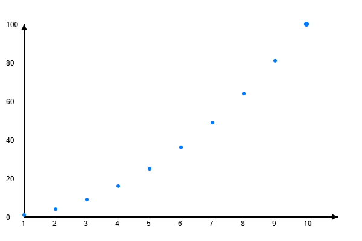
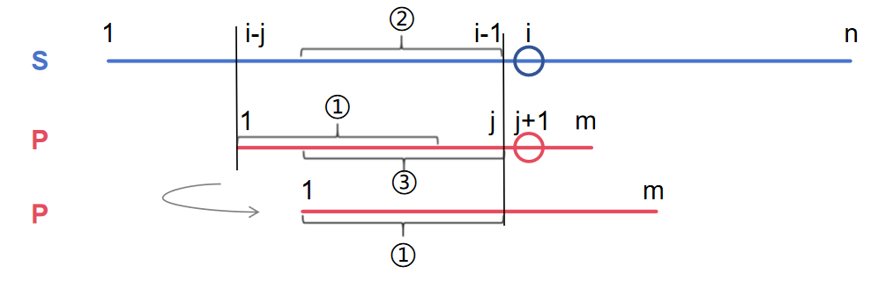
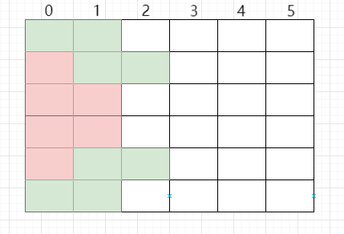
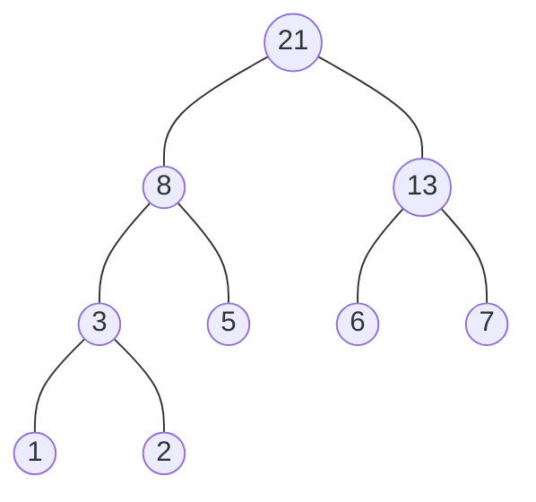

# Acwing\_算法基础课\_笔记

<font size=5>***Yoo, I'm ShaoShuai***👋</font>

- *🍻 Junior at 🇨🇳 [HNU], BSc in Computer Science*
- *⚡ C++ / Python / Matlab.*
- *✍️ Writer at [CSDN](https://blog.csdn.net/obstacle19?type=blog)*

[TOC]

# 基础算法

## 1. 快速排序

### 1.1 快速排序

> **题目**

给定你一个长度为 $n$ 的整数数列。

请你使用归并排序对这个数列按照从小到大进行排序。

并将排好序的数列按顺序输出。

**输入格式**

输入共两行，第一行包含整数 $n$。

第二行包含 $n$ 个整数（所有整数均在 $1∼10^9$ 范围内），表示整个数列。

**输出格式**

输出共一行，包含 $n$ 个整数，表示排好序的数列。

**数据范围**

$1≤n≤100000$

**输入样例：**

```
5
3 1 2 4 5
```

**输出样例：**

```
1 2 3 4 5
```

> **解析**

首先设定一个**分界值**（这里选的是**中点**那个数），通过该分界值将数组分成左右两部分。（分界值也可以移动！）

**将大于或等于分界值的数据集中到数组右边，小于分界值的数据集中到数组的左边**。此时，左边部分中各元素都小于分界值，而右边部分中各元素都大于或等于分界值。

左边和右边的数据可以独立排序。对于左侧的数组数据，又可以取一个分界值，将该部分数据分成左右两部分，同样在左边放置较小值，右边放置较大值。右侧的数组数据也可以做类似处理。重复上述过程。

> **代码模板**

```c++
#include<bits/stdc++.h>
using namespace std;
typedef long long ll;
const int N = 100010;
int q[N];
void quick_sort(int q[], int l, int r)
{
    if (l >= r) return;
    int i = l - 1, j = r + 1, x = q[l + r >> 1]; // 选取分界线。这里选数组中间那个数
    while (i < j)
    {
        do i ++; while (q[i] < x);
        do j --; while (q[j] > x);
        if (i < j) swap(q[i], q[j]);
    }
    quick_sort(q, l, j); // 注意边界是 j ,换成 i 会报错
    quick_sort(q, j + 1, r);
}
int main()
{
    int n;
    cin >> n;
    for (int i = 0; i < n; i ++) cin >> q[i];
    quick_sort(q, 0, n - 1);
    for (int i = 0; i < n; i ++) cout << q[i] << " ";
    return 0;
}
```

## 2. 归并排序

### 2.1 归并排序

> **题目**

给定你一个长度为 $n$ 的整数数列。

请你使用归并排序对这个数列按照从小到大进行排序。

并将排好序的数列按顺序输出。

**输入格式**

输入共两行，第一行包含整数 $n$。

第二行包含 $n$ 个整数（所有整数均在 $1∼10^9$ 范围内），表示整个数列。

**输出格式**

输出共一行，包含 $n$ 个整数，表示排好序的数列。

**数据范围**

$1≤n≤100000$

**输入样例：**

```
5
3 1 2 4 5
```

**输出样例：**

```
1 2 3 4 5
```

> **解析**

算法思想：**分治法**、**双指针算法**

- 算法第二步 `递归处理子问题` 为 `分治法`
- 算法第三步 `合并子问题` 中的 `i = l, j = mid + 1` 为 `双指针算法`


> **代码模板**

```c++
#include <bits/stdc++.h>
using namespace std;
typedef long long ll;
const int N = 1e5 + 10;
int a[N], tmp[N];
void merge_sort(int q[], int l, int r)
{
	// 递归的终止情况
    if (l >= r) return; 
    // 第一步：分成子问题 
    int mid = l + r >> 1;
    // 第二步：递归处理子问题 
    merge_sort(q, l, mid), merge_sort(q, mid + 1, r); // 直到把两个区间之间的比较细分成两个元素之间的比较
	// 第三步：合并子问题 
    int k = 0, i = l, j = mid + 1;
    while (i <= mid && j <= r) // 这时候，问题简化成了两个各自有序递增的子区间之间的排序 
        if (q[i] <= q[j]) tmp[k ++ ] = q[i ++];
        else tmp[k ++] = q[j ++];
    while (i <= mid) tmp[k ++] = q[i ++]; // 右半部分都填充到了tmp中，而左半部分未填充完毕 
    while (j <= r) tmp[k ++] = q[j ++]; // 左半部分都填充到了tmp中，而右半部分未填充完毕 
    for (i = l, j = 0; i <= r; i ++, j ++) q[i] = tmp[j]; // 将tmp有序填充到q数组中 
}
int main()
{
    ll n;
    cin>>n;
    for (int i = 0; i < n; i ++ ) cin>>a[i];
    merge_sort(a, 0, n - 1);
    for (int i = 0; i < n; i ++ ) cout<<a[i]<<" ";
    return 0;
}
```

## 3. 二分

### 3.1 数的范围

> **题目**

给定一个按照升序排列的长度为 $n$ 的整数数组，以及 $q$ 个查询。

对于每个查询，返回一个元素 $k$ 的起始位置和终止位置（位置从 $0$ 开始计数）。

如果数组中不存在该元素，则返回 `-1 -1`。

**输入格式**

第一行包含整数 $n$ 和 $q$，表示数组长度和询问个数。

第二行包含 $n$ 个整数（均在 $1∼10000$ 范围内），表示完整数组。

接下来 $q$ 行，每行包含一个整数 $k$，表示一个询问元素。

**输出格式**

共 $q$ 行，每行包含两个整数，表示所求元素的起始位置和终止位置。

如果数组中不存在该元素，则返回 `-1 -1`。

**数据范围**

$1≤n≤100000$
$1≤q≤10000$
$1≤k≤10000$

**输入样例：**

```
6 3
1 2 2 3 3 4
3
4
5
```

**输出样例：**

```
3 4
5 5
-1 -1
```

> **代码模板**

```c++
#include <bits/stdc++.h>
using namespace std;
const int N = 100010;
int a[N];
int bsearch_1(int l, int r, int x) //查找首次出现（最左边）
{
	while(l < r)
	{
		int mid = l + r >> 1;
		if(a[mid] >= x)
		{
			r = mid;
		}
		else l = mid + 1;
	}
	return l;
}
int bsearch_2(int l, int r, int x) //查找最后一次出现（最右边）
{
	while(l < r)
	{
		int mid = l + r + 1 >> 1;
		if(a[mid] <= x)
		{
			l = mid;
		}
		else r = mid - 1;
	}
	return l;
}
int main()
{
	int n, q, k, left, right;
	cin >> n >> q;
	for(int i = 0; i < n; i ++)
	{
		cin >> a[i];
	}
	while(q --)
	{
		cin >> k;
		left = bsearch_1(0, n - 1, k);
		right = bsearch_2(0, n - 1, k);
		if(a[left] != k)
		{
			cout << "-1 -1" << endl;
			continue;
		}
		cout << left << " " << right << endl;
	}
	return 0;
} 
```

**库函数法：**

```c++
#include<bits/stdc++.h>
using namespace std;
const int N = 100010;
int a[N];
int main()
{
	int n, q, k, left, right;
	cin >> n >> q;
	for(int i = 0; i < n; i ++) cin >> a[i];
	while(q --)
	{
		cin >> k;
		left = lower_bound(a, a + n, k) - a;
		right = upper_bound(a, a + n, k) - a - 1;
		if(a[left] != k)
		{
			cout << "-1 -1" << endl;
			continue;
		}
		cout << left << " " << right << endl;
	}
	return 0;
} 
```

### 3.2 数的三次方根

> **题目**

给定一个浮点数 $n$，求它的三次方根。

**输入格式**

共一行，包含一个浮点数 $n$。

**输出格式**

共一行，包含一个浮点数，表示问题的解。

注意，结果保留 $6$ 位小数。

**数据范围**

$−10000≤n≤10000$

**输入样例：**

```
1000.00
```

**输出样例：**

```
10.000000
```

> **代码模板**

```c++
#include <bits/stdc++.h>
using namespace std;
int main()
{
	double x;
	cin >> x;
	double l = -10000, r = 10000;
	while(r - l > 1e-8)
	{
		double mid = (l + r) / 2;
		if(pow(mid, 3) >= x)
		{
			r = mid;
		}
		else l = mid;
	}
	cout << fixed << setprecision(6) << l << endl;
	system("pause");
	return 0;
 } 
```

## 4. 前缀和与差分

### 4.1 前缀和

> **题目**

输入一个长度为 $n$ 的整数序列。

接下来再输入 $m$ 个询问，每个询问输入一对 $l,r$。

对于每个询问，输出原序列中从第 $l$ 个数到第 $r$ 个数的和。

**输入格式**

第一行包含两个整数 $n$ 和 $m$。

第二行包含 $n$ 个整数，表示整数数列。

接下来 $m$ 行，每行包含两个整数 $l$ 和 $r$，表示一个询问的区间范围。

**输出格式**

共 $m$ 行，每行输出一个询问的结果。

**数据范围**

$1≤l≤r≤n,$
$1≤n,m≤100000,$
$−1000≤数列中元素的值≤1000$

**输入样例：**

```
5 3
2 1 3 6 4
1 2
1 3
2 4
```

**输出样例：**

```
3
6
10
```

> **解析**

**一维前缀和**：

$S[i]=a[1]+a[2]+……+a[2]$

$a[l]+……+a[r]=S[r]-S[l-1]$

- 如何求 $S_i$：`for i = 1; i <= n; i ++`

  ​                     $S[i]=S[i-1]+a_i$ （默认 $S[0]=0$ ）

- 作用：$[l,r]$ 一段数的和为： $S_r-S_{l-1}$

  ​            $S_r=a_1+a_2+……+a_{l-1}+a_l+……+a_r$

  ​            $S_{l-1}=a_1+a_2+……+a_{l-1}$

> **代码模板**

```c++
#include<bits/stdc++.h>
using namespace std;
const int N = 100010;
int n, m;
int a[N], s[N];
int main()
{
    cin >> n >> m;
    for (int i = 1; i <= n; i ++)
    {
    	cin >> a[i];
    	s[i] = a[i] + s[i - 1];
	}
    while (m --)
    {
        int l, r;
        cin >> l >> r;
        cout << s[r] - s[l - 1] << endl; // 区间和的计算
    }
    return 0;
}
```

### 4.2 子矩阵的和

> **题目**

输入一个 $n$ 行 $m$ 列的整数矩阵，再输入 $q$ 个询问，每个询问包含四个整数 $x_1,y_1,x_2,y_2$，表示一个子矩阵的左上角坐标和右下角坐标。

对于每个询问输出子矩阵中所有数的和。

**输入格式**

第一行包含三个整数 $n，m，q$。

接下来 $n$ 行，每行包含 $m$ 个整数，表示整数矩阵。

接下来 $q$ 行，每行包含四个整数 $x_1,y_1,x_2,y_2$，表示一组询问。

**输出格式**

共 $q$ 行，每行输出一个询问的结果。

**数据范围**

$1≤n,m≤1000,$
$1≤q≤200000,$
$1≤x_1≤x_2≤n,$
$1≤y_1≤y_2≤m,$
$−1000≤矩阵内元素的值≤1000$

**输入样例：**

```
3 4 3
1 7 2 4
3 6 2 8
2 1 2 3
1 1 2 2
2 1 3 4
1 3 3 4
```

**输出样例：**

```
17
27
21
```

> **解析**

**二维前缀和**：

$S[i][j]=第i行第j列格子左上部分所有元素的和$

$以(x_1,y_1)为左上角，(x_2,y_2)为右下角的子矩阵的和为：S[x_2,y_2]-S[x_1-1,y2]-S[x_2,y_1-1]+S[x_1-1,y_1-1]$

> **代码模板**

```c++
#include<bits/stdc++.h>
using namespace std;
const int N=1010;
int s[N][N];
int n,m,q;
int main()
{
	cin >> n >> m >> q;
	for(int i = 1; i <= n; i ++)
	{
		for(int j = 1; j <= m; j ++)
		{
			cin >> s[i][j];
			s[i][j] += s[i - 1][j] + s[i][j - 1] - s[i - 1][j - 1];
		}
	}
	while(q --)
	{
		int x1, x2, y1, y2;
		cin >> x1 >> y1 >> x2 >> y2;
		cout << s[x2][y2] - s[x1 - 1][y2] - s[x2][y1 - 1] + s[x1 - 1][y1 - 1] << endl; 
	}
	return 0;
}
```

### 4.3 差分

> **题目**

输入一个长度为 $n$ 的整数序列。

接下来输入 $m$ 个操作，每个操作包含三个整数 $l,r,c$，表示将序列中 $[l,r]$ 之间的每个数加上 $c$。

请你输出进行完所有操作后的序列。

**输入格式**

第一行包含两个整数 $n$ 和 $m$。

第二行包含 $n$ 个整数，表示整数序列。

接下来 $m$ 行，每行包含三个整数 $l，r，c$，表示一个操作。

**输出格式**

共一行，包含 $n$ 个整数，表示最终序列。

**数据范围**

$1≤n,m≤100000,$
$1≤l≤r≤n,$
$−1000≤c≤1000,$
$−1000≤整数序列中元素的值≤1000$

**输入样例：**

```
6 3
1 2 2 1 2 1
1 3 1
3 5 1
1 6 1
```

**输出样例：**

```
3 4 5 3 4 2
```

> **解析**

**一维差分**：

构造 $b_1,b_2……b_n$

使得 $a_i=b_1+b_2+……+b_i$ ，$b$ 称为 $a$ 的差分，$a$ 为 $b$ 的前缀和

即 $b_1=a_1,b_2=a_2-a_1,b_3=a_3-a_2 …… b_n=a_n-a_{n-1}$

给区间 $[l,r]$ 中的每个数加上 $c$ ，只需要修改两个数：`b[l] += c, b[r + 1] -= c`

> **代码模板**

```c++
#include<bits/stdc++.h>
using namespace std;
const int N = 100010;
int n, m;
int a[N], b[N];
void insert(int l, int r, int c)
{
	b[l] += c, b[r + 1] -= c;
}
int main()
{
	cin >> n >> m;
	for(int i = 1; i <= n; i ++)
	{
		cin >> a[i];
		insert(i, i, a[i]); // b 变成 a 的差分 
	}
	while(m --)
	{
		int l, r, c;
		cin >> l >> r >> c;
		insert(l, r, c); // 对差分数组 b 进行操作 
	}
	for(int i = 1; i <= n; i ++)
	{
		b[i] += b[i - 1]; // 将 b 变为自己的前缀和 
		cout << b[i] << " ";
	}
	return 0;
}
```

### 4.4 差分矩阵

> **题目**

输入一个 $n$ 行 $m$ 列的整数矩阵，再输入 $q$ 个操作，每个操作包含五个整数 $x_1,y_1,x_2,y_2,c$，其中 $(x_1,y_1)$ 和 $(x_2,y_2)$ 表示一个子矩阵的左上角坐标和右下角坐标。

每个操作都要将选中的子矩阵中的每个元素的值加上 $c$。

请你将进行完所有操作后的矩阵输出。

**输入格式**

第一行包含整数 $n,m,q$。

接下来 $n$ 行，每行包含 $m$ 个整数，表示整数矩阵。

接下来 $q$ 行，每行包含 $5$ 个整数 $x_1,y_1,x_2,y_2,c$，表示一个操作。

**输出格式**

共 $n$ 行，每行 $m$ 个整数，表示所有操作进行完毕后的最终矩阵。

**数据范围**

$1≤n,m≤1000,$
$1≤q≤100000,$
$1≤x_1≤x_2≤n,$
$1≤y_1≤y_2≤m,$
$−1000≤c≤1000,$
$−1000≤矩阵内元素的值≤1000$

**输入样例：**

```
3 4 3
1 2 2 1
3 2 2 1
1 1 1 1
1 1 2 2 1
1 3 2 3 2
3 1 3 4 1
```

**输出样例：**

```
2 3 4 1
4 3 4 1
2 2 2 2
```

> **解析**

**二维差分**：

给以 $(x_1,y_1)$ 为左上角， $(x_2,y_2)$ 为右下角的子矩阵中所有元素加上 $c$ ：

$S[x_1,y_1]+=c,$
$S[x_2+1,y_1]-=c,$
$S[x_1,y_2+1]-=c,$
$S[x_2+1,y_2+1]+=c$


> **代码模板**

```c++
#include<bits/stdc++.h> 
using namespace std;
const int N = 1010;
int n, m, q;
int a[N][N], b[N][N];
void insert(int x1, int y1, int x2, int y2, int c)
{
    b[x1][y1] += c;
    b[x2 + 1][y1] -= c;
    b[x1][y2 + 1] -= c;
    b[x2 + 1][y2 + 1] += c;
}
int main()
{
    cin >> n >> m >> q;
    for (int i = 1; i <= n; i ++)
    {
    	for (int j = 1; j <= m; j ++ )
    	{
    		cin >> a[i][j];
		}
	}
    for (int i = 1; i <= n; i ++)
    {
    	for (int j = 1; j <= m; j ++ )
    	{
    		insert(i, j, i, j, a[i][j]);
		}
	}
    while (q --)
    {
        int x1, y1, x2, y2, c;
        cin >> x1 >> y1 >> x2 >> y2 >> c;
        insert(x1, y1, x2, y2, c);
    }
    for (int i = 1; i <= n; i ++)
    {
    	for (int j = 1; j <= m; j ++ )
    	{
    		b[i][j] += b[i - 1][j] + b[i][j - 1] - b[i - 1][j - 1]; // b 变为自己的前缀和 
		}
	}
    for (int i = 1; i <= n; i ++)
    {
    	for (int j = 1; j <= m; j ++ )
    	{
    		cout << b[i][j] << " ";
		}
		cout << endl;
	}
   return 0;
}
```

## 5. 位运算

### 5.1 二进制中1的个数

> **题目**

给定一个长度为 $n$ 的数列，请你求出数列中每个数的二进制表示中 $1$ 的个数。

**输入格式**

第一行包含整数 $n$。

第二行包含 $n$ 个整数，表示整个数列。

**输出格式**

共一行，包含 $n$ 个整数，其中的第 $i$ 个数表示数列中的第 $i$ 个数的二进制表示中 $1$ 的个数。

**数据范围**

$1≤n≤100000,$
$0≤数列中元素的值≤10^9$

**输入样例：**

```
5
1 2 3 4 5
```

**输出样例：**

```
1 1 2 1 2
```

> **解析**

位运算：

**求 $n$ 的第 $k$ 位数字**：$n>>k\&1$

**返回 $n$ 的最后一位 $1$** ：$lowbit(n)=n\&n$

> **代码模板**

```c++
#include<bits/stdc++.h>
using namespace std;
int lowbit(int x){
	return x & -x;
}
int main()
{
	int n;
	cin >> n;
	while(n --)
	{
		int x; 
		cin >> x;
		int res = 0;
		while(x)
		{
			x -= lowbit(x);
			res ++;
		}
		cout << res << " ";
	}
	return 0;
} 
```

### 5.2 64位整数乘法

> **题目**

求 $a$ 乘 $b$ 对 $p$ 取模的值。

**输入格式**

第一行输入整数 $a$，第二行输入整数 $b$，第三行输入整数 $p$。

**输出格式**

输出一个整数，表示`a * b mod p`的值。

**数据范围**

$1≤a,b,p≤10^{18}$

**输入样例：**

```
3
4
5
```

**输出样例：**

```
2
```

> **代码模板**

```c++
#include<bits/stdc++.h>
using namespace std;
typedef long long ll;
ll qadd(ll a, ll b, ll p) // quick add
{
    ll res = 0;
    while (b)
    {
        if (b & 1) res = (res + a) % p;
        a = (a + a) % p;
        b >>= 1;
    }
    return res;
}
int main()
{
    ll a, b, p;
    cin >> a >> b >> p;
    cout << qadd(a, b, p) << endl;
    return 0;
}
```

# 数据结构

## 1. 单链表

### 1.1 单链表

> **题目**

实现一个单链表，链表初始为空，支持三种操作：

1. 向链表头插入一个数；
2. 删除第 $k$ 个插入的数后面的一个数；
3. 在第 $k$ 个插入的数后插入一个数。

现在要对该链表进行 $M$ 次操作，进行完所有操作后，从头到尾输出整个链表。

**注意**：题目中第 $k$ 个插入的数并不是指当前链表的第 $k$ 个数。例如操作过程中一共插入了 $n$ 个数，则按照插入的时间顺序，这 $n$ 个数依次为：第 $1$ 个插入的数，第 $2$ 个插入的数，…第 $n$ 个插入的数。

**输入格式**

第一行包含整数 $M$，表示操作次数。

接下来 $M$ 行，每行包含一个操作命令，操作命令可能为以下几种：

1. `H x`，表示向链表头插入一个数 $x$。
2. `D k`，表示删除第 $k$ 个插入的数后面的数（当 $k$ 为 $0$ 时，表示删除头结点）。
3. `I k x`，表示在第 $k$ 个插入的数后面插入一个数 $x$（此操作中 $k$ 均大于 00）。

**输出格式**

共一行，将整个链表从头到尾输出。

**数据范围**

$1≤M≤100000$
所有操作保证合法。

**输入样例：**

```
10
H 9
I 1 1
D 1
D 0
H 6
I 3 6
I 4 5
I 4 5
I 3 4
D 6
```

**输出样例：**

```
6 4 6 5
```

> **解析**

实现方式为**用数组模拟链表与邻接表**。如果用结构体和指针实现链表的话，会非常慢（面试中常用结构体和指针，机试中还是用数组）

> **代码模板**

```c++
#include<bits/stdc++.h>
using namespace std;
const int N = 100010;
// head 表示头结点的下标
// e[i] 表示节点 i 的值
// ne[i] 表示节点 i 的 next 指针是多少
// idx 存储当前已经用到了哪个点
int head, e[N], ne[N], idx;
// 初始化
void init()
{
    head = -1;
    idx = 0;
}
// 将 x 插到头结点
void add_to_head(int x)
{
    e[idx] = x, ne[idx] = head, head = idx ++;
}
// 将 x 插到下标是 k 的点后面
void add(int k, int x)
{
    e[idx] = x, ne[idx] = ne[k], ne[k] = idx ++;
}
// 将下标是 k 的点后面的点删掉
void remove(int k)
{
    ne[k] = ne[ne[k]];
}
int main()
{
    int m;
    cin >> m;
    init();
    while (m --)
    {
        int k, x;
        char op;
        cin >> op;
        if (op == 'H')
        {
            cin >> x;
            add_to_head(x);
        }
        else if (op == 'D')
        {
            cin >> k;
            if (!k) head = ne[head];
            else remove(k - 1);
        }
        else
        {
            cin >> k >> x;
            add(k - 1, x);
        }
    }
    for (int i = head; i != -1; i = ne[i]) cout << e[i] << ' ';
    cout << endl;
    return 0;
}
```

## 2. 单调栈

### 2.1 单调栈

> **题目**

给定一个长度为 $N$ 的整数数列，输出每个数左边第一个比它小的数，如果不存在则输出 $−1$。

**输入格式**

第一行包含整数 $N$，表示数列长度。

第二行包含 $N$ 个整数，表示整数数列。

**输出格式**

共一行，包含 $N$ 个整数，其中第 $i$ 个数表示第 $i$ 个数的左边第一个比它小的数，如果不存在则输出 $−1$。

**数据范围**

$1≤N≤10^5$
$1≤数列中元素≤10^9$S

**输入样例：**

```
5
3 4 2 7 5
```

**输出样例：**

```
-1 3 -1 2 2
```

> **解析**

单调栈即栈里面的元素具有**单调性**

对于这题用**单调递增栈**，当该元素可以入栈的时候，栈顶元素就是它左侧第一个比它小的元素

这个单调递增栈满足以下要求：

- 从栈底元素到栈顶元素单调递增
- 遍历完毕数组下标 $i$ 时， $a[i]$ 一定在栈顶

只需要维护一个从栈底元素到栈顶元素单调递增的栈，每次不符合单调性就弹出栈顶元素，最后输出栈顶元素即可

> **代码模板**

```c++
#include<bits/stdc++.h>
using namespace std;
const int N = 100010;
int stk[N], tt; // tt 为栈顶指针
int main() // 因为这题是找出左边第一个比他小的数，所以这是一个单调递增（不可以相等）的单调栈 
{
    int n;
    cin >> n;
    while (n --)
    {
        int x;
        cin >> x;
        while (tt && stk[tt] >= x) tt --; // 如果栈顶元素比想要新入栈的元素还大或者相等，那么一直弹出栈顶元素，直到栈顶元素比它小
        if (!tt) cout << "-1" << " "; // 如果 tt 减到 0 了，说明栈空了，没有新入栈的元素还小的了
        else cout << stk[tt] << " "; // 如果 tt > 0 ，输出 tt 位置的元素（栈顶元素）即为答案
        stk[++ tt] = x; // 想要新入栈的元素可以入栈了
    }
    return 0;
}
```

## 3. 单调队列

### 3.1 滑动窗口

> **题目**

给定一个大小为 $n≤10^6$ 的数组。

有一个大小为 $k$ 的滑动窗口，它从数组的最左边移动到最右边。

你只能在窗口中看到 $k$ 个数字。

每次滑动窗口向右移动一个位置。

以下是一个例子：

该数组为 `[1 3 -1 -3 5 3 6 7]`，$k$ 为 $3$。

|      窗口位置       | 最小值 | 最大值 |
| :-----------------: | :----: | :----: |
| [1 3 -1] -3 5 3 6 7 |   -1   |   3    |
| 1 [3 -1 -3] 5 3 6 7 |   -3   |   3    |
| 1 3 [-1 -3 5] 3 6 7 |   -3   |   5    |
| 1 3 -1 [-3 5 3] 6 7 |   -3   |   5    |
| 1 3 -1 -3 [5 3 6] 7 |   3    |   6    |
| 1 3 -1 -3 5 [3 6 7] |   3    |   7    |

你的任务是确定滑动窗口位于每个位置时，窗口中的最大值和最小值。

**输入格式**

输入包含两行。

第一行包含两个整数 $n$ 和 $k$，分别代表数组长度和滑动窗口的长度。

第二行有 $n$ 个整数，代表数组的具体数值。

同行数据之间用空格隔开。

**输出格式**

输出包含两个。

第一行输出，从左至右，每个位置滑动窗口中的最小值。

第二行输出，从左至右，每个位置滑动窗口中的最大值。

**输入样例：**

```
8 3
1 3 -1 -3 5 3 6 7
```

**输出样例：**

```
-1 -3 -3 -3 3 3
3 3 5 5 6 7
```

> **解析**

以**查找最小值**为例：

如果**单调队列**中存在两个元素，满足 $a[i] > a[j]$ 且 $i < j$，那么我们就不会取 $a[i]$ 作为最小值了，所以可以直接将 $a[i]$ 删掉，以维护单调队列的单调递增性（并非严格递增，而是**单调不减**）

单调队列中元素索引与元素值关系如下图所示：



每次滑动时，队头元素都会滑出窗口范围。先判断队头元素是否还在单调队列中，若满足 `q.front() == a[i - k]` ，则队头元素出队；否则说明队头元素之前已经出队过了，无需再次出队。

此时队列中剩下的元素单调递增，所以**队头就是整个队列中的最小值**，可以用 $O(1)$ 的时间找到

查找最大值原理同上，将大于号改成小于号即可。

> **代码模板**

```c++
#include<bits/stdc++.h>
using namespace std;
const int N = 1000010;
int a[N];
int main()
{
    int n, k;
    cin >> n >> k;
    for (int i = 1; i <= n; i ++) cin >> a[i]; // 读入原数组 
    deque<int> q; // 使用 STL 双端队列模拟单调队列 
    // 最小值情况 
    for(int i = 1; i <= n; i ++)
    {
        while(q.size() && q.back() > a[i]) q.pop_back(); // 若新进入窗口的值小于队尾元素，则队尾出队列。注意是严格小于 
        q.push_back(a[i]); // 将新进入的元素入队
        if(i - k >= 1 && q.front() == a[i - k]) q.pop_front(); // 若队头滑出了窗口，队头出队。因为之前是严格小于，所以避免了误删 
        if(i >= k) cout << q.front() << " "; // 当窗口形成，输出队头对应的值
    }
    q.clear();
    cout << endl;
    // 最大值情况，原理同上 
    for(int i = 1; i <= n; i ++)
    {
        while(q.size() && q.back() < a[i]) q.pop_back();
        q.push_back(a[i]);
        if(i - k >= 1 && a[i - k] == q.front()) q.pop_front(); 
        if(i >= k) cout << q.front() << " ";
    }
    return 0; 
}
```

## 4. KMP

### 4.1 KMP字符串

> **题目**

给定一个字符串 $S$，以及一个模式串 $P$，所有字符串中只包含大小写英文字母以及阿拉伯数字。

模式串 $P$ 在字符串 $S$ 中多次作为子串出现。

求出模式串 $P$ 在字符串 $S$ 中所有出现的位置的起始下标。

**输入格式**

第一行输入整数 $N$，表示字符串 $P$ 的长度。

第二行输入字符串 $P$。

第三行输入整数 $M$，表示字符串 $S$ 的长度。

第四行输入字符串 $S$。

**输出格式**

共一行，输出所有出现位置的起始下标（下标从 $0$ 开始计数），整数之间用空格隔开。

**数据范围**

$1≤N≤10^5$
$1≤M≤10^6$

**输入样例：**

```
3
aba
5
ababa
```

**输出样例：**

```
0 2
```

> **解析**

设主串（待匹配字符串）为 $s$ ，子串（模式串）为 $p$ ，

**$next[i]=j$ 表示 $p[1,j]=p[i-j+1,i]$ ，即 子串 $p$ 的 $1 \sim j$ 范围和 $i-j+1 \sim i$ 范围完全一致**



如上图所示，在匹配过程中，发现 $s$ 串的 $[i-j,i-1]$ 部分和 $p$ 串的 $[1,j]$ 部分完全相同，但是 $s[i]$ 不等于 $s[j+1]$ ，匹配失败

但是发现 $p$ 串的 ③ 部分与 ① 部分相等（实际上 ① = ② = ③ ），所以利用 $j=next[j]$ 对 $p$ 串进行右移，使 ① 部分和 ② 部分直接匹配，省去了中间匹配的过程

> **代码模板**

```c++
#include<bits/stdc++.h>
using namespace std;
const int N = 100010, M = 1000010;
int n, m;
int ne[N]; // next 数组，next[i]=j 表示 p[1,j]=p[i-j+1,i] 
char s[M], p[N];
int main()
{
    cin >> n >> p + 1 >> m >> s + 1; // 从下标 1 开始索引 
    for (int i = 2, j = 0; i <= n; i ++) // 计算 next 数组的值 
    {
        while (j && p[i] != p[j + 1]) j = ne[j];
        if (p[i] == p[j + 1]) j ++;
        ne[i] = j;
    }
    for (int i = 1, j = 0; i <= m; i ++) // 开始匹配 
    {
        while (j && s[i] != p[j + 1]) j = ne[j];
        if (s[i] == p[j + 1]) j ++;
        if (j == n)
        {
            cout << i - n << " ";
            j = ne[j];
        }
    }
    return 0;
}
```

## 5. 并查集

### 5.1 合并集合

> **题目**

一共有 $n$ 个数，编号是 $1∼n$，最开始每个数各自在一个集合中。

现在要进行 $m$ 个操作，操作共有两种：

1. `M a b`，将编号为 $a$ 和 $b$ 的两个数所在的集合合并，如果两个数已经在同一个集合中，则忽略这个操作；
2. `Q a b`，询问编号为 $a$ 和 $b$ 的两个数是否在同一个集合中；

**输入格式**

第一行输入整数 $n$ 和 $m$。

接下来 $m$ 行，每行包含一个操作指令，指令为 `M a b` 或 `Q a b` 中的一种。

**输出格式**

对于每个询问指令 `Q a b`，都要输出一个结果，如果 $a$ 和 $b$ 在同一集合内，则输出 `Yes`，否则输出 `No`。

每个结果占一行。

**数据范围**

$1≤n,m≤10^5$

**输入样例：**

```
4 5
M 1 2
M 3 4
Q 1 2
Q 1 3
Q 3 4
```

**输出样例：**

```
Yes
No
Yes
```

> **解析**

**并查集**：

1. **将两个集合合并**
2. **查询两个元素是否在同一个集合当中**

基本原理：

每个**集合**用一棵**树**来表示。**树根的编号就是整个集合的编号**。每个节点存储它的父节点编号，$p[x]$ 表示 $x$ 的父节点编号

- 如何判断树根？`if(p[x] == x)`

- 如何求 x 的集合编号？`while(p[x] != x) x = p[x];` （未使用路径压缩的方法）

- 如何合并两个集合？假设有集合 $x$ 和 集合 $y$ ，$px$ 为 $x$ 的根节点， $py$ 为 $y$ 的根节点，嫁接 `p[px] = py`


优化 *“求 x 的集合编号”* 这一步骤：**路径压缩**

> 并查集的路径压缩是一种优化技术，用于减少查找操作的时间复杂度。在自底向上查找节点所属集合的过程中，将路径上的每个节点的父节点直接指向根节点，从而减少树的层数

------

整体算法思想如下图所示：

- 初始化，所有节点的父节点指向自己


- 查找祖宗节点 + 路径压缩（如查询节点 1 的祖宗节点 4 ，将节点 1 路径上的父节点 2、3 全部插入到祖宗节点 4 后面）


- 合并两个集合，将集合 a 的祖宗节点嫁接到集合 b 的祖宗节点上


> **代码模板**

```c++
#include<bits/stdc++.h>
using namespace std;
const int N = 100010;
int p[N]; // p[x] 表示 x 的父节点
int find(int x) // 返回 x 所在集合的编号（返回 x 的祖宗节点的编号） 
{
    if (p[x] != x) p[x] = find(p[x]); // 使用了路径压缩 
    return p[x]; // 找到了便返回祖宗节点的编号 
}
int main()
{
    int n, m;
    cin >> n >> m;
    for (int i = 1; i <= n; i ++) p[i] = i; // 初始化，每个元素的父节点都等于自己 
    while (m --)
    {
        char op;
        int a, b;
        cin >> op >> a >> b;
        // 集合合并操作 
        if (op == 'M') p[find(a)] = find(b); // a 的祖宗节点的父节点 = b 的祖宗节点，即将 a 所在的树的树根嫁接到 b 所在树的树根后 
        // 集合查询操作 
		else
        {
            if (find(a) == find(b)) cout << "Yes" << endl;
            else cout << "No" << endl;
        }
    }
    return 0;
}
```

### 5.2 连通块中点的数量

> **题目**

给定一个包含 $n$ 个点（编号为 $1∼n$）的无向图，初始时图中没有边。

现在要进行 $m$ 个操作，操作共有三种：

1. `C a b`，在点 $a$ 和点 $b$ 之间连一条边，$a$ 和 $b$ 可能相等；
2. `Q1 a b`，询问点 $a$ 和点 $b$ 是否在同一个连通块中，$a$ 和 $b$ 可能相等；
3. `Q2 a`，询问点 $a$ 所在连通块中点的数量；

**输入格式**

第一行输入整数 $n$ 和 $m$。

接下来 $m$ 行，每行包含一个操作指令，指令为 `C a b`，`Q1 a b` 或 `Q2 a` 中的一种。

**输出格式**

对于每个询问指令 `Q1 a b`，如果 $a$ 和 $b$ 在同一个连通块中，则输出 `Yes`，否则输出 `No`。

对于每个询问指令 `Q2 a`，输出一个整数表示点 $a$ 所在连通块中点的数量

每个结果占一行。

**数据范围**

$1≤n,m≤10^5$

**输入样例：**

```
5 5
C 1 2
Q1 1 2
Q2 1
C 2 5
Q2 5
```

**输出样例：**

```
Yes
2
3
```

> **解析**

与上题类似，增加了一个集合计数操作 $cnt$ 。

> **代码模板**

```c++
#include<bits/stdc++.h>
using namespace std;
const int N = 100010;
int n, m;
int p[N], cnt[N]; // p[x] 表示 x 的父节点；cnt[x] 表示点 x 所在连通块中点的数量 
int find(int x)
{
    if (p[x] != x) p[x] = find(p[x]); // 使用了路径压缩
    return p[x]; // 找到了便返回祖宗节点的编号
}
int main()
{
    cin >> n >> m;
    for (int i = 1; i <= n; i ++ )
    {
        p[i] = i; // 初始化，每个元素的父节点都等于自己
        cnt[i] = 1;// 初始化，每个点都是单独的一个连通块 
    }
    while (m --)
    {
        string op;
        int a, b;
        cin >> op;
        // 集合合并操作 
        if (op == "C")
        {
            cin >> a >> b;
            a = find(a), b = find(b);
            if (a != b)
            {
                p[a] = b; // a 所在的树的树根嫁接到 b 所在树的树根后
                cnt[b] += cnt[a]; // b 所在的连通块中点的数量 += a所在的连通块中点的数量 
            }
        }
        // 集合查询操作 
        else if (op == "Q1")
        {
            cin >> a >> b;
            if (find(a) == find(b)) cout << "Yes" << endl;
            else cout << "No" << endl;
        }
        // 集合计数操作 
        else
        {
            cin >> a;
            cout << cnt[find(a)] << endl;
        }
    }
    return 0;
}
```

## 6. 哈希表

### 6.1 模拟散列表

> **题目**

维护一个集合，支持如下几种操作：

1. `I x`，插入一个整数 $x$；
2. `Q x`，询问整数 $x$ 是否在集合中出现过；

现在要进行 $N$ 次操作，对于每个询问操作输出对应的结果。

**输入格式**

第一行包含整数 $N$，表示操作数量。

接下来 $N$ 行，每行包含一个操作指令，操作指令为 `I x`，`Q x` 中的一种。

**输出格式**

对于每个询问指令 `Q x`，输出一个询问结果，如果 $x$ 在集合中出现过，则输出 `Yes`，否则输出 `No`。

每个结果占一行。

**数据范围**

$1≤N≤10^5$
$−10^9≤x≤10^9$

**输入样例：**

```
5
I 1
I 2
I 3
Q 2
Q 5
```

**输出样例：**

```
Yes
No
```

> **解析**

**哈希函数：把复杂信息映射到一个容易维护的值域内，并且合理的避免冲突。**主要方法有开放寻址法和拉链法两种

> **代码模板**

**STL 法：**

（`unordered_map` 本身就是使用哈希表实现的，这里使用 STL 相当于逃课了）

```c++
#include<bits/stdc++.h>
using namespace std;
unordered_map<int, int> m;
int n;
int main()
{
	cin >> n;
	while(n --)
	{
		char op;
		int x;
		cin >> op >> x;
		if(op == 'I') m[x] ++;
		else if(op == 'Q')
		{
			if(m[x]) cout << "Yes" << endl;
			else cout << "No" << endl;
		}
	}
	return 0;
} 
```

**开放寻址法：**

```c++
#include<bits/stdc++.h>
using namespace std;
// 开放寻址法一般开 数据范围的 2 ~ 3 倍, 这样大概率就没有冲突了
const int N = 2e5 + 3, null = 0x3f3f3f3f; // N 为大于数据范围的第一个质数
int h[N]; // 用于实现哈希表
int find(int x) // 找到 x 映射到哈希表中的位置
{
    int t = (x % N + N) % N; // 取模，并且确保哈希值 t 是非负的
    while(h[t] != null && h[t] != x) // 冲突情况：当前位置 t 不为空，并且当前位置的数不为 x 
    {
        t ++; // 向后查找，直到找到合适的位置 
        if(t == N) t = 0; // 查找到数组末尾，返回到数组开头避免越界 
    }
    return t;
}
int main()
{
    memset(h, 0x3f, sizeof(h));
    int n;
    cin >> n;
    while(n --)
    {
        char op;
        int x;
        cin >> op >> x;
        if(op == 'I') h[find(x)] = x;
        else
        {
            if(h[find(x)] == null) cout << "No" << endl;
            else cout << "Yes" << endl;
        }
    }
    return 0;
}
```

**拉链法：**

```c++
#include<bits/stdc++.h>
using namespace std;
const int N = 1e5 + 3;
int h[N], e[N], ne[N], idx;
void insert(int x) // 把当前点 x 插到 h[k] 上
{
// e[i] 表示节点 i 的值
// ne[i] 表示节点 i 的 next 指针是多少
// idx 存储当前已经用到了哪个点
// h[k] 表示哈希表中第 k 个桶（或链表）的头节点索引
    int k = (x % N + N) % N;
    e[idx] = x;
    ne[idx] = h[k];
    h[k] = idx ++;
}
bool find(int x)
{
    int k = (x % N + N) % N;
    for(int i = h[k]; i != -1; i = ne[i])
    {
    	if(e[i] == x) return true;
	}
    return false;
}
int main()
{
    int n;
    cin >> n;
    memset(h, -1, sizeof(h));
    while (n --)
    {
        char op;
        int x;
        cin >> op >> x;
        if (op == 'I') insert(x);
        else
        {
            if (find(x)) cout << "Yes" << endl;
            else cout << "No" << endl;
        }
    }
    return 0;
}
```

拉链法图示如下：

```apl
哈希表 h[0 ... 100002]（数组大小为 1e5+3）
索引 k | 链表（头插法）
-------|-----------------------------------------------------------
  0    | ● → [100003|∅] → [0|∅]
  15   | ● → [200021|→] → [100018|→] → [15|∅]
  ...  | ...（其他槽位可能为空或有少量元素）
100002 | ● → [100002|∅]
```

### 6.2 字符串哈希

> **题目**

给定一个长度为 $n$ 的字符串，再给定 $m$ 个询问，每个询问包含四个整数 $l_1,r_1,l_2,r_2$，请你判断 $[l_1,r_1]$ 和 $[l_2,r_2]$ 这两个区间所包含的字符串子串是否完全相同。

字符串中只包含大小写英文字母和数字。

**输入格式**

第一行包含整数 $n$ 和 $m$，表示字符串长度和询问次数。

第二行包含一个长度为 $n$ 的字符串，字符串中只包含大小写英文字母和数字。

接下来 $m$ 行，每行包含四个整数 $l_1,r_1,l_2,r_2$，表示一次询问所涉及的两个区间。

注意，字符串的位置从 $1$ 开始编号。

**输出格式**

对于每个询问输出一个结果，如果两个字符串子串完全相同则输出 `Yes`，否则输出 `No`。

每个结果占一行。

**数据范围**

$1≤n,m≤10^5$

**输入样例：**

```
8 3
aabbaabb
1 3 5 7
1 3 6 8
1 2 1 2
```

**输出样例：**

```
Yes
No
Yes
```

> **解析**

**字符串前缀哈希法**：把字符串转换成一个 $P$ 进制的数字（哈希值），实现不同的字符串映射到不同的数字

对形如 $X_1X_2X_3\ldots X_{n-1}X_n$ 的字符串，采用字符的**ASCII 码**乘上 $P$ 的次方来计算哈希值。**映射公式**为：

$$
h[n] = h[1, n] = \left(X_1 \times P^{n-1} + X_2 \times P^{n-2} + \ldots + X_{n-1} \times P^1 + X_n \times P^0\right) \mod Q
$$

注意点：

1. 任意字符不可以映射成 $0$ ，否则会出现不同的字符串都映射成 $0$ 的情况，比如 $A$，$AA$，$AAA$ 皆为 $0$
2. 冲突问题：通过巧妙设置 $P$ (如 $131$ 或 $13331$ 等质数) 和 $Q$ (如 $2^{64}$) 的值，一般可以理解为不产生冲突。比较不同区间的子串是否相同，就转化为对应的哈希值是否相同

求一个字符串的哈希值就相当于求**前缀和**，求一个字符串的子串哈希值就相当于求**区间和**

**前缀和公式**为：$h[i+1] = h[i] \times P + s[i] \quad (i \in [1, n])$ ，其中 $h$ 为前缀和数组，$s$ 为字符串数组。

**区间和公式**为：$h[l, r] = h[r] - h[l-1] \times P^{r-l+1}$

区间和公式推导：
$$
h[r] = \left(X_1 \times P^{r-1} + X_2 \times P^{r-2} + \ldots + X_{l - 1} \times P^{r - l + 1} + \ldots + X_{r-1} \times P^1 + X_r \times P^0\right) \mod Q  \qquad (1) \\
h[l - 1] = \left(X_1 \times P^{l-2} + X_2 \times P^{l-3} + \ldots + X_{l-2} \times P^1 + X_{l - 1} \times P^0\right) \mod Q  \qquad (2) \\
由映射公式定义知: \\
h[l, r] = \left(X_l \times P^{r - l} + X_{l + 1} \times P^{r - l - 1} + \ldots + X_{r-1} \times P^1 + X_r \times P^0\right) \mod Q  \qquad (3) \\
又由(1)(2)式推导知:  \quad (3)式 = (1)式 - (2)式 \times P^{r-l+1} \\
即: \quad h[l, r] = h[r] - h[l-1] \times P^{r-l+1}
$$


> **代码模板**

```c++
#include<bits/stdc++.h>
using namespace std;
typedef unsigned long long ULL; // ULL 范围是 [0, (2 ^ 64) - 1]，使用 ULL 数据类型就相当于直接取模 Q 了
const int N = 100010, P = 131; // P 值设为 131 或 13331
int n, m;
char str[N];
ULL h[N], p[N]; // h[i] 表示子串 [1, i] 的哈希值；p[j] 表示 p ^ j
ULL get(int l, int r)
{
    return h[r] - h[l - 1] * p[r - l + 1]; // 区间和公式
}
int main()
{
    cin >> n >> m;
    cin >> str + 1; // 字符串从 1 开始输入，下标从 1 开始
    p[0] = 1; // p ^ 0 = 1 
    for (int i = 1; i <= n; i ++)
    {
        h[i] = h[i - 1] * P + str[i]; // 前缀和公式
        p[i] = p[i - 1] * P; // 前缀和计算 p ^ i
    }
    while (m --)
    {
        int l1, r1, l2, r2;
        cin >> l1 >> r1 >> l2 >> r2;
        if (get(l1, r1) == get(l2, r2)) cout << "Yes" << endl;
        else cout << "No" << endl;
    }
    return 0;
}
```

## 7. 线段树

### 7.1 最大数

> **题目**

给定一个正整数数列 $a_1,a_2,…,a_n$，每一个数都在 $0∼p−1$ 之间。

可以对这列数进行两种操作：

1. 添加操作：向序列后添加一个数，序列长度变成 $n+1$；
2. 询问操作：询问这个序列中最后 $L$ 个数中最大的数是多少。

程序运行的最开始，整数序列为空。

一共要对整数序列进行 $m$ 次操作。

写一个程序，读入操作的序列，并输出询问操作的答案。

**输入格式**

第一行有两个正整数 $m,p$，意义如题目描述；

接下来 $m$ 行，每一行表示一个操作。

如果该行的内容是 `Q L`，则表示这个操作是询问序列中最后 $L$ 个数的最大数是多少；

如果是 `A t`，则表示向序列后面加一个数，加入的数是 $(t+a) mod p$。其中，$t$ 是输入的参数，$a$ 是在这个添加操作之前最后一个询问操作的答案（如果之前没有询问操作，则 $a=0$）。

第一个操作一定是添加操作。对于询问操作，$L>0$ 且不超过当前序列的长度。

**输出格式**

对于每一个询问操作，输出一行。该行只有一个数，即序列中最后 $L$ 个数的最大数。

**数据范围**

$1≤m≤2×10^5$,
$1≤p≤2×10^9$,
$0≤t<p$

**输入样例：**

```
10 100
A 97
Q 1
Q 1
A 17
Q 2
A 63
Q 1
Q 1
Q 3
A 99
```

**输出样例：**

```
97
97
97
60
60
97
```

**样例解释**

最后的序列是 $97,14,60,96$。

> **解析**

**线段树**，是一种基于**分治思想**的**二叉搜索树**。它支持的所有操作都可以在 $O(log \ n)$ 的时间复杂度完成。

线段树的基本特点：

- 线段树的每一个节点表示一个区间。
- 线段树有唯一根，这个根表示的所有会被线段树统计的总区间，一般情况下，根表示的区间就是 $[1, n]$。
- 线段树的叶子节点表示的区间为 $[x, x]$，且长度为 $1$。
- 线段树中如果一个节点表示的区间是 $[l, r]$，且这个点不为叶子节点，即 $l ≠ r$，那么这个节点的左子树的根表示的区间就是 $[l, mid]$，这个节点的右子树的根表示的区间就是 $[mid + 1, r]$，其中 $mid = ⌊\frac{(l + r)}{2}⌋$。

注意，**线段树所维护的信息，需要满足区间加法**

**区间加法**：一个区间 $[l, r]$ 的线段树维护的信息（即区间最大值，区间最小值，区间和，区间 $gcd$ 等），可以由两个区间 $[l, \text{mid}]$ 和 $[\text{mid} + 1, r]$ 合并而来

为了线段树的节点不超过存储范围，一般线段树都要开 $4 \times n$ 的空间，即区间总长度的 $4$ 倍


> **代码模板**

```c++
#include<bits/stdc++.h>
using namespace std;
typedef long long ll;
const int N = 200010;
struct Node{
    int l, r;
    int v; // [l,r] 范围内的最大值
}tr[N * 4]; // 线段树的结点，最大空间开 4 倍
int m, p;
void pushup(int u)
{
	tr[u].v = max(tr[u << 1].v, tr[u << 1 | 1].v);
}
void build(int u, int l, int r) // u 为当前线段树的结点编号，从 1 开始编号 
{
    tr[u] = {l, r}; // 为编号为 u 的节点的左右端点赋值 
    if (l == r) return; // 访问到叶子结点，终止 build 
    int mid = l + r >> 1;
    build(u << 1, l, mid), build(u << 1 | 1, mid + 1, r); // build 左子树和右子树 
}
int query(int u, int l, int r) // 查询以 u 为根节点，区间 [l,r] 中的最大值
{ 
    if (tr[u].l >= l && tr[u].r <= r) return tr[u].v;
	/* 
	   1.不必分治，直接返回
            Tl-----Tr
         L-------------R
	*/ 
    int mid = tr[u].l + tr[u].r >> 1;
    int v = 0;
    if (l <= mid) v = query(u << 1, l, r);
    /* 
	   2.需要在 tr 的左区间[Tl,m]继续分治
           Tl----m----Tr
              L-------------R
    或是：     L-----R 
    */ 
    if (r > mid) v = max(v, query(u << 1 | 1, l, r));
    /* 
	   3.需要在 tr 的右区间[m + 1,Tr]继续分治
           Tl----m----Tr
         L---------R
    或是：     L----R 
	*/
    return v;
}
void modify(int u, int x, int v) // u 为结点编号，x 为更新的位置，更新该结点的区间最大值
{
    if (tr[u].l == tr[u].r) tr[u].v = v;  // 叶子节点，递归出口
    else
	{
        int mid = tr[u].l + tr[u].r >> 1; // 分治处理左右子树, 寻找 x 所在的子树
        if(x <= mid) modify(u << 1, x, v);
        else modify(u << 1 | 1, x, v);
        pushup(u); // 回溯，拿子结点的信息更新父节点，即 pushup 操作
    }
}
int main()
{
    int n = 0, last = 0; // n表示树中的结点个数，last保存上一次查询的结果
    cin >> m >> p;
    build(1, 1, m); // 初始化线段树。因为操作数最多为 m，就算全都是添加操作，结点的区间也最多为 [1,m]
	int x;
	char op[2];
	while (m --)
    {
        cin >> op >> x;
        if (*op == 'Q') // 查询操作 
        {
            last = query(1, n - x + 1, n); // 查询 [n - x + 1, n] 内的最大值，u = 1，即从根节点开始查询
            cout << last << endl;
        }
        else // 添加操作 
        {
            modify(1, n + 1, ((ll)last + x) % p);
            n ++;
        }
    }
    return 0;
}
```

### 7.2 你能回答这些问题吗

> **题目**

给定长度为 $N$ 的数列 $A$，以及 $M$ 条指令，每条指令可能是以下两种之一：

1. `1 x y`，查询区间 $[x,y]$ 中的最大连续子段和，即 $\max_{x \leq l \leq r \leq y} \left\{ \sum_{i=l}^{r} A[i] \right\}$
2. `2 x y`，把 $A[x]$ 改成 $y$。

对于每个查询指令，输出一个整数表示答案。

**输入格式**

第一行两个整数 $N,M$。

第二行 $N$ 个整数 $A[i]$。

接下来 $M$ 行每行 $3$ 个整数 $k,x,y$，$k=1$ 表示查询（此时如果 $x>y$，请交换 $x,y$），$k=2$ 表示修改。

**输出格式**

对于每个查询指令输出一个整数表示答案。

每个答案占一行。

**数据范围**

$N≤500000,M≤100000$,
$−1000≤A[i]≤1000$

**输入样例：**

```
5 3
1 2 -3 4 5
1 2 3
2 2 -1
1 3 2
```

**输出样例：**

```
2
-1
```

> **解析**

首先需要确定**线段树节点** `struct node` 所包含的信息。

要求区间内**最大连续子段和**，因此线段树节点中必须要有一个数 **$t_{max}$** 用来存储当前区间 **$[l,r]$** 的**最大连续字段和**。

考虑子节点向父节点转移，单独有 **$t_{max}$** 并不够。当父节点的最大连续子段和是跨越左右子节点时，并不能保证可以直接由 **$t_{max}$** 转移过来。

此时我们需要左子节点的**最大后缀和** **$\{r_{max}\}$** 以及右子节点的**最大前缀和** **$\{l_{max}\}$**。

由于左右子节点互相独立，因此向父节点转移的 **$t_{max}$** 只有以下三种情况：

- 左子节点的**最大连续子段和** **$l.t_{max}$**；
- 右子节点的**最大连续子段和** **$r.t_{max}$**；
- 左子节点的**最大后缀和** **$\{l.r_{max}\}$** + 右子节点的**最大前缀和** **$\{r.l_{max}\}$**。

父节点 **$u.t_{max}$** 即为：

$$
u.t_{max} = \max(l.r_{max} + r.l_{max}, \max(l.t_{max}, r.t_{max}));
$$

那么父节点的 **$l_{max}$** 和 **$r_{max}$** 是否可以通过当前已知信息直接转移呢？答案是**不能**。

父节点的**最大前缀和** **$l_{max}$** 可能会是以下两种情况：

- 左子节点的**最大前缀和** **$l.l_{max}$**；
- 左子节点的**全部元素和** **$\sum_{i=l}^{mid} A[i]$** + 右子节点的**最大前缀和** **$r.l_{max}$**。

即

$$
u.l_{max} = \max(l.l_{max}, l.sum + r.l_{max});
$$

同理，父节点的**最大后缀和** **$r_{max}$** 的两种情况为：

- 右子节点的**最大后缀和** **$r.r_{max}$**；
- 右子节点的**全部元素和** **$\sum_{i=mid+1}^{r} A[i]$** + 左子节点的**最大后缀和** **$l.r_{max}$**。

即

$$
u.r_{max} = \max(r.r_{max}, r.sum + l.r_{max});
$$

由上述可见，我们还需要一个 **$sum$** 来存储当前节点**区间内所有元素的和**。而父节点的 **$sum$** 可以直接由左右子节点的 **$sum$** 计算得出。

即

$$
u.sum = l.sum + r.sum;
$$
综上所述， `node` 中包含信息如下：

```clojure
/************************************
*   sum : sum of [l, r]             
*   lmax: 最大前缀和                
*   rmax: 最大后缀和                
*   tmax: 区间[l, r]最大连续子段和  
************************************/
```

> **代码模板**

```c++
#include<bits/stdc++.h>
using namespace std;
const int N = 500010;
int n, m;
int w[N]; // 输入的 n 个整数 
struct node
{
    int l, r;
    int sum, lmax, rmax, tmax;
}tr[N * 4];
void pushup(node &u, node &l, node &r)
{
    u.sum = l.sum + r.sum;
    u.lmax = max(l.lmax, l.sum + r.lmax);
    u.rmax = max(r.rmax, r.sum + l.rmax);
    u.tmax = max(max(l.tmax, r.tmax), l.rmax + r.lmax);
}
void pushup(int u)
{
    pushup(tr[u], tr[u << 1], tr[u << 1 | 1]); // 这里使用了重载函数操作，简洁代码
}
void build(int u, int l, int r) {
    if (l == r) tr[u] = {l, r, w[r], w[r], w[r], w[r]}; // 找到叶子节点
    else
	{
        tr[u] = {l, r}; // 设当前节点区间为[l,r]
        int mid = l + r >> 1;
        build(u << 1, l, mid); // 建立左子树
        build(u << 1 | 1, mid + 1, r); // 建立右子树
        pushup(u); // 修改父节点
    }
}
void modify(int u, int x, int v) {
    if (tr[u].l == x && tr[u].r == x) tr[u] = {x, x, v, v, v, v}; // 找到了
    else
	{
        int mid = tr[u].l + tr[u].r >> 1;
        if (x <= mid) modify(u << 1, x, v); // x 位于当前区间的左半子区间
        else modify(u << 1 | 1, x, v); // x 位于当前区间的右半子区间
        pushup(u); // 修改父节点的相关信息
    }
}
node query(int u, int l, int r) // 从节点 u 开始，查找区间[l,r]的信息
{
	/*
        1.包含在区间内
            Tl-----Tr
         L-------------R  
    */
    if (tr[u].l >= l && tr[u].r <= r) return tr[u];
    int mid = tr[u].l + tr[u].r >> 1;
    /*
        2.在当前的左半区间
           Tl-----m-----Tr
             L---R
    */
    if (r <= mid) return query(u << 1, l, r);
    /*
        3.在当前的右半区间
          Tl-----m-----Tr
                   L----R
    */
    else if (l > mid) return query(u << 1 | 1, l, r);
    /*
        4.两边都有，都查询
           Tl----m----Tr
              L-----R
    */
    else 
	{
        auto left = query(u << 1, l, r);
        auto right = query(u << 1 | 1, l, r);
        node res;
        pushup(res, left, right); // 合并答案
        return res;
    }
}
int main()
{
    cin >> n >> m;
    for (int i = 1; i <= n; i ++) cin >> w[i];
    build(1, 1, n);
    int k, x, y;
    while (m --)
    {
        cin >> k >> x >> y;
        if (k == 1)
        {
            if (x > y) swap(x, y);
            cout << query(1, x, y).tmax << endl;
        }
        else modify(1, x, y);
    }
    return 0;
}
```

# 搜索与图论

## 1. DFS

### 1.1 全排列

> **题目**

给定一个整数 $n$，将数字 $1∼n$ 排成一排，将会有很多种排列方法。

现在，请你按照字典序将所有的排列方法输出。

**输入格式**

共一行，包含一个整数 $n$。

**输出格式**

按字典序输出所有排列方案，每个方案占一行。

**数据范围**

$1≤n≤7$

**输入样例：**

```
3
```

**输出样例：**

```
1 2 3
1 3 2
2 1 3
2 3 1
3 1 2
3 2 1
```

> **解析**


> **代码模板**

```c++
#include<bits/stdc++.h>
using namespace std;
typedef long long ll;
ll a[101], book[101], n;
void dfs(ll step)
{
	if(step == n + 1)
	{
		for(ll i = 1; i <= n; i ++)
		{
			cout << a[i] << " ";
		}
		cout << endl;
		return;
	}
	for(ll i = 1; i <= n; i ++)
	{
		if(book[i] == 0)
		{
			a[step] = i;
			book[i] = 1;
			dfs(step + 1);
			book[i] = 0;
		}
	}
	return;
}
int main()
{
	cin >> n;
	dfs(1);
	return 0;
}
```

### 1.2 从n个数中随机选取k个数

> **题目**

给定一个整数 $n$ 和一个整数 $k$，从这 $n$ 个数中随机选取 $k$ 个数，并且输出的这 $k$ 个数不重复。

现在，请你按照字典序将所有的排列方法输出。

**输入格式**

共一行，包含两个整数 $n$ 和 $k$。

**输出格式**

按字典序输出所有排列方案，每个方案占一行。

**数据范围**

$1≤n≤7$

$1≤k≤7$

**输入样例：**

```
6 3
```

**输出样例：**

```
1 2 3
1 2 4
1 2 5
1 2 6
1 3 4
1 3 5
1 3 6
1 4 5
1 4 6
1 5 6
2 3 4
2 3 5
2 3 6
2 4 5
2 4 6
2 5 6
3 4 5
3 4 6
3 5 6
4 5 6
```

> **代码模板**

```c++
#include<bits/stdc++.h>
using namespace std;
typedef long long ll;
const int N = 10010;
ll a[N], book[N], n, k, ans;
void dfs(ll step, ll p)
{
	if(step == k + 1)
	{
		for(int i = 1; i <= k; i ++)
		{
			cout << a[i] << " ";
		}
		cout << endl;
		return;
	}
	for(ll i = p; i <= n; i ++)
	{
		if(book[i] == 0)
		{
			a[step] = i;
			book[i] = 1;
			dfs(step + 1, i + 1); // i + 1 保证了不回头
			book[i] = 0;
		}
	}
	return;
}
int main()
{
	cin >> n >> k;
	dfs(1, 1);
	return 0;
}
```

### 1.3 最大连通

> **题目**

[1.最大连通 - 蓝桥云课 (lanqiao.cn)](https://www.lanqiao.cn/problems/2410/learning/?page=1&first_category_id=1&problem_id=2410)

**问题描述**

小蓝有一个 $30$ 行 $60$ 列的数字矩阵，矩阵中的每个数都是 $0$ 或 $1$ 。

```text
110010000011111110101001001001101010111011011011101001111110

010000000001010001101100000010010110001111100010101100011110 

001011101000100011111111111010000010010101010111001000010100 

101100001101011101101011011001000110111111010000000110110000 

010101100100010000111000100111100110001110111101010011001011 

010011011010011110111101111001001001010111110001101000100011 

101001011000110100001101011000000110110110100100110111101011 

101111000000101000111001100010110000100110001001000101011001 

001110111010001011110000001111100001010101001110011010101110 

001010101000110001011111001010111111100110000011011111101010 

011111100011001110100101001011110011000101011000100111001011 

011010001101011110011011111010111110010100101000110111010110 

001110000111100100101110001011101010001100010111110111011011 

111100001000001100010110101100111001001111100100110000001101 

001110010000000111011110000011000010101000111000000110101101 

100100011101011111001101001010011111110010111101000010000111 

110010100110101100001101111101010011000110101100000110001010 

110101101100001110000100010001001010100010110100100001000011 

100100000100001101010101001101000101101000000101111110001010 

101101011010101000111110110000110100000010011111111100110010 

101111000100000100011000010001011111001010010001010110001010 

001010001110101010000100010011101001010101101101010111100101 

001111110000101100010111111100000100101010000001011101100001 

101011110010000010010110000100001010011111100011011000110010 

011110010100011101100101111101000001011100001011010001110011 

000101000101000010010010110111000010101111001101100110011100 

100011100110011111000110011001111100001110110111001001000111 

111011000110001000110111011001011110010010010110101000011111 

011110011110110110011011001011010000100100101010110000010011 

010011110011100101010101111010001001001111101111101110011101
```

如果从一个标为 $1$ 的位置可以通过上下左右走到另一个标为 $1$ 的位置，则称两个位置连通。与某一个标为 $1$ 的位置连通的所有位置（包括自己）组成一个连通分块。请问矩阵中最大的连通分块有多大？

**答案提交**

这是一道结果填空的题，你只需要算出结果后提交即可。本题的结果为一个整数，在提交答案时只填写这个整数，填写多余的内容将无法得分。

> **代码模板**

```c++
#include<bits/stdc++.h>
using namespace std;
typedef long long ll;
const int N = 101;
char a[N][N];
int row = 30, col = 60;
int cnt; // 最大连通块中 1 的数量
int dx[4] = {0, 0, -1, 1}, dy[4] = {1, -1, 0, 0}; // “上、下、左、右”四个方向
int dfs(int x, int y)
{
  if(a[x][y] == '0')
  {
    return 0;
  }
  a[x][y] = '0'; // 将遍历过的 1 全部修改为 0 ，避免重复遍历
  int sum = 1; // 连通块中 1 的数量
  for(int i = 0; i < 4; i ++) // 四个方向遍历
  {
    int nx = x + dx[i], ny = y + dy[i];
    if(nx < 0 || ny < 0 || nx >= row || ny >= col)
    {
      continue;
    }
    sum += dfs(nx, ny);
  }
  return sum;
}
int main()
{
  for(int i = 0; i < row; i ++)
  {
    cin >> a[i];
  }
  for(int i = 0; i < row; i ++)
  {
    for(int j = 0; j < col; j ++)
    {
      if(a[i][j] == '0')
      {
        continue;
      }
      cnt = max(cnt, dfs(i, j));
    }
  }
  cout << cnt << endl;
  return 0;
}
```

### 1.4 八皇后

> **题目**

[P1219 [USACO1.5\] 八皇后 Checker Challenge - 洛谷 | 计算机科学教育新生态 (luogu.com.cn)](https://www.luogu.com.cn/problem/P1219)

**题目描述**

一个如下的 $6 \times 6$ 的跳棋棋盘，有六个棋子被放置在棋盘上，使得每行、每列有且只有一个，每条对角线（包括两条主对角线的所有平行线）上至多有一个棋子。


上面的布局可以用序列 $2\ 4\ 6\ 1\ 3\ 5$ 来描述，第 $i$ 个数字表示在第 $i$ 行的相应位置有一个棋子，如下：

行号 $1\ 2\ 3\ 4\ 5\ 6$

列号 $2\ 4\ 6\ 1\ 3\ 5$

这只是棋子放置的一个解。请编一个程序找出所有棋子放置的解。 并把它们以上面的序列方法输出，解按字典顺序排列。 

请输出前 $3$ 个解。最后一行是解的总个数。

**输入格式**

一行一个正整数 $n$，表示棋盘是 $n \times n$ 大小的。

**输出格式**

前三行为前三个解，每个解的两个数字之间用一个空格隔开。第四行只有一个数字，表示解的总数。

**样例 #1**

**样例输入 #1**

```
6
```

**样例输出 #1**

```
2 4 6 1 3 5
3 6 2 5 1 4
4 1 5 2 6 3
4
```

**提示** 
对于 $100\%$ 的数据，$6 \le n \le 13$。

> **解析**

**横向纵向不冲突**：

- **DFS**：类似全排列的原理，可以解决横向和纵向不冲突的问题

**对角线不冲突**：

- **暴力** ($×$) ：如果是直接按照全排列来搜索，之后判断对角线方向是否冲突（即相加或相减有重复元素），会超时，只能 $AC$ $50\%$的点
- **剪枝** ($√$) ：可以直接在搜索时标记某条对角线是否已被占领，直接不搜索已被占领的地方，提高效率

> **代码模板**

```c++
#include<bits/stdc++.h>
using namespace std;
typedef long long ll; 
const int N = 101;
ll a[N];
ll book[N], dg[N], udg[N]; // dg为正对角线是否占领，udg为反对角线是否已占领 
ll n, cnt;   
void dfs(ll step)
{
	if(step == n + 1)
	{
    	cnt ++;
    	if(cnt <= 3) // 只输出前三个情况 
    	{
    		for(int i = 1; i <= n; i ++)
    		{
    			cout << a[i] << " "; 
			}
			cout << endl; 
		}
		return;
	}
	for(int i = 1; i <= n; i ++)
	{
		if(book[i] == 0 && dg[i + step] == 0 && udg[30 + i - step] == 0)
		{
			a[step] = i;
			book[i] = 1;
			dg[i + step] = 1; // 正对角线已占领 
			udg[30 + i - step] = 1; // 反对角线已占领。+30目的是防止数字下标变为负数
			dfs(step + 1);
			book[i] = 0;
			dg[i + step] = 0; // 正对角线已恢复 
			udg[30 + i - step] = 0; // 反对角线已恢复 
		}
	}
}
int main()
{
	cin >> n;
	dfs(1);
	cout << cnt << endl;
	return 0;
}
```

## 2. BFS

### 2.1 走迷宫

> **题目**

给定一个 $n×m$ 的二维整数数组，用来表示一个迷宫，数组中只包含 $0$ 或 $1$，其中 $0$ 表示可以走的路，$1$ 表示不可通过的墙壁。

最初，有一个人位于左上角 $(1,1)$ 处，已知该人每次可以向上、下、左、右任意一个方向移动一个位置。

请问，该人从左上角移动至右下角 $(n,m)$ 处，至少需要移动多少次。

数据保证 $(1,1)$ 处和 $(n,m)$ 处的数字为 $0$，且一定至少存在一条通路。

**输入格式**

第一行包含两个整数 $n$ 和 $m$。

接下来 $n$ 行，每行包含 $m$ 个整数（$0$ 或 $1$），表示完整的二维数组迷宫。

**输出格式**

输出一个整数，表示从左上角移动至右下角的最少移动次数。

**数据范围**

$1≤n,m≤100$

**输入样例：**

```
5 5
0 1 0 0 0
0 1 0 1 0
0 0 0 0 0
0 1 1 1 0
0 0 0 1 0
```

**输出样例：**

```
8
```

> **解析**

广度优先搜索思想：

从起点开始，往前走第一步，记录下所有第一步能走到的点，然后从所第一步能走到的点开始，往前走第二步，记录下所有第二步能走到的点，重复下去，直到走到终点。输出步数即可。


> **代码模板**

```c++
#include<bits/stdc++.h> 
using namespace std;
typedef pair<int, int> PII;
const int N = 110;
int n, m;
int g[N][N], d[N][N]; // g[i][j] 存储地图，d[i][j] 存储点 (i,j) 到原点的距离 
int bfs()
{
    queue<PII> q;
    memset(d, -1, sizeof(d));
    d[0][0] = 0; // 原点到自己的距离为 0 
    q.push({0, 0}); // 将第一个节点加入队列 
    int dx[4] = {-1, 0, 1, 0}, dy[4] = {0, 1, 0, -1}; // 向四个方向遍历 
    while (q.size()) // 队列不为空 
    {
        auto t = q.front();
        q.pop();
        for (int i = 0; i < 4; i ++) // 向四个方向遍历
        {
            int x = t.first + dx[i], y = t.second + dy[i];
            if (x >= 0 && x < n && y >= 0 && y < m && g[x][y] == 0 && d[x][y] == -1) // g[x][y] == 0 表示可以经过；d[x][y] == -1 表示还未被遍历过（因为如果之前就遍历到了节点 (i,j) ，说明之前那个是更短距离） 
            {
                d[x][y] = d[t.first][t.second] + 1; // 从当前点走过去，则距离等于当前点和原点之间的距离 + 1
                q.push({x, y}); // 将这个点放入队列，用来走到和它相邻的点
            }
        }
    }
    return d[n - 1][m - 1];
}
int main()
{
    cin >> n >> m;
    for (int i = 0; i < n; i ++)
        for (int j = 0; j < m; j ++)
            cin >> g[i][j];
    cout << bfs() << endl;
    return 0;
}
```

### 2.2 八数码

> **题目**

在一个 $3×3$ 的网格中，$1∼8$ 这 $8$ 个数字和一个 `x` 恰好不重不漏地分布在这 $3×3$ 的网格中。

例如：

```
1 2 3
x 4 6
7 5 8
```

在游戏过程中，可以把 `x` 与其上、下、左、右四个方向之一的数字交换（如果存在）。

我们的目的是通过交换，使得网格变为如下排列（称为正确排列）：

```
1 2 3
4 5 6
7 8 x
```

例如，示例中图形就可以通过让 `x` 先后与右、下、右三个方向的数字交换成功得到正确排列。

交换过程如下：

```
1 2 3   1 2 3   1 2 3   1 2 3
x 4 6   4 x 6   4 5 6   4 5 6
7 5 8   7 5 8   7 x 8   7 8 x
```

现在，给你一个初始网格，请你求出得到正确排列至少需要进行多少次交换。

**输入格式**

输入占一行，将 $3×3$ 的初始网格描绘出来。

例如，如果初始网格如下所示：

```
1 2 3 
x 4 6 
7 5 8 
```

则输入为：`1 2 3 x 4 6 7 5 8`

**输出格式**

输出占一行，包含一个整数，表示最少交换次数。

如果不存在解决方案，则输出 $−1$。

**输入样例：**

```
2 3 4 1 5 x 7 6 8
```

**输出样例**

```
19
```

> **解析**

使用广度优先搜索，把每一个状态 `state` （如 `“23415x768”` ）看成是图论中的一个节点，一步一步广度搜索，直到搜索到状态 `"12345678x"` 后停止

难点在于**状态表示**。最少交换次数的状态使用 `unordered_map<string, int> d` 键值对（字典）来表示

> **代码模板**

```c++
#include<bits/stdc++.h>
using namespace std;
int bfs(string state)
{
    queue<string> q;
    unordered_map<string, int> d; // 存储的是键值对，如 d[string] = int 。d 存储的是（最短）距离，对应题目中“（最少）交换次数” 
    q.push(state);
    d[state] = 0;
    int dx[4] = {-1, 0, 1, 0}, dy[4] = {0, 1, 0, -1};
    string end = "12345678x";
    while (q.size())
    {
        auto t = q.front();
        q.pop();
        if (t == end) return d[t]; // 交换得到最终结果，直接 return 交换次数 
        int distance = d[t];
        int k = t.find('x');
        int x = k / 3, y = k % 3; // x 为横坐标，y为纵坐标 
        for (int i = 0; i < 4; i ++ )
        {
            int a = x + dx[i], b = y + dy[i]; // 上下左右四个方向搜索 
            if (a >= 0 && a < 3 && b >= 0 && b < 3)
            {
                swap(t[a * 3 + b], t[k]); // 交换字符串中的两个字符 
                if (d.count(t) == 0) // unordered_map 中， d.count(t) 返回值为 0 或 1，d.count(t) 为 1 表示键为 t 的值不为 0。 值为 0 则说明没有被搜索到过 
                {
                    d[t] = distance + 1;
                    q.push(t);
                }
                swap(t[a * 3 + b], t[k]); // 再交换回来 
            }
        }
    }
    return -1; // 不存在解决方案，输出 -1 
}
int main()
{
    char s;
    string state; // 初始网格状态 state 
    for (int i = 0; i < 9; i ++ )
    {
        cin >> s;
        state += s; // 去掉输入的空格，变成一段连续的字符串 "23415x768" 
    }
    cout << bfs(state) << endl;
    return 0;
}
```

## 3. Dijkstra

### 3.1 Dijkstra求最短路 I

> **题目**

给定一个 $n$ 个点 $m$ 条边的有向图，图中可能存在重边和自环，所有边权均为正值。

请你求出 $1$ 号点到 $n$ 号点的最短距离，如果无法从 $1$ 号点走到 $n$ 号点，则输出 $−1$。

**输入格式**

第一行包含整数 $n$ 和 $m$。

接下来 $m$ 行每行包含三个整数 $x,y,z$，表示存在一条从点 $x$ 到点 $y$ 的有向边，边长为 $z$。

**输出格式**

输出一个整数，表示 $1$ 号点到 $n$ 号点的最短距离。

如果路径不存在，则输出 $−1$。

**数据范围**

$1≤n≤500,$
$1≤m≤10^5,$
$图中涉及边长均不超过10000$。

**输入样例：**

```
3 3
1 2 2
2 3 1
1 3 4
```

**输出样例：**

```
3
```

> **解析**

使用 $Dijkstra$ 算法**求单源最短路径**。使用**邻接矩阵**创建**有向图**（无向图也是特殊的有向图），条件为**存在重边和子环**，**边权值均为正值**

算法基于贪心的策略，思想如下图所示：


缺点：使用邻接矩阵的话，`n` 过大时会爆掉

> **代码模板**

```c++
#include<bits/stdc++.h>
using namespace std;
const int N = 510;
int n, m;
int g[N][N]; // g[i][j] 是指从 i 节点到 j 节点的距离，也可以表示不存在（即 +∞，这里用 0x3f3f3f3f 表示） 
int dist[N]; // distance 的缩写，代表每个节点到起始点（这里是节点 1 ）的距离
bool st[N]; // state 的缩写，当st[i]为 true 时，说明节点 i 到起始点的最短距离已经确定了
int dijkstra()
{
    memset(dist, 0x3f, sizeof(dist)); // 初始化每个节点到起始点的距离都为 +∞
    dist[1] = 0; // 起始点到自己的距离为 0
    // 每次循环都会确定一个最小值 dist[t]，还会再创造一个最小值（留给下一次循环去确定） 
    for (int i = 0; i < n - 1; i ++) // 循环 n-1 次，表示进行 n-1 轮迭代。i 无意义
    {
    	// 寻找未确定最短路径的*点集*中的距离最小点 dist[t]
        int t = -1; // t 表示未确定最短路径的*点集*中的距离最小点的*序号*
        for (int j = 1; j <= n; j ++ )
            if (!st[j] && (t == -1 || dist[t] > dist[j]))
                t = j;
        st[t] = true; // 这一轮迭代的最小值已经确定 
        // 根据节点 t 进行拓展 
        for (int j = 1; j <= n; j ++ )
            dist[j] = min(dist[j], dist[t] + g[t][j]); // 更新最短距离 
    }
    if (dist[n] == 0x3f3f3f3f) return -1; // 如果路径不存在，返回 -1
    return dist[n];
}
int main()
{
    cin >> n >> m;
	// 默认初始化所有边长度为 +∞
    memset(g, 0x3f, sizeof(g)); // memset 函数初始化特点是按字节去逐个初始化，所以得到 0x3f3f3f3f ，表示一个很大的数，但又不至于溢出 
    while (m --)
    {
        int a, b, c;
        cin >> a >> b >> c;
        g[a][b] = min(g[a][b], c); // 可能存在重边（两个点之间有多条边），所以只取最短的那条 
    }
    cout << dijkstra() << endl; // 利用 Dijkstra 算法求解最短路径 
    return 0;
}
```

### 3.2 Dijkstra求最短路 II

> **题目**

给定一个 $n$ 个点 $m$ 条边的有向图，图中可能存在重边和自环，所有边权均为非负值。

请你求出 $1$ 号点到 $n$ 号点的最短距离，如果无法从 $1$ 号点走到 $n$ 号点，则输出 $−1$。

**输入格式**

第一行包含整数 $n$ 和 $m$。

接下来 $m$ 行每行包含三个整数 $x,y,z$，表示存在一条从点 $x$ 到点 $y$ 的有向边，边长为 $z$。

**输出格式**

输出一个整数，表示 $1$ 号点到 $n$ 号点的最短距离。

如果路径不存在，则输出 $−1$。

**数据范围**

$1≤n,m≤1.5×10^5,$
$图中涉及边长均不小于 $0$，且不超过 10000$。
$数据保证：如果最短路存在，则最短路的长度不超过 10^9$。

**输入样例：**

```
3 3
1 2 2
2 3 1
1 3 4
```

**输出样例：**

```
3
```

> **解析**

使用 $Dijkstra$ 算法**求单源最短路径**。使用**邻接表**创建**有向图**（无向图也是特殊的有向图），条件为**存在重边和子环**，**边权值均为非负值**

> **代码模板**

```c++
#include<bits/stdc++.h>
using namespace std;
typedef pair<int, int> PII;
const int N = 1e6 + 10;
int n, m;
int h[N], w[N], e[N], ne[N], idx;
// h[i] 是以结点 i 为起点的第一条边的编号，初始化全为 -1 
// w[i] 是第 i 条边的权重 
// e[i]是 i 这条边的终点的结点编号
// ne[i] 是与 i 这条边同起点的下一条边的编号
// idx 是当前边的索引（序号） 
int dist[N]; // distance 的缩写，代表每个节点到起始点（这里是节点 1 ）的距离
bool st[N]; // state 的缩写，当st[i]为 true 时，说明节点 i 到起始点的最短距离已经确定了
void add(int a, int b, int c) // 创建邻接表（使用模拟单链表） 
{
    e[idx] = b, w[idx] = c, ne[idx] = h[a], h[a] = idx ++;
}
int dijkstra()
{
    memset(dist, 0x3f, sizeof(dist)); // 初始化每个节点到起始点的距离都为 +∞
    dist[1] = 0; // 起始点到自己的距离为 0
    priority_queue<PII, vector<PII>, greater<PII>> heap; // 创建一个小根堆（使用优先队列） 
    heap.push({0, 1}); // 放入①距离②节点编号
    while (heap.size()) // heap里面元素为空时结束循环 
    {
    	// 取出堆里面最小距离的点，然后释放掉
        auto t = heap.top();
        heap.pop();
        // ver 是未确定最短路径的*点集*中的距离最小点  
        int ver = t.second, distance = t.first;
        if (st[ver]) continue;
        st[ver] = true;
        // 根据节点 ver 进行拓展
        for (int i = h[ver]; i != -1; i = ne[i])
        {
            int j = e[i];
            if (dist[j] > dist[ver] + w[i])
            {
                dist[j] = dist[ver] + w[i]; // 更新最短距离
                heap.push({dist[j], j});
            }
        }
    }
    if (dist[n] == 0x3f3f3f3f) return -1; // 如果路径不存在，返回 -1
    return dist[n];
}
int main()
{
    cin >> n >> m;
    memset(h, -1, sizeof(h)); // h 数组初始化操作，全部赋值为 -1 
    while (m --)
    {
        int a, b, c;
        cin >> a >> b >> c;
        add(a, b, c);
    }
    cout << dijkstra() << endl; // 向邻接表中添加新的边 
    return 0;
}
```

## 4. Bellman-Ford

### 4.1 有边数限制的最短路

> **题目**

给定一个 $n$ 个点 $m$ 条边的有向图，图中可能存在重边和自环， **边权可能为负数**。

请你求出从 $1$ 号点到 $n$ 号点的最多经过 $k$ 条边的最短距离，如果无法从 $1$ 号点走到 $n$ 号点，输出 `impossible`。

注意：图中可能 **存在负权回路** 。

**输入格式**

第一行包含三个整数 $n,m,k$。

接下来 $m$ 行，每行包含三个整数 $x,y,z$，表示存在一条从点 $x$ 到点 $y$ 的有向边，边长为 $z$。

点的编号为 $1∼n$。

**输出格式**

输出一个整数，表示从 $1$ 号点到 $n$ 号点的最多经过 $k$ 条边的最短距离。

如果不存在满足条件的路径，则输出 `impossible`。

**数据范围**

$1≤n,k≤500$,
$1≤m≤10000$,
$1≤x,y≤n$，
任意边长的绝对值不超过 $10000$。

**输入样例：**

```
3 3 1
1 2 1
2 3 1
1 3 3
```

**输出样例：**

```
3
```

> **解析**

因为边权可能为负数，所以不能使用 $Dijkstra$ 。而 $bellman-ford$ 允许存在负环、负权边

> **代码模板**

```c++
#include<bits/stdc++.h>
using namespace std;
const int N = 510, M = 10010;
struct Edge
{
    int a, b, c;
}edges[M];
int n, m, k;
int dist[N]; // distance 的缩写，代表每个节点到起始点（这里是节点 1 ）的距离
int last[N]; // 备份数组，防止串联导致一次性走好几步
void bellman_ford()
{
    memset(dist, 0x3f, sizeof(dist));
    dist[1] = 0;
    for (int i = 0; i < k; i ++) // k 次循环，只允许最多走 k 步
    {
        memcpy(last, dist, sizeof(dist)); // 备份以防止串联
        for (int j = 0; j < m; j ++) // 每一步中，遍历所有边。类似于广度优先搜索
        {
            auto e = edges[j];
            dist[e.b] = min(dist[e.b], last[e.a] + e.c); // 更新最短距离
        }
    }
}
int main()
{
    cin >> n >> m >> k;
    for (int i = 0; i < m; i ++)
    {
        int a, b, c;
        cin >> a >> b >> c;
        edges[i] = {a, b, c};
    }
    bellman_ford();
    if (dist[n] > 0x3f3f3f3f / 2) cout << "impossible" << endl; // 考虑到边权 e.c 可能小于 0 ，更新最短距离时把 +∞ 更新成了 (+∞ - x)，导致结果虽然还是正无穷，但略小于 0x3f3f3f3f
    else cout << dist[n] << endl;
    return 0;
}
```

## 5. spfa

### 5.1 spfa求最短路

> **题目**

给定一个 $n$ 个点 $m$ 条边的有向图，图中可能存在重边和自环， **边权可能为负数**。

请你求出 $1$ 号点到 $n$ 号点的最短距离，如果无法从 $1$ 号点走到 $n$ 号点，则输出 `impossible`。

数据保证不存在负权回路。

**输入格式**

第一行包含整数 $n$ 和 $m$。

接下来 $m$ 行每行包含三个整数 $x,y,z$，表示存在一条从点 $x$ 到点 $y$ 的有向边，边长为 $z$。

**输出格式**

输出一个整数，表示 $1$ 号点到 $n$ 号点的最短距离。

如果路径不存在，则输出 `impossible`。

**数据范围**

$1≤n,m≤10^5$,
图中涉及边长绝对值均不超过 $10000$。

**输入样例：**

```
3 3
1 2 5
2 3 -3
1 3 4
```

**输出样例：**

```
2
```

> **解析**

**算法思想**：相比于 $Bellman-ford$ 算法遍历所有边，**$spfa$ 算法只需要遍历那些到源点距离变小的点所连接的边即可**。因为不需要对距离进行排序，所以用一个**队列**存储遍历到的结点即可

**$st$ 数组的作用**：判断当前的点是否已经加入到队列当中，已经加入队列的结点就不需要反复的把该点加入到队列中了，就算此次还是会更新到源点的距离，那只用更新一下数值而不用加入到队列当中（即使不使用 $st$ 数组结果也不会错，但是使用的好处在于可以提升效率）

**总结**：

- $Dijkstra$ 是用距离最短的结点去更新其他边（适用于非负权边的图）
- $spfa$ 是用上次更新的终点去更新其他边（适用于有负权边但没有负权环的图）
- $Bellman-Ford$ 则是暴力地每次更新所有边

> **代码模板**

```c++
#include<bits/stdc++.h>
using namespace std;
const int N = 100010;
int n, m;
int h[N], w[N], e[N], ne[N], idx;
int dist[N];
bool st[N];
void add(int a, int b, int c)
{
    e[idx] = b, w[idx] = c, ne[idx] = h[a], h[a] = idx ++ ;
}
int spfa()
{
    memset(dist, 0x3f, sizeof(dist));
    dist[1] = 0;
    queue<int> q;
    q.push(1);
    st[1] = true; // true 代表在队列中，无需再次入队；false 代表不在队列中
    while (q.size())
    {
        int t = q.front();
        q.pop();
        st[t] = false;
        for (int i = h[t]; i != -1; i = ne[i])
        {
            int j = e[i];
            if (dist[j] > dist[t] + w[i])
            {
                dist[j] = dist[t] + w[i];
                if (!st[j]) // 若 j 不在队列中，则需要入队，以更新 j 的后继结点
                {
                    q.push(j);
                    st[j] = true;
                }
            }
        }
    }
    return dist[n];
}
int main()
{
    cin >> n >> m;
    memset(h, -1, sizeof(h));
    while (m --)
    {
        int a, b, c;
        cin >> a >> b >> c;
        add(a, b, c);
    }
    int t = spfa();
    if (t == 0x3f3f3f3f) cout << "impossible" << endl;
    else cout << t << endl;
    return 0;
}
```

### 5.2 spfa判断负环

> **题目**

给定一个 $n$ 个点 $m$ 条边的有向图，图中可能存在重边和自环， **边权可能为负数**。

请你判断图中是否存在负权回路。

**输入格式**

第一行包含整数 $n$ 和 $m$。

接下来 $m$ 行每行包含三个整数 $x,y,z$，表示存在一条从点 $x$ 到点 $y$ 的有向边，边长为 $z$。

**输出格式**

如果图中**存在**负权回路，则输出 `Yes`，否则输出 `No`。

**数据范围**

$1≤n≤2000$,
$1≤m≤10000$,
图中涉及边长绝对值均不超过 $10000$。

**输入样例：**

```
3 3
1 2 -1
2 3 4
3 1 -4
```

**输出样例：**

```
Yes
```

> **解析**

初始时将所有点插入队列的理解方法：

- 在原图的基础上抽象出一个**虚拟源点**（起始点），从该点向其他所有点连一条权值为 $0$ 的**有向边**。那么**原图有负环等价于新图有负环**。此时在新图上做 $spfa$ ，将虚拟源点加入队列中，然后进行 $spfa$ 的第一次迭代，这时就会将所有点的距离更新并将所有点插入队列中

$cnt[i]$ 表示到达结点 $i$ 到虚拟源点最短路走过的边的数量 

> **代码模板**

```c++
#include<bits/stdc++.h>
using namespace std;
const int N = 2010, M = 10010;
int n, m;
int h[N], w[M], e[M], ne[M], idx;
int dist[N], cnt[N]; // cnt[i] 表示到达结点 i 到虚拟源点最短路走过的边的数量 
bool st[N];
void add(int a, int b, int c)
{
    e[idx] = b, w[idx] = c, ne[idx] = h[a], h[a] = idx ++ ;
}
bool spfa()
{
    queue<int> q;
    for (int i = 1; i <= n; i ++)
    {
        st[i] = true; // true 代表在队列中，无需再次入队；false 代表不在队列中
        q.push(i);
    }
    // 这里不需要初始化 dist 数组为 +∞ 的原因是：因为所有点都已经被 push 进队列中了，如果存在负环，那么 dist 不管初始化为多少，都会被更新
    while (q.size())
    {
        int t = q.front();
        q.pop();
        st[t] = false;
        for (int i = h[t]; i != -1; i = ne[i])
        {
            int j = e[i];
            if (dist[j] > dist[t] + w[i])
            {
                dist[j] = dist[t] + w[i];
                cnt[j] = cnt[t] + 1; // 最短路的边的数量加 1
                if (cnt[j] >= n) return true;
                /*
                  意味着从 j 到 虚拟源点之间经过了 n 条边，即 n + 1 个点
                  又因为图中只有 n 个点，所以证明存在负环
                */
                if (!st[j])
                {
                    q.push(j);
                    st[j] = true;
                }
            }
        }
    }
    return false;
}
int main()
{
    cin >> n >> m;
    memset(h, -1, sizeof(h));
    while (m --)
    {
        int a, b, c;
        cin >> a >> b >> c;
        add(a, b, c);
    }
    if (spfa()) cout << "Yes" << endl;
    else cout << "No" << endl;
    return 0;
}
```

## 6. Prim

### 6.1 Prim算法求最小生成树

> **题目**

给定一个 $n$ 个点 $m$ 条边的无向图，图中可能存在重边和自环，边权可能为负数。

求最小生成树的树边权重之和，如果最小生成树不存在则输出 `impossible`。

给定一张边带权的无向图 $G=(V,E)$，其中 $V$ 表示图中点的集合，$E$ 表示图中边的集合，$n=|V|$，$m=|E|$。

由 $V$ 中的全部 $n$ 个顶点和 $E$ 中 $n−1$ 条边构成的无向连通子图被称为 $G$ 的一棵生成树，其中边的权值之和最小的生成树被称为无向图 $G$ 的最小生成树。

**输入格式**

第一行包含两个整数 $n$ 和 $m$。

接下来 $m$ 行，每行包含三个整数 $u,v,w$，表示点 $u$ 和点 $v$ 之间存在一条权值为 $w$ 的边。

**输出格式**

共一行，若存在最小生成树，则输出一个整数，表示最小生成树的树边权重之和，如果最小生成树不存在则输出 `impossible`。

**数据范围**

$1≤n≤500,$
$1≤m≤10^5,$
$图中涉及边的边权的绝对值均不超过 10000。$

**输入样例：**

```
4 5
1 2 1
1 3 2
1 4 3
2 3 2
3 4 4
```

**输出样例：**

```
6
```

> **解析**

$Prim$ 算法采用的是一种**贪心**的策略。

每次将**离连通部分的最近的点**和**点对应的边**加入到连通部分，连通部分逐渐扩大，最后将整个图连通起来，并且边长之和最小。


> **代码模板**

```c++
#include<bits/stdc++.h>
using namespace std;
const int N = 510, INF = 0x3f3f3f3f;
int n, m; // n 个节点，m 条边
int g[N][N]; // g[i][j] 是指从 i 节点到 j 节点的距离，也可以表示不存在（即 +∞，这里用 0x3f3f3f3f 表示） 
int dist[N]; // distance 的缩写，代表每个节点到生成树的距离
bool st[N]; // state 的缩写，当st[i]为 true 时，说明节点 i 已经加入到生成树中了 
int prim()
{
    memset(dist, 0x3f, sizeof(dist)); // 初始化每个节点到生成树的距离都为 +∞
    int res = 0; // 最小生成树的权重之和 
    for (int i = 0; i < n; i ++) // 循环 n - 1 次（加入 n - 1 个点进生成树），i 无意义 
    {
    	// 寻找未加入生成树的*点集*中的距离最小点 dist[t]
        int t = -1; // t 表示未加入生成树的*点集*中的距离最小点的*序号*
        for (int j = 1; j <= n; j ++)
            if (!st[j] && (t == -1 || dist[t] > dist[j]))
                t = j;
        if (i && dist[t] == INF) return INF; // 存在孤立点导致不存在生成树 
        if (i) res += dist[t];
        st[t] = true; // 节点 t 已加入生成树 
        for (int j = 1; j <= n; j ++) dist[j] = min(dist[j], g[t][j]); // 更新每个节点到生成树的最小距离 
    }
    return res;
}
int main()
{
    cin >> n >> m;
    memset(g, 0x3f, sizeof(g));
    while (m --)
    {
        int a, b, c;
        cin >> a >> b >> c;
        g[a][b] = g[b][a] = min(g[a][b], c); // 无向图 
    }
    int t = prim();
    if (t == INF) cout << "impossible" << endl;
    else cout << t << endl;
    return 0;
}
```

## 7. Kruskal

### 7.1 Kruskal算法求最小生成树

> **题目**

给定一个 $n$ 个点 $m$ 条边的无向图，图中可能存在重边和自环，边权可能为负数。

求最小生成树的树边权重之和，如果最小生成树不存在则输出 `impossible`。

给定一张边带权的无向图 $G=(V,E)$，其中 $V$ 表示图中点的集合，$E$ 表示图中边的集合，$n=|V|$，$m=|E|$。

由 $V$ 中的全部 $n$ 个顶点和 $E$ 中 $n−1$ 条边构成的无向连通子图被称为 $G$ 的一棵生成树，其中边的权值之和最小的生成树被称为无向图 $G$ 的最小生成树。

**输入格式**

第一行包含两个整数 $n$ 和 $m$。

接下来 $m$ 行，每行包含三个整数 $u,v,w$，表示点 $u$ 和点 $v$ 之间存在一条权值为 $w$ 的边。

**输出格式**

共一行，若存在最小生成树，则输出一个整数，表示最小生成树的树边权重之和，如果最小生成树不存在则输出 `impossible`。

**数据范围**

$1≤n≤10^5,$
$1≤m≤2×10^5,$
$图中涉及边的边权的绝对值均不超过 1000。$

**输入样例：**

```
4 5
1 2 1
1 3 2
1 4 3
2 3 2
3 4 4
```

**输出样例：**

```
6
```

> **解析**

$Kruskal$ 算法采用的也是一种**贪心**的策略。

- 将所有边按权重**从小到大**排序
- 枚举每条边 $a-b$ ，权重为 $c$ ，**如果 $a,b$ 不连通**，那么就将这条边加入集合中


实现方式为**并查集**的应用。

> **代码模板**

```c++
#include<bits/stdc++.h>
using namespace std;
const int N = 100010, M = 200010, INF = 0x3f3f3f3f;
int n, m;
int p[N]; // p[x] 表示 x 的父节点（并查集） 
struct Edge
{
    int a, b, w;
}edges[M]; // 用一个结构体存所有边 
bool cmp(Edge x, Edge y)
{
	return x.w < y.w;
}
int find(int x) // 返回 x 的祖宗节点的编号（并查集） 
{
    if (p[x] != x) p[x] = find(p[x]);
    return p[x];
}
int kruskal()
{
    sort(edges, edges + m, cmp); // 边权重从小到大排序 
    for (int i = 1; i <= n; i ++) p[i] = i; // 初始化并查集
    int res = 0, cnt = 0; // res 为最小生成树边权重之和； cnt 为最小生成树中边的数量 
    for (int i = 0; i < m; i ++) // 依次遍历每条边 
    {
        int a = edges[i].a, b = edges[i].b, w = edges[i].w;
        a = find(a), b = find(b);
        if (a != b) // a 和 b 不连通，边 a-b 可以加入生成树 
        {
            p[a] = b;
            res += w;
            cnt ++;
        }
    }
    if (cnt < n - 1) return INF; // 存在孤立点，图不是连通图，也就不存在生成树
    return res; // 返回边权重之和 
}
int main()
{
    cin >> n >> m;
    for (int i = 0; i < m; i ++)
    {
        int a, b, w;
        cin >> a >> b >> w;
        edges[i] = {a, b, w};
    }
    int t = kruskal();
    if (t == INF) cout << "impossible" << endl; // 存在孤立点，图不是连通图
    else cout << t << endl;
    return 0;
}
```

# 数学知识

## 1. 质数

### 1.1 试除法判定质数

> **题目**

给定 $n$ 个正整数 $a_i$，判定每个数是否是质数。

**输入格式**

第一行包含整数 $n$。

接下来 $n$ 行，每行包含一个正整数 $a_i$。

**输出格式**

共 $n$ 行，其中第 $i$ 行输出第 $i$ 个正整数 $a_i$ 是否为质数，是则输出 `Yes`，否则输出 `No`。

**数据范围**

$1≤n≤100,$
$1≤a_i≤2^{31}−1$

**输入样例：**

```
2
2
6
```

**输出样例：**

```
Yes
No
```

> **代码模板**

```c++
#include<bits/stdc++.h>
using namespace std;
typedef long long ll;
bool is_prime(int x)
{
    if (x < 2) return false;
    for (int i = 2; i <= x / i; i ++ )
        if (x % i == 0)
            return false;
    return true;
}
int main()
{
    ll n;
    cin >> n;
    while (n --)
    {
        ll x;
        cin >> x;
        if (is_prime(x)) cout<<"Yes"<<endl;
        else cout<<"No"<<endl;
    }
    return 0;
}
```

### 1.2 筛质数

> **题目**

**题目要求**

给定一个正整数 $n$，请你求出 $1∼n$ 中质数的个数。

**输入格式**

共一行，包含整数 $n$。

**输出格式**

共一行，包含一个整数，表示 $1∼n$ 中质数的个数。

**数据范围**

$1≤n≤1×10^6$

**输入样例**

```
8
```

**输出样例**

```
4
```

> **代码模板**

```c++
#include <bits/stdc++.h>
using namespace std;
typedef long long ll;
const int N = 1e6 + 5;
ll prime[N];
bool st[N]; // 刚开始默认都是质数，后面依次排除
ll cnt = 1;
void get_prime(ll n)
{
    for(int i = 2; i <= n; i ++)
    {
        if(st[i])
        {
            continue;
        }
        prime[cnt] = i;
        cnt ++;
        for(int j = 2 * i; j <= n; j += i)
        {
            st[j] = true;
        }
    }
}
int main()
{
    ll n;
    cin >> n;
    get_prime(n);
    cout << cnt - 1 << endl;
    return 0;
}
```

## 2. 约数

### 2.1 试除法求约数

> **题目**

给定 $n$ 个正整数 $ a_i $，对于每个整数 $a_i$，请你按照从小到大的顺序输出它的所有约数。

**输入格式**

第一行包含整数 $n$。

接下来 $n$ 行，每行包含一个整数 $a_i$。

**输出格式**

输出共 $n$ 行，其中第 $i$ 行输出第 $i$ 个整数 $a_i$ 的所有约数。

**数据范围**

$1≤n≤100,$
$1≤a_i≤2×10^9$

**输入样例：**

```
2
6
8
```

**输出样例：**

```
1 2 3 6 
1 2 4 8 
```

> **代码模板**

```C++
#include<bits/stdc++.h>
using namespace std;
typedef long long ll;
vector<int> get_divisors(int x)
{
    vector<int> res;
    for (int i = 1; i <= x / i; i ++ )
        if (x % i == 0)
        {
            res.push_back(i);
            if (i != x / i) //避免sqrt(x)被push两次进数组
            {
                res.push_back(x / i);
            }
        }
    sort(res.begin(), res.end());
    return res;
}

int main()
{
    ll n;
    cin >> n;
    while (n -- )
    {
        int x;
        cin >> x;
        auto res = get_divisors(x);
        for (auto i : res) cout << i << ' ';
        cout << endl;
    }
    return 0;
}
```

### 2.2 约数个数

> **题目**

给定 $n$ 个正整数 $a_i$，请你输出这些数的乘积的约数个数，答案对 $10^9+7$ 取模。

**输入格式**

第一行包含整数 $n$。

接下来 $n$ 行，每行包含一个整数 $a_i$。

**输出格式**

输出一个整数，表示所给正整数的乘积的约数个数，答案需对 $10^9+7$ 取模。

**数据范围**

$1≤n≤100,$
$1≤a_i≤2×10^9$

**输入样例：**

```
3
2
6
8
```

**输出样例：**

```
12
```

> **解析**

对于任意一个整数 $N$，将 $N$ 分解质因数，都可以得到 $N={p_1}^{α_1}×{p_2}^{α_2}×……×{p_k}^{α_k}$，其中，$p_k＞1$ 且 $p_k$为质数。

那么，对于这个整数 $N$，它的**约数个数**就为 $(α_1+1)(α_2+1)……(α_k+1)$

> **代码模板**

```c++
#include<bits/stdc++.h>
using namespace std;
typedef long long ll;
const int N = 110, mod = 1e9 + 7;
int main()
{
    int n;
    cin >> n;
    unordered_map<int, int> primes; // map 存储的是键值对，其中每个键都是唯一的。与 std::map 不同，unordered_map 不保证元素的排序，但通常提供更快的查找速度
    while (n --)
    {
        int x;
        cin >> x;
        for (int i = 2; i <= x / i; i ++ )
            while (x % i == 0)
            {
                x /= i;
                primes[i] ++ ;
            }
        if (x > 1) primes[x] ++ ; // 如果没除干净，那么x本身就是质数 
    }
    ll res = 1;
    for (auto p : primes) res = res * (p.second + 1) % mod;
    cout << res << endl;
    return 0;
}
```

### 2.3 约数之和

> **题目**

给定 $n$ 个正整数 $a_i$，请你输出这些数的乘积的约数之和，答案对 $10^9+7$ 取模。

**输入格式**

第一行包含整数 $n$。

接下来 $n$ 行，每行包含一个整数 $a_i$。

**输出格式**

输出一个整数，表示所给正整数的乘积的约数之和，答案需对 $10^9+7$ 取模。

**数据范围**

$1≤n≤100,$
$1≤a_i≤2×10^9$

**输入样例：**

```
3
2
6
8
```

**输出样例：**

```
252
```

> **解析**

对于任意一个整数 $N$，将 $N$ 分解质因数，都可以得到 $N={p_1}^{α_1}×{p_2}^{α_2}×……×{p_k}^{α_k}$，其中，$p_k＞1$ 且 $p_k$为质数。

那么，对于这个整数 $N$，它的**约数之和**就为 $({p_1}^{0}+{p_1}^{1}+……+{p_1}^{α_1})……({p_k}^{0}+{p_k}^{1}+……+{p_k}^{α_k})$

> **代码模板**

```c++
#include<bits/stdc++.h>
using namespace std;
typedef long long ll;
const int N = 110, mod = 1e9 + 7;
int main()
{
    int n;
    cin >> n;
    unordered_map<int, int> primes;
    while (n -- )
    {
        int x;
        cin >> x;
        for (int i = 2; i <= x / i; i ++ )
            while (x % i == 0)
            {
                x /= i;
                primes[i] ++ ;
            }
        if (x > 1) primes[x] ++ ;
    }
    ll res = 1;
    for (auto p : primes)
    {
        ll a = p.first, b = p.second;
        ll cnt = 1;
        while (b -- ) cnt = (cnt * a + 1) % mod; // 第一次是1，第二次是p1+1，第三次是p1^2+p1+1……第k次就是累加的和了（等比数列pow会爆，不能用）
        res = res * cnt % mod;
    }
    cout << res << endl;
    return 0;
}
```

### 2.4 最大公约数

> **题目**

给定 $n$ 对正整数 $ai,bi$，请你求出每对数的最大公约数。

**输入格式**

第一行包含整数 $n$。

接下来 $n$ 行，每行包含一个整数对 $a_i,b_i$。

**输出格式**

输出共 $n$ 行，每行输出一个整数对的最大公约数。

**数据范围**

$1≤n≤10^5,$
$1≤a_i,b_i≤2×10^9$

**输入样例：**

```
2
3 6
4 6
```

**输出样例：**

```
3
2
```

> **解析**

欧几里得算法，也叫辗转相除法，

基本性质： 由 $d|a,d|b$  ，可得  $\Rightarrow d|(a+b)$  ，可得  $\Rightarrow d|(a·x+b·y)$

核心原理：定义 $(a,b)$ 为 $a$ 和 $b$ 的最大公约数。则最大公约数 $(a,b) = (b,a\%b)$

```c++
#include<bits/stdc++.h>
using namespace std;
typedef long long ll;
int gcd(int a, int b)
{
    return b ? gcd(b, a % b) : a;
}
int main()
{
    ll n;
    cin >> n;
    while (n --)
    {
        int a, b;
        scanf("%d%d", &a, &b);
        printf("%d\n", gcd(a, b));
    }
    return 0;
}
```

## 3. 快速幂

### 3.1 快速幂

> **题目**

给定 $n$ 组 $a_i,b_i,p_i$，对于每组数据，求出 $a_i^{b_i}\,mod\,pi$ 的值。

**输入格式**

第一行包含整数 $n$。

接下来 $n$ 行，每行包含三个整数 $a_i,b_i,p_i$。

**输出格式**

对于每组数据，输出一个结果，表示 $a_i^{b_i}\,mod\,pi$ 的值。

每个结果占一行。

**数据范围**

$1≤n≤100000$

$1≤a_i,b_i,p_i≤2×10^9$

**输入样例**

```
2
3 2 5
4 3 9
```

**输出样例**

```
4
1
```

> **解析**

预处理出 $a^{2^0}, a^{2^1}, a^{2^2}, \ldots, a^{2^{\log b}}$ 这 $b$ 个数。

将 $a^b$ 用 $a^{2^0}, a^{2^1}, a^{2^2}, \ldots, a^{2^{\log b}}$ 这 $b$ 种数来组合，即组合成 $a^b = a^{2^{x_1}} \times a^{2^{x_2}} \times \ldots \times a^{2^{x_t}} = a^{2^{x_1} + 2^{x_2} + \ldots + 2^{x_t}}$ ，即用二进制表示

> **代码模板**

```c++
#include <bits/stdc++.h> 
using namespace std;
typedef long long ll;
const ll N = 1e5 + 5;
ll qmi(ll a, ll k, ll p)
{
    ll res = 1;// res 为每一步得到的结果。因为是相乘的，所以初始为1 
    while(k)
    {
        if(k & 1) // 二进制位有无 1
		{
			res = (res * a) % p;// a 就是 a ^ (2 ^ k)。如第 3 位有 1 ，则 res × a ^ (2 ^ 3)
		}
        a = (a * a) % p;// 每次平方（a ^ (2 ^ 0)，a ^ (2 ^ 1)，a ^ (2 ^ 2)，a ^ (2 ^ 3)……）
        k >>= 1;
    }
    return res;
}
int main()
{
    int n;
    cin >> n;
    while(n --)
    {
        int a, k, p;
        cin >> a >> k >> p;
        cout << qmi(a, k, p) << endl;
    }
    return 0;
}
```

## 4. 扩展欧几里得算法

### 4.1 扩展欧几里得算法

> **题目**

给定 $n$ 对正整数 ai,bi，对于每对数，求出一组 $x_i,y_i$，使其满足 $a_i×x_i+b_i×y_i=gcd(ai,bi)$。

**输入格式**

第一行包含整数 $n$。

接下来 $n$ 行，每行包含两个整数 $a_i,b_i$。

**输出格式**

输出共 $n$ 行，对于每组 $a_i,b_i$，求出一组满足条件的 $x_i,y_i$，每组结果占一行。

本题答案不唯一，输出任意满足条件的 $x_i,y_i$ 均可。

**数据范围**

$1≤n≤10^5,$
$1≤a_i,b_i≤2×10^9$

**输入样例：**

```
2
4 6
8 18
```

**输出样例：**

```
-1 1
-2 1
```

> **解析**

裴蜀定理：

对于任意正整数 $a,b$ ，一定存在非零整数 $x,y$ ，使得 $ax+by=(a,b)$ 。

下面进行解题：

引理：定义 $(a,b)$ 为 $a$ 和 $b$ 的最大公约数。则最大公约数 $(a,b) = (b,a\%b)$

因为 $ax+by=(a,b)$，

所以 $by+(a\%b)x=(b,a\%b)$

所以 $by+(a- \lfloor \frac{a}{b} \rfloor b)x=(b,a\%b)$

整理得 $ax+b(y- \lfloor \frac{a}{b} \rfloor x)=(b,a\%b)$

> **代码模板**

```c++
#include<bits/stdc++.h> 
using namespace std;
typedef long long ll; 
int gcd(int a, int b) // 欧几里得算法，与下面形成对照 
{
	if(!b)
	{
		return a;
	}
    return gcd(b, a % b);
}
int exgcd(int a, int b, int &x, int &y) // 扩展欧几里得算法，返回值仍为最大公约数 
{
    if(!b)
    {
        x = 1, y = 0;
        return a;
    }
    int d = exgcd(b, a % b, y, x); // x和y需要翻转一下，因为(a,b)变成(b,a%b)了 
    y -= a / b * x;
    return d;
}

int main()
{
    ll n;
    scanf("%d", &n);
    while (n --)
    {
        int a, b;
        scanf("%d%d", &a, &b);
        int x, y;
        exgcd(a, b, x, y);
        printf("%d %d\n", x, y);
    }
    return 0;
}
```

## 5. 高斯消元

### 5.1 高斯消元解线性方程组

> **题目**

输入一个包含 $n$ 个方程 $n$ 个未知数的线性方程组。

方程组中的系数为实数。

求解这个方程组。

下图为一个包含 $m$ 个方程 $n$ 个未知数的线性方程组示例：
$$
\begin{cases}
a_{11} x_1 + a_{12} x_2 + \cdots + a_{1n} x_n = b_1 \\
a_{21} x_1 + a_{22} x_2 + \cdots + a_{2n} x_n = b_2 \\
\vdots \\
a_{n1} x_1 + a_{n2} x_2 + \cdots + a_{nn} x_n = b_n
\end{cases}
$$
**输入格式**

第一行包含整数 $n$。

接下来 $n$ 行，每行包含 $n+1$ 个实数，表示一个方程的 $n$ 个系数以及等号右侧的常数。

**输出格式**

如果给定线性方程组存在唯一解，则输出共 $n$ 行，其中第 $i$ 行输出第 $i$ 个未知数的解，结果保留两位小数。

注意：本题有 SPJ，当输出结果为 `0.00` 时，输出 `-0.00` 也会判对。在数学中，一般没有正零或负零的概念，所以严格来说应当输出 `0.00`，但是考虑到本题作为一道模板题，考察点并不在于此，在此处卡住大多同学的代码没有太大意义，故增加 SPJ，对输出 `-0.00` 的代码也予以判对。

如果给定线性方程组存在无数解，则输出 `Infinite group solutions`。

如果给定线性方程组无解，则输出 `No solution`。

**数据范围**

$1≤n≤100$,
所有输入系数以及常数均保留两位小数，绝对值均不超过 $100$。

**输入样例：**

```
3
1.00 2.00 -1.00 -6.00
2.00 1.00 -3.00 -9.00
-1.00 -1.00 2.00 7.00
```

**输出样例：**

```
1.00
-2.00
3.00
```

> **解析**

对于如下的线性方程组：
$$
\begin{cases}
a_{11} x_1 + a_{12} x_2 + \cdots + a_{1n} x_n = b_1 \\
a_{21} x_1 + a_{22} x_2 + \cdots + a_{2n} x_n = b_2 \\
\vdots \\
a_{n1} x_1 + a_{n2} x_2 + \cdots + a_{nn} x_n = b_n
\end{cases}
$$
对线性方程组进行**初等行列变换**（把某一行乘一个非零的数、交换某两行、把某行的若干倍加到某一行上去），**线性方程组的解不变**

线性方程组系数的增广矩阵如下：
$$
\begin{pmatrix}
a_{11} & a_{12} & \cdots & a_{1n} & | & b_1 \\
a_{21} & a_{22} & \cdots & a_{2n} & | & b_2 \\
\vdots & \vdots & \ddots & \vdots & | & \vdots \\
a_{n1} & a_{n2} & \cdots & a_{nn} & | & b_n
\end{pmatrix}
$$
把系数矩阵通过初等行变换，变成上三角形式：
$$
\begin{pmatrix}
? & ? & ? & ? & | & ? \\
0 & ? & ? & ? & | & ? \\
0 & 0 & ? & ? & | & ? \\
0 & 0 & 0 & ? & | & ? \\
\end{pmatrix}
$$
如果这个上三角矩阵是：

- **完美阶梯形**：有唯一解
- **某一行等号左边是 0，右边非零**（右边是 0，左边非零）：无解
- **某一行等号左右两边都是 0** ：有无穷多个解

高斯消元算法思想：

枚举每一列 $c$

- 找到绝对值最大的一行
-  将该行换到最上面
- 将该行第一个数变成 $1$ （该行其他数也跟着变化，同除 $a_{11}$ ）
- 将下面所有行的第 $c$ 列消成 $0$
- 第 $c$ 行和第 $c$ 列从此固定，下次遍历从 $c+1$ 行 $c+1$ 列开始

$$
\begin{pmatrix}
? & ? & ? & ? & | & ? \\
0 & ? & ? & ? & | & ? \\
0 & 0 & ? & ? & | & ? \\
0 & 0 & 0 & ? & | & ? \\
\end{pmatrix} 
\Rightarrow
\begin{pmatrix}
1 & 2 & 3 & 4 & | & 5 \\
0 & ? & ? & ? & | & ? \\
0 & 0 & ? & ? & | & ? \\
0 & 0 & 0 & ? & | & ? \\
\end{pmatrix}
\Rightarrow
\begin{pmatrix}
1 & 2 & 3 & 4 & | & 5 \\
0 & 1 & 7 & 8 & | & 9 \\
0 & 0 & ? & ? & | & ? \\
0 & 0 & 0 & ? & | & ? \\
\end{pmatrix} 
\Rightarrow
…
\Rightarrow
\begin{pmatrix}
1 & 0 & 0 & 0 & | & 3 \\
0 & 1 & 0 & 0 & | & 4 \\
0 & 0 & 1 & 0 & | & 2 \\
0 & 0 & 0 & 1 & | & 1 \\
\end{pmatrix}
$$


> **代码模板**

```c++
#include<bits/stdc++.h>
using namespace std;
const int N = 110;
const double eps = 1e-8;
int n;
double a[N][N];
int gauss()  // 高斯消元，答案存于a[i][n]中，0 <= i < n
{
    int c, r; // c 为列，r 为行 
    for (c = 0, r = 0; c < n; c ++) // 按照列枚举 
    {
        int t = r;
        for (int i = r; i < n; i ++ )  // 找绝对值最大的行
            if (fabs(a[i][c]) > fabs(a[t][c]))
                t = i;
        if (fabs(a[t][c]) < eps) continue; // 该列全为 0 
        for (int i = c; i <= n; i ++ ) swap(a[t][i], a[r][i]);  // 将绝对值最大的行换到最顶端
        for (int i = n; i >= c; i -- ) a[r][i] /= a[r][c];  // 将当前行的首位变成1
        for (int i = r + 1; i < n; i ++ )  // 用当前行将下面所有的列消成0
            if (fabs(a[i][c]) > eps)
                for (int j = n; j >= c; j -- )
                    a[i][j] -= a[r][j] * a[i][c];
        r ++ ;
    }
    if (r < n)
    {
        for (int i = r; i < n; i ++ )
            if (fabs(a[i][n]) > eps)
                return 2; // 无解
        return 1; // 有无穷多组解
    }
    for (int i = n - 1; i >= 0; i -- ) // 消成单位矩阵 
        for (int j = i + 1; j < n; j ++ )
            a[i][n] -= a[i][j] * a[j][n];
    return 0; // 有唯一解
}
int main()
{
    cin >> n;
    for (int i = 0; i < n; i ++)
    {
    	for (int j = 0; j < n + 1; j ++)
    	{
    		cin >> a[i][j];
		}
	}
    int t = gauss();
    if (t == 2) cout << "No solution" << endl;
    else if (t == 1) cout << "Infinite group solutions" << endl;
    else
    {
        for (int i = 0; i < n; i ++)
            cout << fixed << setprecision(2) << a[i][n] << endl;
    }
    return 0;
}
```

## 6. 求组合数

### 6.1 求组合数 I

> **题目**

给定 $n$ 组询问，每组询问给定两个整数 $a$，$b$，请你输出 $C_a^b$  $mod$  $(10^9+7)$ 的值。

**输入格式**

第一行包含整数 $n$。

接下来 $n$ 行，每行包含一组 $a$ 和 $b$。

**输出格式**

共 $n$ 行，每行输出一个询问的解。

**数据范围**

$1≤n≤10000,$
$1≤b≤a≤2000$

**输入样例：**

```
3
3 1
5 3
2 2
```

**输出样例：**

```
3
10
1
```

> **解析**

组合数公式：

$C_a^b=C_{a-1}^b+C_{a-1}^{b-1}$

> **代码模板**

```c++
#include<bits/stdc++.h>
using namespace std;
typedef long long ll;
const int N = 2010, mod = 1e9 + 7;
int c[N][N];
void init() // 预处理 
{
    for(int i = 0; i < N; i ++)
    {
    	for(int j = 0; j <= i; j ++)
    	{
    		if (j == 0) c[i][j] = 1;
    		else c[i][j] = (c[i - 1][j] + c[i - 1][j - 1]) % mod;
		}
	}          
}
int main()
{
    ll n;
    init();
    cin >> n;
    while(n --)
    {
        ll a, b;
        cin >> a >> b;
        cout << c[a][b] << endl;
    }
    return 0;
}
```

## 7. 博弈论

### 7.1 Nim游戏

> **题目**

给定 $n$ 堆石子，两位玩家轮流操作，每次操作可以从任意一堆石子中拿走任意数量的石子（可以拿完，但不能不拿），最后无法进行操作的人视为失败。

问如果两人都采用最优策略，先手是否必胜。

**输入格式**

第一行包含整数 $n$。

第二行包含 $n$ 个数字，其中第 $i$ 个数字表示第 $i$ 堆石子的数量。

**输出格式**

如果先手方必胜，则输出 `Yes`。

否则，输出 `No`。

**数据范围**

$1≤n≤10^5$,
$1≤每堆石子数≤10^9$

**输入样例：**

```
2
2 3
```

**输出样例：**

```
Yes
```

> **解析**

$C$ 语言中**异或**操作是**二进制按位异或**

设 $n$ 堆石子个数分别为  $a_1,a_2,…,a_n$

结论：

- **若 $a_1 \oplus a_2 \oplus … \oplus a_n=0$ ，则先手必败**
- **若 $a_1 \oplus a_2 \oplus … \oplus a_n≠0$ ，则先手必胜**

------

证明如下，对于先手：

**① 若 $0 \oplus 0 \oplus … \oplus 0=0$ 全为 $0$** ，先手无法拿任何石子，先手必败

**② 若 $a_1 \oplus a_2 \oplus … \oplus a_n=x≠0$**

设 $x$ 的二进制表示中最高一位 $1$ 在第 $k$ 位，则 $a_1  \sim a_n$ 中必然存在一个数 $a_i$ ， $a_i$ 的第 $k$ 位是 $1$ 。并且， $a_i \oplus x＜a_i$ 

比如， 
$$
a_i=1100 \ 1001 \  1010 \\ 
\ \ \qquad x=1010 \ 0100 \\
a_i \oplus x=1100 \ 0011 \ 1110 \quad \ \ \ \\
x的最高一位1在第7位，同时a_i的第7位也是1
$$
然后，先手从 $a_i$ 中拿走 $a_i-(a_i \oplus x)$ 个石子，则第 $i$ 堆剩下 $a_i-(a_i-(a_i \oplus x))=a_i \oplus x$ 个石子

已知 $a_1 \oplus a_2 \oplus … \oplus a_n=x≠0$ ，则拿走石子后，剩余的 $a_1 \oplus a_2 \oplus … \oplus (a_i \oplus x) \oplus a_{i+1} \oplus … \oplus a_n=x \oplus x=0$ ，后手必败，即先手必胜

**③ 若 $a_1 \oplus a_2 \oplus … \oplus a_n=0$**

用反证法，假设先手必胜，即先手进行过对第 $a_i$ 堆拿的操作后（$a_i$ 变为 $a^{'}_{i}$），剩下的 $a_1 \oplus a_2 \oplus  … \oplus a^{'}_{i} \oplus a_{i+1} \oplus … \oplus a_n$ 仍为 $0$

又因为 $a_1 \oplus a_2 \oplus  … \oplus a_{i} \oplus a_{i+1} \oplus … \oplus a_n=0$ ，将上述两式左右两边进行异或操作，得到 $a_i \oplus a^{'}_i=0$ ，矛盾，故先手必败

------

综上所述，若先手情况为 $a_1 \oplus a_2 \oplus … \oplus a_n≠0$ ，那么先手每次都从 $a_i$ 中拿走 $a_i-(a_i \oplus x)$ 个石子，就可以必胜

> **代码模板**

```c++
#include<bits/stdc++.h>
using namespace std;
const int N = 100010;
int main()
{
    int n;
    cin >> n;
    int res = 0;
    while (n --)
    {
        int x;
        cin >> x; 
        res ^= x;
    }
    if (res) cout << "Yes" << endl;
    else cout << "No" << endl;
    return 0;
}
```

### 7.2 台阶-Nim游戏

> **题目**

现在，有一个 $n$ 级台阶的楼梯，每级台阶上都有若干个石子，其中第 $i$ 级台阶上有 $a_i$ 个石子($i≥1$)。

两位玩家轮流操作，每次操作可以从任意一级台阶上拿若干个石子放到下一级台阶中（不能不拿）。

已经拿到地面上的石子不能再拿，最后无法进行操作的人视为失败。

问如果两人都采用最优策略，先手是否必胜。

**输入格式**

第一行包含整数 $n$。

第二行包含 $n$ 个整数，其中第 $i$ 个整数表示第 $i$ 级台阶上的石子数 $a_i$。

**输出格式**

如果先手方必胜，则输出 `Yes`。

否则，输出 `No`。

**数据范围**

$1≤n≤10^5$,
$1≤a_i≤10^9$

**输入样例：**

```
3
2 1 3
```

**输出样例：**

```
Yes
```

> **解析**

设 $n$ 级楼梯上的石子个数分别为  $a_1,a_2,…,a_n$

结论：

- **若奇数级台阶异或和 $a_1 \oplus a_3 \oplus … \oplus a_n=0$ ，则先手必败**
- **若奇数级台阶异或和 $a_1 \oplus a_3 \oplus … \oplus a_n=x≠0$ ，则先手必胜**

是奇数级台阶的原因：保证先手最后得到状态 $\Rightarrow$ 台阶 $1$ 上面有 $x$ 个石子，其余台阶上面都没有石子

------

证明如下，对于先手：

**① 若 $a_1 \oplus a_3 \oplus a_5 \oplus … \oplus a_n=x≠0$**

设 $x$ 的二进制表示中最高一位 $1$ 在第 $k$ 位，则 $a_1  \sim a_n$ 中必然存在一个数 $a_i$ ， $a_i$ 的第 $k$ 位是 $1$ 。并且， $a_i \oplus x＜a_i$ 

然后，先手从 $a_i$ 中拿走 $a_i-(a_i \oplus x)$ 个石子，放到 $a_{i-1}$ 堆中去，则第 $i$ 堆剩下 $a_i-(a_i-(a_i \oplus x))=a_i \oplus x$ 个石子

已知 $a_1 \oplus a_3 \oplus a_5 \oplus … \oplus a_n=x≠0$ ，则拿走石子后，剩余的 $a_1 \oplus a_3 \oplus … \oplus (a_i \oplus x) \oplus a_{i+2} \oplus … \oplus a_n=x \oplus x=0$ ，后手必败，即先手必胜

------

综上所述，若先手情况为 $a_1 \oplus a_3 \oplus a_5 \oplus … \oplus a_n≠0$ ，那么先手每次都从 $a_i$ （ $i$ 为奇数）中拿走 $a_i-(a_i \oplus x)$ 个石子，放到 $a_{i-1}$ （ $i-1$ 为偶数）堆中去，就可以必胜

> **代码模板**

```c++
#include<bits/stdc++.h> 
using namespace std;
const int N = 100010;
int main()
{
    int n;
    cin >> n;
    int res = 0;
    for (int i = 1; i <= n; i ++)
    {
        int x;
        cin >> x;
        if (i & 1) res ^= x; // 奇数级台阶 
    }
    if (res) cout << "Yes" << endl;
    else cout << "No" << endl;
    return 0;
}
```

# 动态规划

## 1. 背包问题

### 1.1 0-1背包问题

> **题目**

有 $N$ 件物品和一个容量是 $V$ 的背包。每件物品只能使用一次。

第 $i$ 件物品的体积是 $v_i$，价值是 $w_i$。

求解将哪些物品装入背包，可使这些物品的总体积不超过背包容量，且总价值最大。输出最大价值。

**输入格式**

第一行两个整数，$N$，$V$，用空格隔开，分别表示物品数量和背包容积。

接下来有 $N$ 行，每行两个整数 $v_i,w_i$，用空格隔开，分别表示第 $i$ 件物品的体积和价值。

**输出格式**

输出一个整数，表示最大价值。

**数据范围**

$0<N,V≤1000$
$0<v_i,w_i≤1000$

**输入样例：**

```
4 5
1 2
2 4
3 4
4 5
```

**输出样例：**

```
8
```

> **解析**

$f[i][j]$ 表示只看前 $i$ 个物品，总体积是 $j$ 的情况下，总价值最大是多少。

$result=max\{f[n][0\sim v]\}$

则：

$$ f[i][j]=\left\{ \begin{matrix} f[i-1][j] & 不选第i个物品 \\ f[i-1][j-v[i]]+w[i] & 选第i个物品 \end{matrix} \right. $$

> **代码模板**

**朴素做法 (二维)：**

```c++
#include<bits/stdc++.h>
using namespace std;
typedef long long ll;
const int N = 1010;
ll f[N][N];
ll v[N], w[N];
int main()
{
	ll n, m;
	cin >> n >> m;
	for(int i = 1; i <= n; i ++)
	{
		cin >> v[i] >> w[i];
	}
	for(int i = 1; i <= n; i ++)
	{
		for(int j = 0; j <= m; j ++)
		{
			f[i][j] = f[i - 1][j];
			if(j >= v[i])
			f[i][j] = max(f[i][j], f[i - 1][j - v[i]] + w[i]);
		}
	}
	ll res = 0;
	for(int i = 0; i <= m; i ++)
	{
		res = max(res, f[n][i]);
	}
	cout << res << endl; // 这里直接cout << f[n][m]也可以 
	return 0;
}
```

**空间优化 (一维)：**

```c++
#include<bits/stdc++.h>
using namespace std;
typedef long long ll;
const int N = 1010;
ll f[N];
ll v[N], w[N];
int main()
{
	ll n, m;
	cin >> n >> m;
	for(int i = 1; i <= n; i ++)
	{
		cin >> v[i] >> w[i];
	}
	for(int i = 1; i <= n; i ++)
	{
		for(int j = m; j >= v[i]; j --)
		{
			f[j] = max(f[j], f[j - v[i]] + w[i]);
		}
	}
    cout << f[m] << endl;
	return 0;
}
```

如果直接删除掉 $f[i]$ 这一维，即

$f[j] = max(f[j], f[j-v[i]] + w[i]);$

如果删掉 $f[i]$ 这一维，结果如下：（如果 $j$ 层循环时递增的，则是错误的）

```c++
for (int i = 1; i <= n; i++) {
    for (int j = v[i]; j <= m; j++) {
        f[j] = max(f[j], f[j - v[i]] + w[i]);
    }
}
```

证明：$j$ 层循环若是递增的，则是错误的

原式：$f[i][j] = max(f[i][j], f[i - 1][j - v[i]] + w[i]);$

改成一维：$f[j] = max(f[j], f[j - v[i]] + w[i]);$

由于 $f[i][]$ 只跟上一状态（$f[i - 1][]$）有关，上面两个式子 ：这一状态（左）= 上一状态（右）

即 $f[i][j]$ 是由 $f[i - 1][j - v[i]]$ 推出来的，现在进行空间优化，那么必须要保证 $f[j]$ 要由 $f[j - v[i]]$ 推出来的。

如果 $j$ 层循环是递增的，则相当于 $f[i][j]$ 变得是由 $f[i][j - v[i]]$ 推出来的， 而不是 $f[i - 1][j - v[i]]$ 推出来的。**所以需要进行逆序处理**。

### 1.2 完全背包问题

> **题目**

有 $N$ 种物品和一个容量是 $V$ 的背包，每种物品都有无限件可用。

第 $i$ 种物品的体积是 $v_i$，价值是 $w_i$。

求解将哪些物品装入背包，可使这些物品的总体积不超过背包容量，且总价值最大。
输出最大价值。

**输入格式**

第一行两个整数，$N，V$，用空格隔开，分别表示物品种数和背包容积。

接下来有 $N$ 行，每行两个整数 $v_i,w_i$，用空格隔开，分别表示第 $i$ 种物品的体积和价值。

**输出格式**

输出一个整数，表示最大价值。

**数据范围**

$0<N,V≤1000$
$0<v_i,w_i≤1000$

**输入样例**

```
4 5
1 2
2 4
3 4
4 5
```

**输出样例：**

```
10
```

> **解析**

$f[i][j]$ 表示只看前 $i$ 个物品，总体积是 $j$ 的情况下，总价值最大是多少。

**0-1背包**：$f[i][j] = max(f[i-1][j], f[i - 1][j - v] + w)$

**完全背包**：$f[i][j] = max(f[i-1][j], f[i][j - v] + w)$

对完全背包问题进行数学推导：
$$
f[i][j] = max(f[i-1][j],f[i - 1][j - v] + w,f[i - 1][j - 2v] + 2w……) \qquad (1)式 \\
令 j=j-v,代入(1)式,得: \\
f[i][j-v] = max(f[i-1][j-v],f[i-1][j-2v] + w,f[i-1][j-3v]+2w……) \qquad (2)式\\
令(2)式=u \\
即 \quad max(f[i-1][j-v],f[i-1][j-2v] + w,f[i-1][j-3v]+2w……)=u, \\
则(1)式右部中 \quad max(f[i - 1][j - v] + w,f[i - 1][j - 2v] + 2w……)=u+w \qquad (3)式 \\
又因为: \quad f[i][j-v]也等于u \\
所以：\quad (3)式=u+w=f[i][j-v]+w \\
代回(1)式中, \quad f[i][j] = max(f[i-1][j],f[i][j-v]+w), \quad 得证\#
$$

> **代码模板**

**朴素做法 (二维)：**

```c++
#include<bits/stdc++.h>
using namespace std;
typedef long long ll;
const int N = 1010;
ll f[N][N];
ll v[N], w[N];
int main()
{
	ll n, m;
	cin >> n >> m;
	for(int i = 1; i <= n; i ++)
	{
		cin >> v[i] >> w[i];
	}
	for(int i = 1; i <= n; i ++)
	{
		for(int j = 0; j <= m; j ++)
		{
			f[i][j] = f[i - 1][j];
			if(j >= v[i])
			f[i][j] = max(f[i][j], f[i][j - v[i]] + w[i]); // 与01背包相比，唯一的改动在这里
		}
	}
	cout << f[n][m] << endl;
	return 0;
}
```

**空间优化 (一维)：**

```c++
#include<bits/stdc++.h>
using namespace std;
typedef long long ll;
const int N = 1010;
ll f[N];
ll v[N], w[N];
int main()
{
	ll n, m;
	cin >> n >> m;
	for(int i = 1; i <= n; i ++)
	{
		cin >> v[i] >> w[i];
	}
	for(int i = 1; i <= n; i ++)
	{
		for(int j = v[i]; j <= m; j ++) // 与01背包相比，唯一的改动在这里
		{
			f[j] = max(f[j], f[j - v[i]] + w[i]);
		}
	}
    cout << f[m] << endl;
	return 0;
}
```

因为现在 $f[i][j]$ 是由 $f[i][j - v[i]]$ 推出来的了，所以需要**正序遍历**。

### 1.3 多重背包问题 I

> **题目**

有 $N$ 种物品和一个容量是 $V$ 的背包。

第 $i$ 种物品最多有 $s_i$ 件，每件体积是 $v_i$，价值是 $w_i$。

求解将哪些物品装入背包，可使物品体积总和不超过背包容量，且价值总和最大。
输出最大价值。

**输入格式**

第一行两个整数，$N，V$，用空格隔开，分别表示物品种数和背包容积。

接下来有 $N$ 行，每行三个整数 $v_i,w_i,s_i$，用空格隔开，分别表示第 $i$ 种物品的体积、价值和数量。

**输出格式**

输出一个整数，表示最大价值。

**数据范围**

$0<N,V≤100$
$0<v_i,w_i,s_i≤100$

**输入样例**

```
4 5
1 2 3
2 4 1
3 4 3
4 5 2
```

**输出样例：**

```
10
```

> **解析**

递推式如下：

$f[i][j] = max(f[i][j], f[i - 1][j - k × v[i]] + k × w[i]) \qquad k∈[0,s_i] $

数据范围不大， $O(n^3)$ 可以过

> **代码模板**

**朴素做法 (二维)：**

```c++
#include<bits/stdc++.h>
using namespace std;
const int N = 110;
int n, m;
int v[N], w[N], s[N];
int f[N][N];
int main()
{
    cin >> n >> m;
    for (int i = 1; i <= n; i ++)
    {
    	cin >> v[i] >> w[i] >> s[i];
	}
    for (int i = 1; i <= n; i ++)
    {
    	for (int j = 0; j <= m; j ++)
    	{
    		for (int k = 0; k <= s[i] && k * v[i] <= j; k ++) // k等于零表示不选这个物品，k为正数表示选 k 个这个物品 
    		{
    			f[i][j] = max(f[i][j], f[i - 1][j - v[i] * k] + w[i] * k);
			}
		}
	}
    cout << f[n][m] << endl;
    return 0;
}
```

**空间优化 (一维)：**

```c++
#include<bits/stdc++.h>
using namespace std;
typedef long long ll;
const int N = 110;
ll f[N];
ll v[N], w[N], s[N];
int main()
{
	ll n, m;
	cin >> n >> m;
	for(int i = 1; i <= n; i ++)
	{
		cin >> v[i] >> w[i] >> s[i];
	}
	for(int i = 1; i <= n; i ++)
	{
		for(int j = m; j >= v[i]; j --) // 依然是逆序
		{
			for(int k = 1; k <= s[i] && k * v[i] <= j; k ++) //实际上相当于01背包的扩展，多了一层循环
			{
				f[j] = max(f[j], f[j - k * v[i]] + k * w[i]);
			}
			
		}
	}
    cout << f[m] << endl;
	return 0;
}
```

### 1.4 多重背包问题 II

> **题目**

有 $N$ 种物品和一个容量是 $V$ 的背包。

第 $i$ 种物品最多有 $s_i$ 件，每件体积是 $v_i$，价值是 $w_i$。

求解将哪些物品装入背包，可使物品体积总和不超过背包容量，且价值总和最大。
输出最大价值。

**输入格式**

第一行两个整数，$N，V$，用空格隔开，分别表示物品种数和背包容积。

接下来有 $N$ 行，每行三个整数 $v_i,w_i,s_i$，用空格隔开，分别表示第 $i$ 种物品的体积、价值和数量。

**输出格式**

输出一个整数，表示最大价值。

**数据范围**

$0<N≤1000$
$0<V≤2000$
$0<v_i,w_i,s_i≤2000$

**提示：**

本题考查多重背包的二进制优化方法。

**输入样例**

```
4 5
1 2 3
2 4 1
3 4 3
4 5 2
```

**输出样例：**

```
10
```

> **解析**

题面和上一题完全一样，但是数据范围变大了。

可以**把多重背包问题转化成 01 背包问题**，也就是把 $s$ 个相同的物品全部加入 01 背包中，所以总共有 $\sum_{i=0}^{n-1}s[i]$ 个物品。

但是显然，这样并没有使复杂度降低。

因为我们没有必要把 $s[i]$ 个物品拆分成一个一个的，只要拆分出的数能完整表示出 $[1 \sim s[i]]$ 之间的所有的数即可。

所以使用**二进制拆分法**

引理：

$$对于任意一个数 s ，一定可以分成 \lceil \log_2{s} \rceil 个数，且这 \lceil \log_2{s} \rceil 个数一定能表示出，并且仅能表示出 [1,s] 之间的任意一个数。$$

比如，对于 $s=13$ ，

可以拆分成 $1,2,4,6$ ，这四个数可以表示出 $[1 \sim 13]$ 中的任何一个数，但是不能表示出 $≥14$ 的数

> **代码模板**

```cpp
#include<bits/stdc++.h> 
using namespace std;
const int N = 11010, M = 2010; // 优化后，最多有 log2000 * 1000 = 11000 个物品 
int n, m;
int v[N], w[N];
int f[M];
int cnt; // 记录物品总个数 
int main()
{
    cin >> n >> m;
    for (int i = 1; i <= n; i ++)
    {
        int a, b, s; // 临时变量 
        cin >> a >> b >> s;
        int k = 1;
        while (k <= s)
        {
            cnt ++;
            v[cnt] = a * k;
            w[cnt] = b * k;
            s -= k;
            k *= 2;
        }
        if (s > 0) // 1、2、4、8…等数无法完全表示出 s 的情况 
        {
            cnt ++ ;
            v[cnt] = a * s;
            w[cnt] = b * s;
        }
    }
    n = cnt; // 更新物品个数 
    for (int i = 1; i <= n; i ++) // 一维 01 背包问题 
        for (int j = m; j >= v[i]; j --)
            f[j] = max(f[j], f[j - v[i]] + w[i]);
    cout << f[m] << endl;
    return 0;
}
```

### 1.5 分组背包问题

> **题目**

有 $N$ 组物品和一个容量是 $V$ 的背包。

每组物品有若干个，同一组内的物品最多只能选一个。
每件物品的体积是 $v_{ij}$，价值是 $w_{ij}$，其中 $i$ 是组号，$j$ 是组内编号。

求解将哪些物品装入背包，可使物品总体积不超过背包容量，且总价值最大。

输出最大价值。

**输入格式**

第一行有两个整数 $N，V$，用空格隔开，分别表示物品组数和背包容量。

接下来有 $N$ 组数据：

- 每组数据第一行有一个整数 $S_i$，表示第 $i$ 个物品组的物品数量；
- 每组数据接下来有 $S_i$ 行，每行有两个整数 $v_{ij},w_{ij}$，用空格隔开，分别表示第 $i$ 个物品组的第 $j$ 个物品的体积和价值；

**输出格式**

输出一个整数，表示最大价值。

**数据范围**

$0<N,V≤100$
$0<S_i≤100$
$0<v_{ij},w_{ij}≤100$

**输入样例：**

```
3 5
2
1 2
2 4
1
3 4
1
4 5
```

**输出样例：**

```
8
```

> **解析**

**分组背包问题** 递推式如下：

$f[i][j] = max(f[i][j],f[i-1][j-v[i][0]] + w[i][0],f[i-1][j-v[i][1]] + w[i][1],…,f[i-1][j-v[i][s_i-1]] + w[i][s_i-1]) \qquad 二维$

也即：

$f[j] = max(f[j],f[j-v[i][0]] + w[i][0],f[j-v[i][1]] + w[i][1],…,f[j-v[i][s_i-1]] + w[i][s_i-1]) \qquad 一维$

另外，多重背包问题和分组背包问题代码很相似，这是因为**多重背包问题也可以看成是特殊的分组背包问题**。即在多重背包问题中，第 $i$ 个物品有 $s_i$ 件，把这 $s_i$ 件物品看成一个组 $\{[v_i,w_i],[2·v_i,2·w_i],…[s_i·v_i,s_i·w_i]\}$，就转化成了分组背包问题。

因为多重背包问题是特殊的分组背包问题，具有特殊性，所以可以去优化（二进制优化法）。而分组背包问题是一个更具有一般性的问题，所以不好去优化。

> **代码模板**

```cpp
#include<bits/stdc++.h>
using namespace std;
const int N = 110;
int n, m;
int v[N][N], w[N][N], s[N];
int f[N];
int main()
{
    cin >> n >> m;
    for (int i = 1; i <= n; i ++)
    {
        cin >> s[i];
        for (int j = 0; j < s[i]; j ++)
            cin >> v[i][j] >> w[i][j];
    }
    for (int i = 1; i <= n; i ++)
    {
    	for (int j = m; j >= 0; j --)
    	{
    		for (int k = 0; k < s[i]; k ++)
    		{
    			if (v[i][k] <= j)
    			{
    				f[j] = max(f[j], f[j - v[i][k]] + w[i][k]);
				}
			} 
		}
	}              
    cout << f[m] << endl;
    return 0;
}
```

## 2. 线性DP

### 2.1 最大子段和

> **题目**

[洛谷 P1115]([P1115 最大子段和 - 洛谷 | 计算机科学教育新生态 (luogu.com.cn)](https://www.luogu.com.cn/problem/P1115))

**题目描述**

给出一个长度为 $n$ 的序列 $a$，选出其中连续且非空的一段使得这段和最大。

**输入格式**

第一行是一个整数，表示序列的长度 $n$。

第二行有 $n$ 个整数，第 $i$ 个整数表示序列的第 $i$ 个数字 $a_i$。

**输出格式**

输出一行一个整数表示答案。

**样例 #1**

**样例输入 #1**

```
7
2 -4 3 -1 2 -4 3
```

**样例输出 #1**

```
4
```

**提示**

**样例 1 解释**

选取 $[3, 5]$ 子段 $\{3, -1, 2\}$，其和为 $4$。

**数据规模与约定**

- 对于 $40\%$ 的数据，保证 $n \leq 2 \times 10^3$。
- 对于 $100\%$ 的数据，保证 $1 \leq n \leq 2 \times 10^5$，$-10^4 \leq a_i \leq 10^4$。

> **解析**

设 $b[j]$ 为强制以 $j$ 结尾的最大子段和，

则动态规划递推式为 $b[j]=max\{b[j-1]+a[j],a[j]\}$

> **代码模板**

```c++
#include<bits/stdc++.h>
using namespace std;
typedef long long ll;
const int N = 2e5 + 10;
ll a[N], b[N], ans = LLONG_MIN;
int main()
{
	ll n;
	cin >> n;
	for(int i = 1; i <= n; i ++)
	{
		cin >> a[i];
		if(i == 1)
		{
			b[i] = a[i];
		}
		else
		{
			b[i] = max(b[i - 1] + a[i], a[i]);
		}
		ans = max(ans, b[i]);
	}
	cout << ans << endl;
	return 0;
} 
```

### 2.2 最长公共子序列

> **题目**

给定两个长度分别为 $N$ 和 $M$ 的字符串 $A$ 和 $B$，求既是 $A$ 的子序列又是 $B$ 的子序列的字符串长度最长是多少。

**输入格式**

第一行包含两个整数 $N$ 和 $M$。

第二行包含一个长度为 $N$ 的字符串，表示字符串 $A$。

第三行包含一个长度为 $M$ 的字符串，表示字符串 $B$。

字符串均由小写字母构成。

**输出格式**

输出一个整数，表示最大长度。

**数据范围**

$1≤N,M≤1000$

**输入样例：**

```
4 5
acbd
abedc
```

**输出样例：**

```
3
```

> **解析**

给定两个序列 $X=\{x_1,x_2,…,x_m\}$ 和 $Y=\{y_1,y_2,…,y_n\}$，

其中，$X_i$ 和 $Y_j$ 分别表示子序列 $\{x_1,x_2,…,x_i\}$ 和 $\{y_1,y_2,…,y_j\}$

用 $c[i][j]$ 记录序列 $X_i$ 和 $Y_j$ 的最长公共子序列的长度。

则：

$$ c[i][j]=\left\{ \begin{matrix} 0 & i>0;j=0或j>0;i=0 \\ c[i-1][j-1]+1 & i,j>0;x_i=y_j \\ max\{c[i][j-1],c[i-1][j]\} & i,j>0;x_i≠y_j \end{matrix} \right. $$

> **代码模板**

```c++
#include<bits/stdc++.h>
using namespace std;
typedef long long ll;
const int N = 1010;
ll n, m;
char a[N], b[N];
int f[N][N];
int main()
{
    cin >> n >> m;
    cin >> a + 1 >> b + 1; // 方便后续从下标1开始遍历 
    for (int i = 1; i <= n; i ++)
    {
        for (int j = 1; j <= m; j ++)
        {
            f[i][j] = max(f[i - 1][j], f[i][j - 1]);
            if (a[i] == b[j])
			{
				f[i][j] = f[i - 1][j - 1] + 1;
			}
        }
    }
    cout << f[n][m] << endl;
    return 0;
}
```

### 2.3 最长上升子序列 I

> **题目**

给定一个长度为 $N$ 的数列，求数值严格单调递增的子序列的长度最长是多少。

**输入格式**

第一行包含整数 $N$。

第二行包含 $N$ 个整数，表示完整序列。

**输出格式**

输出一个整数，表示最大长度。

**数据范围**

$1≤N≤100000$，
$−10^9≤数列中的数≤10^9$

**输入样例：**

```
7
3 1 2 1 8 5 6
```

**输出样例：**

```
4
```

> **解析**

$a[i]$ 表示数列中第 $i$ 个数

$f[i]$ 表示所有以 第 $i$ 个数结尾的上升子序列的长度最大值

$$ f[i]=\left\{ \begin{matrix} 1 & a[i]前面没有比它小的数了 \\ max(f[i],f[j]+1) & j<i且a[j]<a[i] \end{matrix} \right. $$

> **代码模板**

```c++
#include<bits/stdc++.h>
using namespace std;
const int N = 1010;
int n;
int a[N], f[N];
int main()
{
    cin >> n;
    for (int i = 1; i <= n; i ++) cin >> a[i];
    for (int i = 1; i <= n; i ++)
    {
        f[i] = 1; // 只有a[i]一个数
        for (int j = 1; j < i; j ++) // 向前寻找满足 a[j] < a[i] 的所有数
            if (a[j] < a[i])
                f[i] = max(f[i], f[j] + 1); // 取这些数的 f[j] 最大值，再 + 1
    }
    int res = 0;
    for (int i = 1; i <= n; i ++) res = max(res, f[i]);
    cout << res << endl; 
    return 0;
}
```

### 2.4 最短编辑距离

> **题目**

给定两个字符串 $A$ 和 $B$，现在要将 $A$ 经过若干操作变为 $B$，可进行的操作有：

1. 删除–将字符串 $A$ 中的某个字符删除。
2. 插入–在字符串 $A$ 的某个位置插入某个字符。
3. 替换–将字符串 $A$ 中的某个字符替换为另一个字符。

现在请你求出，将 $A$ 变为 $B$ 至少需要进行多少次操作。

**输入格式**

第一行包含整数 $n$，表示字符串 $A$ 的长度。

第二行包含一个长度为 $n$ 的字符串 $A$。

第三行包含整数 $m$，表示字符串 $B$ 的长度。

第四行包含一个长度为 $m$ 的字符串 $B$。

字符串中均只包含大小写字母。

**输出格式**

输出一个整数，表示最少操作次数。

**数据范围**

$1≤n,m≤1000$

**输入样例：**

```
10
AGTCTGACGC
11
AGTAAGTAGGC
```

**输出样例：**

```
4
```

> **解析**

**$f[i][j]$ 表示所有把 $a$ 中的前 $i$ 个字母 变成 $b$ 中前 $j$ 个字母的最小操作次数**

- **删除**操作：`f[i][j] = f[i-1][j] + 1`，删除 $a$ 的第 $i$ 位（当前最后一位）字母 $a[i]$ ，$a[1 \sim i]$  变为 $a[1 \sim i-1]$
- **增加**操作：`f[i][j] = f[i][j-1] + 1`，在 $a$ 的最后再添加一位 $b[j]$ ，$a[1 \sim i]$  变为 $a[1 \sim i+1]$
- **替换**操作：
  - 若 $a[i]$ 与 $b[j]$ 相等：`f[i][j] = f[i-1][j-1]`，无需替换
  - 若 $a[i]$ 与 $b[j]$ 不相等：`f[i][j] = f[i-1][j-1] + 1`，多一次替换操作

遍历上述三种操作，找出 $min(f[i][j])$ 。并且，每次操作只关心最后一位，因为之前的部分都已经规划好了

> **代码模板**

```c++
#include<bits/stdc++.h>
using namespace std;
const int N = 1010;
int n, m;
char a[N], b[N];
int f[N][N]; // f[i][j] 表示所有把 a 中的前 i 个字母 变成 b 中前 j 个字母的最小操作次数
int main()
{
    cin >> n >> a + 1;
    cin >> m >> b + 1;
    for (int i = 0; i <= m; i ++) f[0][i] = i; //边界，a 字符串的前 i 个字符变为 b 字符串的前 0 个字符，需要 i 步
    for (int i = 0; i <= n; i ++) f[i][0] = i; //边界，a 字符串的前 0 个字符变为 b 字符串的前 i 个字符，需要 i 步
    for (int i = 1; i <= n; i ++)
    {
    	for (int j = 1; j <= m; j ++)
        {
            f[i][j] = min(f[i - 1][j] + 1, f[i][j - 1] + 1); // 删除 和 增加 操作 
            if (a[i] == b[j]) // 替换操作 
			{
				f[i][j] = min(f[i][j], f[i - 1][j - 1]); // 最后一位相等，无需替换 
			}
            else f[i][j] = min(f[i][j], f[i - 1][j - 1] + 1); // 最后一位不相等，需要替换 
        }
	}
    cout << f[n][m] << endl; // f[n][m] 表示字符串 a 变为字符串 b 需要的最少步骤
    return 0;
}
```

## 3. 区间DP

### 3.1 石子合并

> **题目**

设有 $N$ 堆石子排成一排，其编号为 $1,2,3,…,N$。

每堆石子有一定的质量，可以用一个整数来描述，现在要将这 $N$ 堆石子合并成为一堆。

每次只能合并相邻的两堆，合并的代价为这两堆石子的质量之和，合并后与这两堆石子相邻的石子将和新堆相邻，合并时由于选择的顺序不同，合并的总代价也不相同。

例如有 $4$ 堆石子分别为 `1 3 5 2`， 我们可以先合并 $1、2$ 堆，代价为 $4$，得到 `4 5 2`， 又合并 $1、2$ 堆，代价为 $9$，得到 `9 2` ，再合并得到 $11$，总代价为 $4+9+11=24$；

如果第二步是先合并 $2、3$ 堆，则代价为 $7$，得到 `4 7`，最后一次合并代价为 $11$，总代价为 $4+7+11=22$。

问题是：找出一种合理的方法，使总的代价最小，输出最小代价。

**输入格式**

第一行一个数 $N$ 表示石子的堆数 $N$。

第二行 $N$ 个数，表示每堆石子的质量(均不超过 $1000$)。

**输出格式**

输出一个整数，表示最小代价。

**数据范围**

$1≤N≤300$

**输入样例：**

```
4
1 3 5 2
```

**输出样例：**

```
22
```

> **解析**

这题思路与《算法设计与分析》中矩阵链乘法类似。

输入 $n$ 堆石子，石子重量为 $s[1]$ 到 $s[n]$

然后 $s[i] += s[i - 1]$ ，将 $s[i]$ 变为自己的前缀和数组，方便后续使用

**状态表示**： $f[i][j]$ 表示将 $i$ 到 $j$ 这一段石子合并成一堆的最小代价，属性为 $min$

**状态计算**：

- 当 $i < j$ 时

  $f[i][j] = \min_{i \leq k \leq j-1} \{ f[i][k] + f[k+1][j] + s[j] - s[i-1] \}$ 

- 当 $i = j$ 时 

  $f[i][i] = 0$  （合并一堆石子代价为 $0$）

结果为 $f[1][n]$ ，表示第 $1$ 到 $n$ 这段石子合并成一堆的最小代价

> **代码模板**

```c++
#include<bits/stdc++.h> 
using namespace std;
const int N = 310;
int n;
int s[N]; // 前缀和数组 
int f[N][N];
int main()
{
    cin >> n;
    for (int i = 1; i <= n; i ++) cin >> s[i];
    for (int i = 1; i <= n; i ++) s[i] += s[i - 1]; // s[i] 变为自己的前缀和数组 
    for (int len = 2; len <= n; len ++) // 区间长度为 len 。因为长的区间需要用到短区间的值，所以区间由短到长进行遍历（同矩阵链乘法） 
        for (int i = 1; i + len - 1 <= n; i ++)
        {
            int l = i, r = i + len - 1; // l 为区间左端点，r 为区间右端点 
            f[l][r] = 1e8; // 先置 f[l][r] 为一个极大值 
            for (int k = l; k < r; k ++)
                f[l][r] = min(f[l][r], f[l][k] + f[k + 1][r] + s[r] - s[l - 1]); // 状态转移方程 
        }
    cout << f[1][n] << endl;
    return 0;
}
```

### 3.2 环形石子合并

> **题目**

将 $n$ 堆石子绕圆形操场排放，现要将石子有序地合并成一堆。

规定每次只能选相邻的两堆合并成新的一堆，并将新的一堆的石子数记做该次合并的得分。

请编写一个程序，读入堆数 $n$ 及每堆的石子数，并进行如下计算：

- 选择一种合并石子的方案，使得做 $n−1$ 次合并得分总和最大。
- 选择一种合并石子的方案，使得做 $n−1$ 次合并得分总和最小。

**输入格式**

第一行包含整数 $n$，表示共有 $n$ 堆石子。

第二行包含 $n$ 个整数，分别表示每堆石子的数量。

**输出格式**

输出共两行：

第一行为合并得分总和最小值，

第二行为合并得分总和最大值。

**数据范围**

$1≤n≤200$

**输入样例：**

```
4
4 5 9 4
```

**输出样例：**

```
43
54
```

> **解析**

思路同上题，求最大得分时将 $min$ 换成 $max$ 即可。关键在于**破环成链**

假设输入石子是 `1 4 2 5 3` 则破环成链后，得到两倍的原序列，即 `1 4 2 5 3 1 4 2 5 3` 。依次计算每个区间的 $f[i][j]$ ，找出长度为 $n$ 的区间的 $f$ 最大值。状态转移方程同上。

结果为 $min(f[i][i+n-1]),i∈[1,n]$ 和 $max(f[i][i+n-1]),i∈[1,n]$

> **代码模板**

```c++
#include<bits/stdc++.h>
using namespace std;
const int N = 410, INF = 0x3f3f3f3f;
int n;
int s[N];
int f[N][N], g[N][N];
int main()
{
    cin >> n;
    for (int i = 1; i <= n; i ++)
    {
        cin >> s[i];
        s[i + n] = s[i]; // 破环成链，把链延长两倍，得到诸如 1、2、3、4、1、2、3、4 这样的链 
    }
    for (int i = 1; i <= n * 2; i ++) s[i] += s[i - 1]; // s[i] 变为自己的前缀和数组
    for (int len = 2; len <= n; len ++) // 思路同上题，只是链长度由 n 变成了 2n 
        for (int i = 1; i + len - 1 <= n * 2; i ++)
        {
            int l = i, r = i + len - 1;
            f[l][r] = 1e8, g[l][r] = -1e8;
            for (int k = l; k < r; k ++)
            {
                f[l][r] = min(f[l][r], f[l][k] + f[k + 1][r] + s[r] - s[l - 1]);
                g[l][r] = max(g[l][r], g[l][k] + g[k + 1][r] + s[r] - s[l - 1]);
            }
        }
    int minv = INF, maxv = -INF;
    for (int i = 1; i <= n; i ++) // 遍历每个长度为 n 的区间，找出最大最小值 
    {
        minv = min(minv, f[i][i + n - 1]);
        maxv = max(maxv, g[i][i + n - 1]);
    }
    cout << minv << endl << maxv << endl;
    return 0;
}
```

## 4. 计数类DP

### 4.1 整数划分

> **题目**

一个正整数 $n$ 可以表示成若干个正整数之和，形如：$n=n_1+n_2+…+n_k$，其中 $n_1≥n_2≥…≥n_k,k≥1$。

我们将这样的一种表示称为正整数 $n$ 的一种划分。

现在给定一个正整数 $n$，请你求出 $n$ 共有多少种不同的划分方法。

**输入格式**

共一行，包含一个整数 $n$。

**输出格式**

共一行，包含一个整数，表示总划分数量。

由于答案可能很大，输出结果请对 $10^9+7$ 取模。

**数据范围**

$1≤n≤1000$

**输入样例:**

```
5
```

**输出样例：**

```
7
```

> **解析**

问题相当于一个**完全背包**问题。因为要把正整数 $n$ 拆成若干个正整数的和，也就是说，把 $1,2,3, … n$ 分别看做 $n$ 个物体的体积，这 $n$ 个物体均无使用次数限制，问恰好能装满总体积为 $n$ 的背包的总方案数。

**状态表示**： $f[i][j]$ 表示只从 $1 \sim i$ 中选，且总和等于 $j$ 的方案数

**状态计算**：$f[i][j] = f[i-1][j]+f[i][j-i]$

证明如下：
$$
f[i][j] = f[i-1][j]+f[i - 1][j - i]+f[i - 1][j - 2i]+…… \qquad (1)式 \\
其中，右侧第一项表示方案选0个i,第二项表示方案选1个i,第三项表示方案选2个i,以此类推 \\
令 j=j-i,代入(1)式,得: \\
f[i][j-i] = f[i-1][j-i]+f[i-1][j-2i]+f[i-1][j-3i]+…… \qquad (2)式\\
令(2)式=u \\
即 \quad f[i-1][j-i]+f[i-1][j-2i]+f[i-1][j-3i]+……=u, \\
则(1)式右部中 \quad f[i - 1][j - i]+f[i - 1][j - 2i]+……=u \qquad (3)式 \\
又因为: \quad f[i][j-i]也等于u \\
所以：\quad (3)式=u=f[i][j-i] \\
代回(1)式中, \quad f[i][j] = f[i-1][j]+f[i][j-i] \quad 得证\#
$$
注意， 所有的 $f[i][0]$ 都为 $1$ 。比如 $f[1][1]=f[0][1]+f[1][0]=0+f[1][0]=1$

> **代码模板**

**朴素做法 (二维)：**

```c++
#include<bits/stdc++.h> 
using namespace std;
const int N = 1010, mod = 1e9 + 7;
int n;
int f[N][N];
int main()
{
    cin >> n;
    for(int i = 0; i <= n; i ++)
    {
    	f[i][0] = 1; // 对应 f[i][0] ，容量为 0 时，前 i 个物品全不选也是一种方案。
	}
    for (int i = 1; i <= n; i ++)
        for (int j = 0; j <= n; j ++)
        {
        	f[i][j] = f[i - 1][j];
        	if(j >= i) f[i][j] = (f[i - 1][j] + f[i][j - i]) % mod;
		}
    cout << f[n][n] << endl;
    return 0;
}
```

**空间优化 (一维)：**

```c++
#include<bits/stdc++.h> 
using namespace std;
const int N = 1010, mod = 1e9 + 7;
int n;
int f[N];
int main()
{
    cin >> n;
    f[0] = 1; // 对应 f[i][0] ，容量为 0 时，前 i 个物品全不选也是一种方案。 
    for (int i = 1; i <= n; i ++)
        for (int j = i; j <= n; j ++)
            f[j] = (f[j] + f[j - i]) % mod;
    cout << f[n] << endl;
    return 0;
}
```

## 5. 状态压缩DP

### 5.1 蒙德里安的梦想

> **题目**

求把 $N×M$ 的棋盘分割成若干个 $1×2$ 的长方形，有多少种方案。

例如当 $N=2,M=4$ 时，共有 $5$ 种方案。当 $N=2,M=3$ 时，共有 $3$ 种方案。

如下图所示：


**输入格式**

输入包含多组测试用例。

每组测试用例占一行，包含两个整数 $N$ 和 $M$ 。

当输入用例 $N=0,M=0$ 时，表示输入终止，且该用例无需处理。

**输出格式**

每个测试用例输出一个结果，每个结果占一行。

**数据范围**

$1≤N,M≤11$

**输入样例：**

```
1 2
1 3
1 4
2 2
2 3
2 4
2 11
4 11
0 0
```

**输出样例：**

```
1
0
1
2
3
5
144
51205
```

> **解析**

**核心**：先放横着的长方形，再放竖着的长方形。**总方案数就等于只放横着的长方形的合法方案数**

**状态表示** $f[i][j]$ ：**前 $i - 1$ 列已经摆好，且从第 $i - 1$ 列伸出到第 $i$ 列的长方形，其构成的状态为 $j$ 时的方案数**（ $j$ 为二进制数，表示棋盘第 $i$ 列从上到下哪些格子被长方形覆盖）

**状态转移**：$f[i][j] += f[i - 1][k]$， $k$ 满足 `(j & k) == 0 && st[j | k] == true`

**判断合法的条件**：

遍历每一列，第 $i$ 列的方案数只和第 $i - 1$ 列有关系。假设第 $i$ 列的状态为 $j$ ，第 $i - 1$ 列的状态为 $k$ ，需要满足以下两个条件才能合法：

1. **同一格子不能重复占用**：二进制数 `j & k == 0` ， $i - 2$ 列伸到 $i - 1$ 的长方形，和 $i - 1$ 列伸到 $i$ 列的长方形不重复。即第 $i - 1$ 列的任一格子不能被重复占有
2. **每一列连续空着的方格数量不可以是奇数**：对于每一列，所有连续的空着的小方格必须是偶数个，不可以是奇数个，不然后续无法被竖着的长方形填充。即 `st[j | k]`

**输出结果**：

最终结果为 $f[m][0]$ ，表示前 $m - 1$ 列已经摆好，且第 $m$ 列没有任何延伸的方案数（因为只有 $m - 1$ 列，下标为 $[0, m - 1]$ ）



上图表示的即为输入为 $N = 6, M = 6$ 时， $f[2][(010010)_2]$ 的状态（红色为竖着的长方形，绿色为横着的长方形）。$f[2][010010]$ 表示前 $1$ 列（第 $0$ 列和第 $1$ 列）已经摆好，且从第 $1$ 列伸出到第 $2$ 列的长方形构成的状态为 $010010$ 时的方案数。二进制数 $010010$ 中的 $0$ 表示没有覆盖， $1$ 表示被覆盖


> **代码模板**

```c++
#include<bits/stdc++.h>
using namespace std;
typedef long long ll;
const int N = 12, M = 1 << N;
int n, m;
ll f[N][M];
vector<vector<int>> state(M); // 记录合法的状态对
bool st[M]; // st 数组保存状态 i 是否有奇数个连续的 0 的情况 
int main()
{
    while (cin >> n >> m, n || m) // n 和 m 同时为 0 时输入终止 
    {
    	/* 
		   第一部分：预处理_1
	       对于每个状态，先预处理保证每列不能有奇数个连续的 0 ，即保证合法 
		*/
        for (int i = 0; i < 1 << n; i ++) // 二进制枚举 0 ~ (2 ^ n) - 1 
        {
            int cnt = 0; // 记录连续的 0 的个数 
            bool is_valid = true; // 假定当前合法 
            for (int j = 0; j < n; j ++)
            {
                if (i >> j & 1)
                {
                    if (cnt & 1) // 存在奇数个连续的 0
                    {
                        is_valid = false;
                        break;
                    }
                    cnt = 0;
                }
                else cnt ++;	
			}
            if (cnt & 1) is_valid = false; // 最后再判断一次，防止 000111 这种情况的出现 
            st[i] = is_valid; // st 数组保存状态 i 是否有奇数个连续的 0 的情况
        }
    	/* 
		   第二部分：预处理_2
	       继续判断第 i - 2 列伸出来的和第 i - 1 列（相邻两列）伸出来的是否冲突 
		*/
        for (int i = 0; i < 1 << n; i ++) // 二进制枚举 0 ~ (2 ^ n) - 1 
        {
            state[i].clear();
            for (int j = 0; j < 1 << n; j ++)
            {
                if ((i & j) == 0 && st[i | j]) state[i].push_back(j); // 相邻两列的状态可以一个取 i ，一个取 j 
			}
        }
    	/* 
		   第三部分：动态规划
		*/
        memset(f, 0, sizeof(f));
        f[0][0] = 1; // 根据定义， f[0][0] 表示没有伸出来的，即全是竖着摆的，只有 1 种 
        for (int i = 1; i <= m; i ++)
        {
            for (int j = 0; j < 1 << n; j ++)
            {
                for (auto k : state[j])
                    f[i][j] += f[i - 1][k]; // 状态转移方程 
			}
		}
        cout << f[m][0] << endl;
    }
    return 0;
}
```

### 5.2 最短Hamilton路径

> **题目**

给定一张 $n$ 个点的带权无向图，点从 $0∼n−1$ 标号，求起点 $0$ 到终点 $n−1$ 的最短 $Hamilton$ 路径。

$Hamilton$ 路径的定义是从 $0$ 到 $n−1$ 不重不漏地经过每个点恰好一次。

**输入格式**

第一行输入整数 $n$。

接下来 $n$ 行每行 $n$ 个整数，其中第 $i$ 行第 $j$ 个整数表示点 $i$ 到 $j$ 的距离（记为 $a[i,j]$）。

对于任意的 $x,y,z$，数据保证 $a[x,x]=0,a[x,y]=a[y,x]$ 并且 $a[x,y]+a[y,z]≥a[x,z]$。

**输出格式**

输出一个整数，表示最短 $Hamilton$ 路径的长度。

**数据范围**

$1≤n≤20$
$0≤a[i,j]≤10^7$

**输入样例：**

```
5
0 2 4 5 1
2 0 6 5 3
4 6 0 8 3
5 5 8 0 5
1 3 3 5 0
```

**输出样例：**

```
18
```

> **解析**

**状态表示** $f[state][j]$ ：表示经过的点集为 $state$ ，且当前到达点 $j$ 的所有路径长度的最小值

- 集合：经过的点集为 $state$ ，且当前到达点 $j$ 的所有路径。 $state$ 是一个二进制数，范围从 $ 000…00$ 到 $111…11$
- 属性：路径长度的最小值

**状态计算**：假设当前要从点 $k$ 转移到 点 $j$，那么根据 $Hamilton$ 路径的定义，每个点只能走一次，走到点 $k$ 的路径就不能经过点 $j$ ，所以状态转移方程为：
$$
f[state][j] = min \{ f[state - (1 << j)][k] + w[k][j] \}
$$
其中 $w[k][j]$ 表示从点 $k$ 到点 $j$ 的距离。$k, j \in [0, n - 1]$

**判断合法的条件**：

1. 当前状态 $state$ 内必须包含点 $j$ ：`(state >> j) & 1 == true`
2. 当前状态 $state$ 内也必须包含点 $k$ ：`(state >> k) & 1 == true`

**输出结果**：

输出结果为 $f[(1 << n) - 1][n - 1]$ ，即为 $f[111…11][n - 1]$

> **代码模板**

```c++
#include<bits/stdc++.h> 
using namespace std;
const int N = 20, M = 1 << N;
int n;
int w[N][N]; // w[i][j] 表示点 i 和点 j 之间的距离 
int f[M][N]; // 上述 f[state][j]
int main()
{
    cin >> n;
    for (int i = 0; i < n; i ++ )
        for (int j = 0; j < n; j ++ )
            cin >> w[i][j];

    memset(f, 0x3f, sizeof(f)); //  // 由于要求最小值，所以这里将 f 初始化为正无穷会更好处理
    f[1][0] = 0; // 点 0 的状态为 000…01 ，只包含点 0 的路径长度为 0  
    for (int i = 0; i < 1 << n; i ++) // 状态从 000…00 到 111…11 枚举
    /*
	   其实这里可以改成 for(int i = 1; i < 1 << n; i += 2) ，或者加上 if(i & 1)
	   因为路径一定从点 0 开始，所以状态中最低位必须是 1 ，即 xxx…x1 这种形式 
	*/ 
        for (int j = 0; j < n; j ++) // 枚举所有当前到达的点 
            if (i >> j & 1) // 当前状态 i 内必须包含点 j 才合法 
                for (int k = 0; k < n; k ++) // 枚举点 k 作为点 j 的前置节点 
                    if (i >> k & 1) // 当前状态 i 内也必须包含点 k 才合法
                        f[i][j] = min(f[i][j], f[i - (1 << j)][k] + w[k][j]); // 状态转移方程，即由:点 k -> 点 j 
    
	cout << f[(1 << n) - 1][n - 1]; // 最后输出 f[111…11][n - 1]
    return 0;
}
```

### 5.3 小国王

> **题目**

在 $n×n$ 的棋盘上放 $k$ 个国王，国王可攻击相邻的 $8$ 个格子，求使它们无法互相攻击的方案总数。

**输入格式**

共一行，包含两个整数 $n$ 和 $k$。

**输出格式**

共一行，表示方案总数，若不能够放置则输出 $0$。

**数据范围**

$1≤n≤10,$
$0≤k≤n^2$

**输入样例：**

```
3 2
```

**输出样例：**

```
16
```

> **解析**

**状态表示** $f[i][j][s]$ ：表示所有只摆在前 $i$ 行，已经摆了 $j$ 个国王，并且第 $i$ 行摆放的状态是 $s$ 的所有方案数量

- 集合：所有只摆在前 $i$ 行，已经摆了 $j$ 个国王，并且第 $i$ 行摆放的状态是 $s$ 的所有方案（ $s$ 是一个二进制数，假设棋盘有 $n$ 列， $s$  就是一个 $n$  位的二进制数）
- 属性：数量

**状态计算**：假设已经摆完了前 $i$ 排，并且第 $i$ 排的状态是 $a$ ，第 $i - 1$ 排的状态是 $b$ ，已经摆了 $j$ 个国王的所有方案数量的状态转移方程为：
$$
f[i][j][a] = \sum_{b = 0}^{b 的所有合法状态} f[i - 1][j - count(a)][b]
$$
**判断合法的条件**：

1. 第 $i - 1$ 行和第 $i$ 行内部都不能有两个 $1$ 相邻
2. 第 $i - 1$ 行和第 $i$  行之间也不能相互攻击到。代码实现思路：
   - 假设第 $i - 1$ 行状态为 $b$ ，第  $i$ 行状态为 $a$  ，需要保证 `(a & b) == 0` 且 `(a | b) 不能有两个相邻的 1`

**输出结果**：

输出结果为 $f[n + 1][m][0]$

> **代码模板**

```c++
#include<bits/stdc++.h> 
using namespace std;
typedef long long ll;
const int N = 12, M = 1 << 10, K = 110;
int n, m; // n 为棋盘边长，m 为国王数量 
vector<int> state; // state 用来表示所有的合法的状态
int cnt[M];
vector<int> head[M]; // 二维数组，处理互相合法的两种状态 
ll f[N][K][M];
bool check(int state) // 检查 state 内部不能有两个 1 相邻 
{
    for (int i = 0; i < n; i ++)
        if ((state >> i & 1) && (state >> i + 1 & 1))
            return false;
    return true;
}
int count(int state) // 计算二进制数 state 中 1 的数量 
{
    int res = 0;
    for (int i = 0; i < n; i ++)
		res += state >> i & 1;
    return res;
}
int main()
{
    cin >> n >> m;
	// 预处理 
    for (int i = 0; i < 1 << n; i ++) // 枚举 0 ~ (2 ^ n) - 1 之间的所有二进制数
	{
		if (check(i)) // 检查是否合法 
        {
            state.push_back(i);
            cnt[i] = count(i);
        }
	} 
    for (int i = 0; i < state.size(); i ++)
    {
        for (int j = 0; j < state.size(); j ++)
        {
            int a = state[i], b = state[j];
            if ((a & b) == 0 && check(a | b))
                head[i].push_back(j); // 关联两种互相合法的状态 
        }
	}
	// 开始 DP 
    f[0][0][0] = 1;
    for (int i = 1; i <= n + 1; i ++) // 行数 
        for (int j = 0; j <= m; j ++) // 已摆放的国王数 
            for (int a = 0; a < state.size(); a ++) // 第 i 行的状态 
                for (int b : head[a]) // 第 i - 1 行的状态 
                {
                    int c = cnt[state[a]];
                    if (j >= c)
                        f[i][j][state[a]] += f[i - 1][j - c][state[b]];
                        // 也可以写成 f[i][j][a] += f[i - 1][j - c][b]， 因为下标唯一 
                }

    cout << f[n + 1][m][0] << endl;
    return 0;
}
```

## 6. 树形DP

### 6.1 没有上司的舞会

> **题目**

Ural 大学有 $N$ 名职员，编号为 $1∼N$。

他们的关系就像一棵以校长为根的树，父节点就是子节点的直接上司。

每个职员有一个快乐指数，用整数 $H_i$ 给出，其中 $1≤i≤N$。

现在要召开一场周年庆宴会，不过，没有职员愿意和直接上司一起参会。

在满足这个条件的前提下，主办方希望邀请一部分职员参会，使得所有参会职员的快乐指数总和最大，求这个最大值。

**输入格式**

第一行一个整数 $N$。

接下来 $N$ 行，第 $i$ 行表示 $i$ 号职员的快乐指数 $H_i$。

接下来 $N−1$ 行，每行输入一对整数 $L,K$，表示 $K$ 是 $L$ 的直接上司。（注意一下，后一个数是前一个数的**父节点**，不要搞反）。

**输出格式**

输出最大的快乐指数。

**数据范围**

$1≤N≤6000$,
$−128≤H_i≤127$

> **解析**

**状态表示**：

- $f[u][0]$ 表示所有从以 $u$ 为根的子树中选择，并且**不选** $u$ 这个点的方案的快乐指数最大值
- $f[u][1]$ 表示所有从以 $u$ 为根的子树中选择，并且**选择** $u$ 这个点的方案的快乐指数最大值

**状态计算**：
$$
f[u][0] = \sum_{i \in \text{sons}} \max(f[i][1], f[i][0])
$$

$$
f[u][1] = happy[u] + \sum_{i \in \text{sons}}f[i][0]
$$

使用由父节点指向各个子节点的有向图表示这棵树，从根节点开始进行深度优先搜索。快乐指数最大值即为 $\max(f[u][0], f[u][1])$

> **代码模板**

```c++
#include<bits/stdc++.h>
using namespace std;
const int N = 6010;
int n; // n 个职员
int h[N], e[N], ne[N], idx;
// h[i] 是以结点 i 为起点的第一条边的编号，初始化全为 -1 
// e[i]是 i 这条边的终点的结点编号
// ne[i] 是与 i 这条边同起点的下一条边的编号
// idx 是当前边的索引（序号）
int happy[N]; // 每个职工的快乐指数 
int f[N][2]; // 状态表示 
bool has_fa[N]; // 判断当前节点是否有父节点 
void add(int a, int b) // 创建邻接表，由 a 指向 b
{
    e[idx] = b, ne[idx] = h[a], h[a] = idx ++ ;
}
void dfs(int u)
{
    f[u][1] = happy[u];
    for (int i = h[u]; ~i; i = ne[i]) // 遍历 u 的所有子节点。~i 和 i != -1 意义相同 
    {
        int j = e[i];
        dfs(j);
        // 状态转移公式 
        f[u][1] += f[j][0];
        f[u][0] += max(f[j][0], f[j][1]);
    }
}
int main()
{
    cin >> n;
    for (int i = 1; i <= n; i ++) cin >> happy[i];
    memset(h, -1, sizeof(h));
    for (int i = 0; i < n - 1; i ++)
    {
        int a, b;
        cin >> a >> b; // a 为子节点，b 为父节点 
        add(b, a); // 父节点指向子节点的有向图 
        has_fa[a] = true; // 表示 a 有父节点 
    }
    int root = 1;
    while (has_fa[root]) root ++; // 找出根节点编号 root 
    dfs(root);
    cout << max(f[root][0], f[root][1]) << endl;
    return 0;
}
```

## 7. 记忆化搜索

### 7.1 滑雪

> **题目**

给定一个 $R$ 行 $C$ 列的矩阵，表示一个矩形网格滑雪场。

矩阵中第 $i$ 行第 $j$ 列的点表示滑雪场的第 $i$ 行第 $j$ 列区域的高度。

一个人从滑雪场中的某个区域内出发，每次可以向上下左右任意一个方向滑动一个单位距离。

当然，一个人能够滑动到某相邻区域的前提是该区域的高度低于自己目前所在区域的高度。

下面给出一个矩阵作为例子：

```
 1  2  3  4 5
16 17 18 19 6
15 24 25 20 7
14 23 22 21 8
13 12 11 10 9
```

在给定矩阵中，一条可行的滑行轨迹为 $24−17−2−1$。

在给定矩阵中，最长的滑行轨迹为 $25−24−23−…−3−2−1$，沿途共经过 $25$ 个区域。

现在给定你一个二维矩阵表示滑雪场各区域的高度，请你找出在该滑雪场中能够完成的最长滑雪轨迹，并输出其长度(可经过最大区域数)。

**输入格式**

第一行包含两个整数 $R$ 和 $C$。

接下来 $R$ 行，每行包含 $C$ 个整数，表示完整的二维矩阵。

**输出格式**

输出一个整数，表示可完成的最长滑雪长度。

**数据范围**

$1≤R,C≤300$,

$0≤矩阵中整数≤10000$

**输入样例：**

```
5 5
1 2 3 4 5
16 17 18 19 6
15 24 25 20 7
14 23 22 21 8
13 12 11 10 9
```

**输出样例：**

```
25
```

> **解析**

**记忆化搜索** 思路：**dp + dfs**，在搜索基础上，用一张表把搜索过的节点存起来。需要用时直接访问表，实现**剪枝**的效果。

在本题中，判断当前位置的 `f[x][y]` 是否已被计算过，如果计算过，则不计算，直接返回 `f[x][y]`。

> **代码模板**

```c++
#include<bits/stdc++.h>
using namespace std;
const int N = 310;
int n, m; // 网格滑雪场的行和列
int g[N][N]; // 滑雪场各个位置的高度 
int f[N][N]; // f[i][j] 表示从点 (i,j) 开始的最长滑雪距离。初始化为 -1 
int dx[4] = {-1, 0, 1, 0}, dy[4] = {0, 1, 0, -1}; // 上下左右四个方向移动 
int dp(int x, int y) // 记忆化搜索， dp 或 dfs 
{
    int &v = f[x][y]; // 小技巧：把 f[x][y] 简化成了 v ，如果 v 发生变化， f[x][y] 也会随之变化
    if (v != -1) return v; // 如果已经访问过了，就可以直接返回答案
    v = 1; // 若未访问过，先将最长距离初始化为 1 
    for (int i = 0; i < 4; i ++)
    {
        int nx = x + dx[i], ny = y + dy[i];
        if (nx >= 1 && nx <= n && ny >= 1 && ny <= m && g[x][y] > g[nx][ny]) // 满足:不越界，可滑行 
            v = max(v, dp(nx, ny) + 1);
    }
    return v;
}
int main()
{
    cin >> n >> m;
    for (int i = 1; i <= n; i ++)
    {
    	for (int j = 1; j <= m; j ++)
    	{
    		cin >> g[i][j];
		}
	}     
    memset(f, -1, sizeof(f));
    int res = 0; // 最长滑雪距离 
    for (int i = 1; i <= n; i ++) // 遍历每个点 
    {
    	for (int j = 1; j <= m; j ++)
    	{
    		res = max(res, dp(i, j));
		}
	}
	cout << res << endl;
    return 0;
}
```

# 贪心

## 1. 区间问题

### 1.1 区间选点

> **题目**

给定 $N$ 个闭区间 $[a_i,b_i]$，请你在数轴上选择尽量少的点，使得每个区间内至少包含一个选出的点。

输出选择的点的最小数量。

位于区间端点上的点也算作区间内。

**输入格式**

第一行包含整数 $N$，表示区间数。

接下来 $N$ 行，每行包含两个整数 $a_i,b_i$，表示一个区间的两个端点。

**输出格式**

输出一个整数，表示所需的点的最小数量。

**数据范围**

$1≤N≤10^5,$
$−10^9≤a_i≤b_i≤10^9$

**输入样例：**

```
3
-1 1
2 4
3 5
```

**输出样例：**

```
2
```

> **解析**

- 将每个区间按**右端点**从小到大排序
- 从前往后依次枚举每个区间
  - 如果当前区间中已经包含点，则直接跳过
  - 否则，选择当前区间的**右端点**

> **代码模板**

```c++
#include<bits/stdc++.h> 
using namespace std;
const int N = 100010;
int n;
struct Range
{
    int l, r;
}range[N];
bool cmp(Range a, Range b)
{
	return a.r < b.r;
}
int main()
{
    cin >> n;
    for (int i = 0; i < n; i ++)
	{
		cin >> range[i].l >> range[i].r;
	}
    sort(range, range + n, cmp);
    int res = 0, ed = -2e9;
    for (int i = 0; i < n; i ++)
        if (range[i].l > ed) // 若该区间左端点都大于选中的点，则选中的点无法覆盖该区间，则以该区间的右端点作为新的选中的点
        {
            res ++; // 所需要的点增加一个
            ed = range[i].r;
        }
    cout << res << endl;
    return 0;
}
```

### 1.2 最大不相交区间数量

> **题目**

给定 $N$ 个闭区间 $[a_i,b_i]$，请你在数轴上选择若干区间，使得选中的区间之间互不相交（包括端点）。

输出可选取区间的最大数量。

**输入格式**

第一行包含整数 $N$，表示区间数。

接下来 $N$ 行，每行包含两个整数 $a_i,b_i$，表示一个区间的两个端点。

**输出格式**

输出一个整数，表示可选取区间的最大数量。

**数据范围**

$1≤N≤10^5,$
$−10^9≤ai≤bi≤10^9$

**输入样例：**

```
3
-1 1
2 4
3 5
```

**输出样例：**

```
2
```

> **解析**

- 将每个区间按**右端点**从小到大排序
- 从前往后依次枚举每个区间
  - 如果该区间和上一个选的区间有重合，则跳过
  - 如果和上一个选的区间没有重合，则选取该区间

> **代码模板**

```c++
// 代码同1.1 区间选点
#include<bits/stdc++.h> 
using namespace std;
const int N = 100010;
int n;
struct Range
{
    int l, r;
}range[N];
bool cmp(Range a, Range b)
{
	return a.r < b.r;
}
int main()
{
    cin >> n;
    for (int i = 0; i < n; i ++)
	{
		cin >> range[i].l >> range[i].r;
	}
    sort(range, range + n, cmp);
    int res = 0, ed = -2e9;
    for (int i = 0; i < n; i ++)
        if (range[i].l > ed) // 该区间和上一个选的区间没有重合
        {
            res ++; // 则为一个新的区间
            ed = range[i].r;
        }
    cout << res << endl;
    return 0;
}
```

### 1.3 区间分组

> **题目**

给定 $N$ 个闭区间 $[a_i,b_i]$，请你将这些区间分成若干组，使得每组内部的区间两两之间（包括端点）没有交集，并使得组数尽可能小。

输出最小组数。

**输入格式**

第一行包含整数 $N$，表示区间数。

接下来 $N$ 行，每行包含两个整数 $a_i,b_i$，表示一个区间的两个端点。

**输出格式**

输出一个整数，表示最小组数。

**数据范围**

$1≤N≤10^5,$
$−10^9≤a_i≤b_i≤10^9$

**输入样例：**

```
3
-1 1
2 4
3 5
```

**输出样例：**

```
2
```

> **解析**

- 将所有区间按照**左端点**从小到大排序

- 从前往后处理每个区间

  - 判断能否将其放入某个现有的组（区间组）中（根据**新区间的左端点**和**右端点最小的组的最右端点（即为最小组的最右端点）**判断）
    $$
    range[i].l > Group_{min}r_{max} \quad 能放进现有的组 \\
    range[i].l ≤ Group_{min}r_{max} \quad 不能放进现有的组
    $$

    - 如果不存在能放进的组，则开新的组，然后将其放进去
    - 如果存在这样的组，将其放进去，并更新当前组的 $max\_r$

```basic
/*-----------------------.
| ——————                 |	 区间 1
|         —————————————— |	 区间 2
`-----------------------*/
                        ↑
                 /*---------- --.
                 | ———————————— |	区间 3
                 `-------------*/
                  ↑
```

> **代码模板**

```c++
#include<bits/stdc++.h> 
using namespace std;
const int N = 100010;
int n;
struct Range
{
    int l, r;
}range[N];
bool cmp(Range x, Range y) // 按照区间左端点从小到大排序
{
	return x.l < y.l;
}
int main()
{
    cin >> n;
    for (int i = 0; i < n; i ++)
    {
        int l, r;
        cin >> l >> r;
        range[i] = {l, r};
    }
    sort(range, range + n, cmp);
    priority_queue<int, vector<int>, greater<int>> heap; // 定义一个优先队列（堆），heap.top()为队列顶部的元素。因为定义了 greater<int>，所以 heap.top() 为最小值，从顶部到底部单调递增 
    for (int i = 0; i < n; i ++)
    {
        Range temp = range[i];
        // heap 中的元素为各个组的右端点，按照从小到大排序
        // heap.top() 为前一个组的右端点最小值，temp.l 为新区间的左端点 
        if (heap.empty() || heap.top() >= temp.l) heap.push(temp.r); // 堆为空或者不能放进组里，则开新的组 
        else // 可以放进前一个组 
        {
            heap.pop(); // pop一个，再push一个，既保证组的右端点得以更新，也保证了heap中元素个数即为组的数量 
            heap.push(temp.r);
        }
    }
    cout << heap.size() << endl; // heap中元素个数即为组的数量
    return 0;
}
```

### 1.4 区间覆盖

> **题目**

给定 $N$ 个闭区间 $[a_i,b_i]$ 以及一个线段区间 $[s,t]$，请你选择尽量少的区间，将指定线段区间完全覆盖。

输出最少区间数，如果无法完全覆盖则输出 $−1$。

**输入格式**

第一行包含两个整数 $s$ 和 $t$，表示给定线段区间的两个端点。

第二行包含整数 $N$，表示给定区间数。

接下来 $N$ 行，每行包含两个整数 $a_i,b_i$，表示一个区间的两个端点。

**输出格式**

输出一个整数，表示所需最少区间数。

如果无解，则输出 $−1$。

**数据范围**

$1≤N≤10^5,$
$−10^9≤a_i≤b_i≤10^9,$
$−10^9≤s≤t≤10^9$

**输入样例：**

```
1 5
3
-1 3
2 4
3 5
```

**输出样例：**

```
2
```

> **解析**

- 将所有区间按**左端点**从小到大排序
- 从前往后依次枚举每个区间，在**所有**能覆盖 `start` 的区间中，选择**右端点最大**的区间，然后将 `start` 更新成右端点的最大值

```basic
    |------------------------|
    ↑start                   ↑end
—————————————
		————————————————
			——————————————————————
```

> **代码模板**

```c++
#include<bits/stdc++.h>
using namespace std;
const int N = 100010;
int n;
struct Range
{
    int l, r;
}range[N];
bool cmp(Range x, Range y)
{
	return x.l < y.l;
}
int main()
{
    int st, ed;
    cin >> st >> ed;
    cin >> n;
    for (int i = 0; i < n; i ++ )
    {
        int l, r;
        cin >> l >> r;
        range[i] = {l, r};
    }
    sort(range, range + n, cmp); // 左端点从小到大排序 
    int res = 0; // 所需要的最少区间数 
    bool success = false; // 成功覆盖与否 
    for (int i = 0; i < n; i ++)
    {
        int j = i, r = -2e9;
        while (j < n && range[j].l <= st) // j < n 是防止越界；后面是当前区间左端点小于等于 start 
        { // 符合上述要求的，全部遍历一遍 
            r = max(r, range[j].r); // 选择右端点最大的区间 
            j ++ ; // j 指针后移一位 
        }
        if (r < st) // 所有区间都无法覆盖 st 的情况 
        {
            res = -1;
            break;
        }
        res ++ ; // 所需要的区间数 ++ 
        if (r >= ed) // 目标线段区间已经全部被覆盖 
        {
            success = true;
            break;
        }
        st = r; // 更新 start 为右端点最大值 
        i = j - 1; // [0,j - 1]号区间都遍历结束了，下一个需要遍历 j 号区间。但是外层 for 循环马上还要把 i ++，所以 i 需要赋值为 j - 1
    }
    if (!success) res = -1;
    cout << res << endl;
    return 0;
}
```

## 2. Huffman树

### 2.1 合并果子

> **题目**

在一个果园里，达达已经将所有的果子打了下来，而且按果子的不同种类分成了不同的堆。

达达决定把所有的果子合成一堆。

每一次合并，达达可以把两堆果子合并到一起，消耗的体力等于两堆果子的重量之和。

可以看出，所有的果子经过 $n−1$ 次合并之后，就只剩下一堆了。

达达在合并果子时总共消耗的体力等于每次合并所耗体力之和。

因为还要花大力气把这些果子搬回家，所以达达在合并果子时要尽可能地节省体力。

假定每个果子重量都为 $1$，并且已知果子的种类数和每种果子的数目，你的任务是设计出合并的次序方案，使达达耗费的体力最少，并输出这个最小的体力耗费值。

例如有 $3$ 种果子，数目依次为 $1，2，9$。

可以先将 $1、2$ 堆合并，新堆数目为 $3$，耗费体力为 $3$。

接着，将新堆与原先的第三堆合并，又得到新的堆，数目为 $12$，耗费体力为 $12$。

所以达达总共耗费体力$=3+12=15$。

可以证明 $15$ 为最小的体力耗费值。

**输入格式**

输入包括两行，第一行是一个整数 $n$，表示果子的种类数。

第二行包含 $n$ 个整数，用空格分隔，第 $i$ 个整数 $a_i$ 是第 $i$ 种果子的数目。

**输出格式**

输出包括一行，这一行只包含一个整数，也就是最小的体力耗费值。

输入数据保证这个值小于 $2^{31}$。

**数据范围**

$1≤n≤10000,$
$1≤a_i≤20000$

**输入样例：**

```
3 
1 2 9 
```

**输出样例：**

```
15
```

> **解析**

**算法思想**：贪心算法，哈夫曼树

**使用的数据结构**：小根堆

给定N个权值作为N个叶子结点，构造一棵二叉树，若该树的带权路径长度达到最小，称这样的二叉树为最优二叉树，也称为**哈夫曼树**(Huffman Tree)。哈夫曼树是带权路径长度最短的树，权值较大的结点离根较近。构造过程如下：

- 初始化：将字符及其频率作为节点放入优先队列。
- 构建树：重复取出两个频率最小节点，创建新节点（频率为两者之和），并将其作为新节点的子节点，再将新节点放回队列，直至只剩一个节点。
- 生成编码：从根节点开始，左子节点分配“0”，右子节点分配“1”，叶子节点的路径序列即为字符编码。



> **代码模板**

```cpp
#include<bits/stdc++.h>
using namespace std;
int main()
{
    int n;
    cin >> n;
    // 使用小根堆维护所有果子，每次弹出堆顶的两堆果子，并将其合并，合并之后将两堆重量之和再次插入小根堆中
    priority_queue<int, vector<int>, greater<int>> heap;
    while (n --)
    {
        int x;
        cin >> x;
        heap.push(x);
    }
    int res = 0;
    while (heap.size() > 1) // 只有合并成一堆后，heap.size() 才 == 1。否则继续合并 
    {
        int a = heap.top(); heap.pop();
        int b = heap.top(); heap.pop();
        res += a + b;
        heap.push(a + b); // 将合并后的新元素加入哈夫曼树 
    }
    cout << res << endl;
    return 0;
}
```

## 3. 绝对值不等式

### 3.1 货仓选址

> **题目**

在一条数轴上有 $N$ 家商店，它们的坐标分别为 $A_1∼A_N$。

现在需要在数轴上建立一家货仓，每天清晨，从货仓到每家商店都要运送一车商品。

为了提高效率，求把货仓建在何处，可以使得货仓到每家商店的距离之和最小。

**输入格式**

第一行输入整数 $N$。

第二行 $N$ 个整数 $A_1∼A_N$。

**输出格式**

输出一个整数，表示距离之和的最小值。

**数据范围**

$1≤N≤100000,$
$0≤A_i≤40000$

**输入样例：**

```
4
6 2 9 1
```

**输出样例：**

```
12
```

> **解析**

$|x-a|+|x-b|≥|a-b|$
$$
|a_1-x|+|a_2-x|+…+|a_n-x| \\
=(|a_1-x|+|a_n-x|)+(|a_2-x|+|a_{n-1}-x|)+… \\
≥|a_n-a_1|+|a_{n-1}-a_2|+… \qquad 当且仅当x位于最中间的两个区间内时,等号成立
$$

- 若 $n$ 为奇数，则 $x$ 和中位数 $a[\frac{n}{2}]$ 重合即可
- 若 $n$ 为偶数，则 $x$ 位于 $[a[\frac{n}{2}-1],a[\frac{n}{2}]]$ 之间任一位置即可

这里方便起见，都取 $a[\frac{n}{2}]$

> **代码模板**

```cpp
#include<bits/stdc++.h>
using namespace std;
const int N = 100010;
int n;
int a[N];
int main()
{
    cin >> n;
    for (int i = 0; i < n; i ++) cin >> a[i];
    sort(a, a + n);
    int res = 0;
    for (int i = 0; i < n; i ++) res += abs(a[i] - a[n >> 1]);
    cout << res << endl;
    return 0;
}
```

## 4. 推公式

### 4.1 耍杂技的牛

> **题目**

农民约翰的 $N$ 头奶牛（编号为 $1..N$）计划逃跑并加入马戏团，为此它们决定练习表演杂技。

奶牛们不是非常有创意，只提出了一个杂技表演：

叠罗汉，表演时，奶牛们站在彼此的身上，形成一个高高的垂直堆叠。

奶牛们正在试图找到自己在这个堆叠中应该所处的位置顺序。

这 $N$ 头奶牛中的每一头都有着自己的重量 $W_i$ 以及自己的强壮程度 $S_i$。

一头牛支撑不住的可能性取决于它头上所有牛的总重量（不包括它自己）减去它的身体强壮程度的值，现在称该数值为风险值，风险值越大，这只牛撑不住的可能性越高。

您的任务是确定奶牛的排序，使得所有奶牛的风险值中的最大值尽可能的小。

**输入格式**

第一行输入整数 $N$，表示奶牛数量。

接下来 $N$ 行，每行输入两个整数，表示牛的重量和强壮程度，第 $i$ 行表示第 $i$ 头牛的重量 $W_i$ 以及它的强壮程度 $S_i$。

**输出格式**

输出一个整数，表示最大风险值的最小可能值。

**数据范围**

$1≤N≤50000,$
$1≤Wi≤10,000,$
$1≤Si≤1,000,000,000$

**输入样例：**

```
3
10 3
2 5
3 3
```

**输出样例：**

```
2
```

> **解析**

设每只奶牛重量为 $w$ ，能力为 $s$ ，假设叠罗汉如下（$w_1,s_1$ 在最**上**面）：
$$
w_1,s_1 \\
w_2,s_2 \\
… \\
w_i,s_i \\
w_{i+1},s_{i+1} \\
… \\
w_n,s_n
$$
现在交换第 $i$ 头奶牛和第 $i+1$ 头奶牛的顺序，交换前后这两头奶牛的**风险值**如下表所示：

|               | 交换前              | 交换后                      |
| ------------- | ------------------- | --------------------------- |
| 第 $i$ 头牛   | $w_1+…+w_{i-1}-s_i$ | $w_1+…+w_{i-1}+w_{i+1}-s_i$ |
| 第 $i+1$ 头牛 | $w_1+…+w_i-s_{i+1}$ | $w_1+…+w_{i-1}-s_{i+1}$     |

**只比较大小**的话，上述表格中两头奶牛的风险值可以简化为：

|               | 交换前        | 交换后        |
| ------------- | ------------- | ------------- |
| 第 $i$ 头牛   | $-s_i$        | $w_{i+1}-s_i$ |
| 第 $i+1$ 头牛 | $w_i-s_{i+1}$ | $-s_{i+1}$    |

所以比较 $w_i-s_{i+1}$ 和 $w_{i+1}-s_i$ 两个值的大小关系：

若 $w_i-s_{i+1}＞w_{i+1}-s_i$ ，则**表示交换前风险最大值更大，所以需要交换**。移项得：

$w_i+s_i＞w_{i+1}+s_{i+1}$

整理得：
$$
w_i+s_i＞w_{i+1}+s_{i+1} \quad 交换前风险最大值更大，所以需要交换 \\
w_i+s_i＜w_{i+1}+s_{i+1} \quad 交换后风险最大值更大，所以不需要交换
$$
每次必要的交换后，局部的风险最大值都会更小，也就是更优。

**所以要按照每头奶牛的 $w+s$ 从小到大排序**。从罗汉顶向下方依次遍历，寻找风险值的最大值

> **代码模板**

```cpp
#include<bits/stdc++.h>
using namespace std;
typedef pair<int, int> PII;
const int N = 50010;
int n;
PII cow[N];
int main()
{
    cin >> n;
    for (int i = 0; i < n; i ++)
    {
        int w, s;
        cin >> w >> s;
        cow[i] = {w + s, w};
    }
    sort(cow, cow + n); // 默认按照 cow[i].first 从小到大排序 
    int res = -2e9, sum = 0;
    for (int i = 0; i < n; i ++) // 自罗汉顶向下遍历 
    {
        int s = cow[i].first - cow[i].second; // 得到每头奶牛的 s ，即能力值 
		int w = cow[i].second;
        res = max(res, sum - s); // res 为最大风险，sum 为头顶所有奶牛的重量，s 为能力值 
        sum += w;
    }
    cout << res << endl;
    return 0;
}
```

# STL


------

