# 计算机组成原理复习笔记

[TOC]

## 一、计算机系统概述

- **计算机系统**：硬件 + 软件

### 1.1 计算机发展历程

- **计算机硬件的发展**

  - $1946$ 年世界上第一台电子数字计算机：$\text{ENIAC}$
  
  | 发展阶段 | 时间          | 逻辑元件         |
  | -------- | ------------- | ---------------- |
  | 第一代   | $1946 - 1957$ | 电子管           |
  | 第二代   | $1958 - 1964$ | 晶体管           |
  | 第三代   | $1964 - 1971$ | 中小规模集成电路 |
  | 第四代   | $1972 - 至今$ | 超大规模集成电路 |

- **计算机软件的发展**
  - 计算机语言的发展：$\text{FORTRAN}$、$\text{PASCAL}$、$\text{C++}$、$\text{Java}$、$\text{Python}$
  - 操作系统的发展：$\text{Windows}$、$\text{UNIX}$、$\text{Linux}$

### 1.2 计算机系统层次结构

- **计算机硬件的基本组成**
  - **输入设备**
  - **输出设备**
  - **存储器**：分为主存储器（内存）和辅存储器（外存，如硬盘等）
  - **运算器**
  - **控制器**

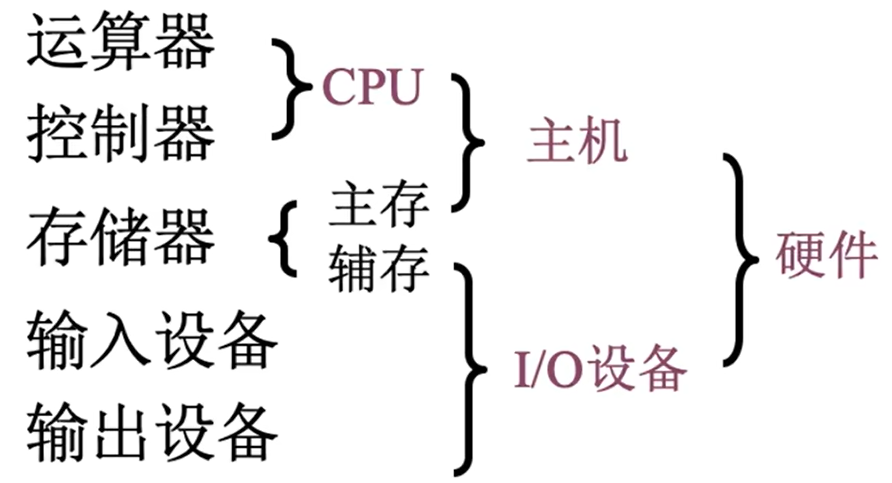

- **冯诺依曼结构**：以运算器为中心
- **现代计算机结构**：以存储器为中心

- **各硬件部件的工作原理**
  - 各硬件部件
    - 主存：存储体、$\text{MAR}$、$\text{MDR}$
    - 运算器：$\text{ACC}$、$\text{MQ}$、$\text{X}$、$\text{ALU}$
    - 控制器：$\text{PC}$、$\text{IR}$、$\text{CU}$
  - 工作过程
    - 初始：指令、数据存入主存，$\text{PC}$ 指向第一条指令
    - 从主存中取指令放入 $\text{IR}$ ，$\text{PC}$ 自动加 $1$ ，$\text{CU}$ 分析指令，$\text{CU}$ 指挥其它部件执行指令

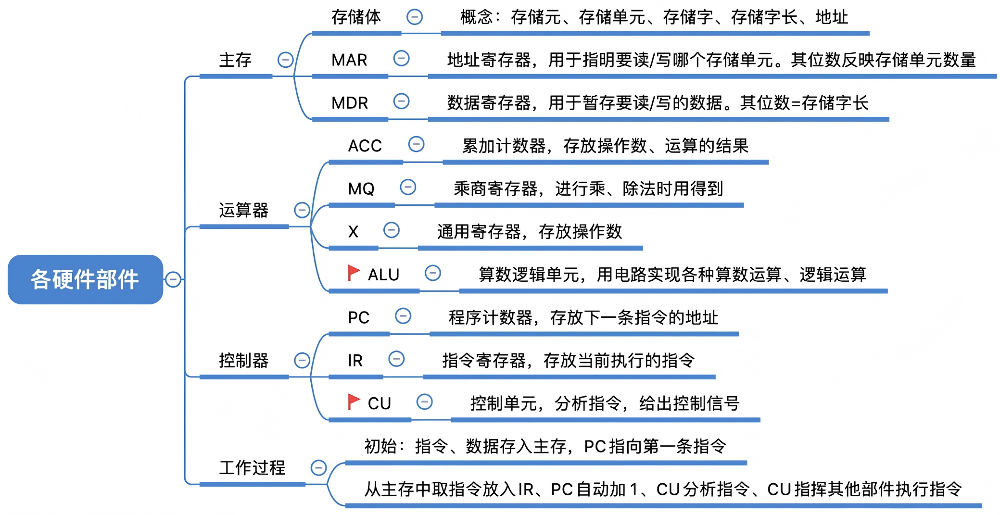

- **计算机软件**
  - **系统软件**：用来管理整个计算机系统
    - 如：操作系统、数据库管理系统、标准程序库、网络软件
  - **应用软件**：按任务需要编制成的各种程序

- **三种级别的语言**
  - **机器语言**：二进制代码
  - **汇编语言**：助记符
  - **高级语言**：编译型语言（$\text{C}$、$\text{C++}$）、解释型语言（$\text{JavaScript}$、$\text{Python}$、$\text{Shell}$）

- **翻译程序**
  - **汇编器**：将汇编语言程序翻译成机器语言程序
  - **解释器**：将源程序中的语句按执行顺序逐条翻译成机器指令并立即执行
  - **编译器**：将高级语言程序翻译成汇编语言或机器语言程序

- **从源程序到可执行文件**

  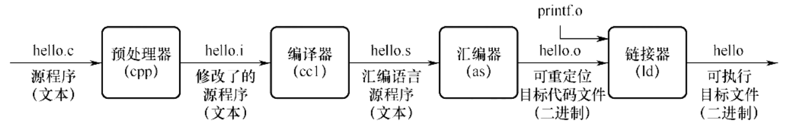

### 1.3 计算机的性能指标

- **机器字长**：计算机进行一次整数运算所能处理的二进制数据的位数
  - 字长一般等于寄存器的位数或 $\text{ALU}$ 的宽度
  - $32$ 位，$64$ 位机器的 “ $32$ ”  “ $64$ ” 指的就是机器字长

- **数据通路带宽**：数据总线一次所能并行传送信息的位数

- **主存容量**：主存储器所能存储信息的最大容量
  - $\text{MAR}$ 的位数反映了存储单元的个数
  - $\text{MDR}$ 的位数反映了存储单元的字长

- **$\text{CPU}$ 的性能指标**

  - **$\text{CPU}$ 时钟周期**：$\text{CPU}$ 中最小的时间单位

  - **主频（ $\text{CPU}$ 时钟频率）**
    $$
    主频 = \frac{1}{时钟周期}
    $$

  - **$\text{CPI}$**：执行一条指令所需的时钟周期数

  - **$\text{IPS}$**：每秒执行多少条指令
    $$
    \text{IPS} = \frac{主频}{\text{CPI}_{平均}}
    $$

  - **$\text{FLOPS}$**：每秒执行多少次浮点运算

  - **$\text{CPU}$ 执行时间**
    $$
    \text{CPU} \ 执行时间 = \frac{\text{CPU} \ 时钟周期数}{主频} = \frac{指令条数 \times \text{CPI}}{主频}
    $$

    - 上式表明，$\text{CPU}$ 的性能取决于：主频、$\text{CPI}$、指令条数

## 二、数据的表示和运算

### 2.1 数制与编码

- **进位计数法**

  - 一个 $r$ 进制数（$K_{n}K_{n-1} \ldots K_{0}K_{-1} \ldots K_{-m}$）的数值可表示为：
    $$
    K_{n}r^{n} + K_{n-1}r^{n-1} + \ldots + K_{0}r^{0} + K_{-1}r^{-1} + \ldots + K_{-m}r^{-m} = \sum_{i=n}^{-m} K_ir^i
    $$

- **定点数的编码表示**

  - > 定点数：小数点的位置固定，如 $996.007$
    >
    > 浮点数：小数点的位置不固定，如 $9.96007 \times 10^2$

  - **无符号数**：整个机器字长的全部二进制位均为数值位，没有符号位

  - **有符号数**

    - **原码**：用机器数的最高位表示数的符号，其余各位表示数的绝对值

      > 如，$x_1=+1110,x_2=-1110$，字长为 $8$ 位，则其原码表示为 $[x_1]_原=00001110,[x_2]_原=10001110$

    - **反码**：正数的反码与原码相同，负数的反码为原码将数值位全部取反

      > 如，$x_1=+10011,x_2=-10011$，字长为 $8$ 位，则其反码表示为 $[x_1]_反=00010011,[x_2]_反=11101100$

    - **补码**：正数的补码与原码相同，负数的补码为反码 $+1$

      对向量 $\vec{x} = [x_{w-1}, x_{w-2}, \ldots , x_0]$ ，
      $$
      B2T_w(\vec{x}) = -x_{w-1}2^{w-1} + \sum_{i=0}^{w-2}x_i2^i
      $$

      > 如，$x_1=+10011,x_2=-10011$，字长为 $8$ 位，则其补码表示为 $[x_1]_补=00010011,[x_2]_补=11101101$

    - **移码**：在补码的基础上，将符号位取反

- **$\text{C}$ 语言中的整数类型及类型转换**

  - > $\text{C}$ 语言中的定点整数是用**补码**存储的

    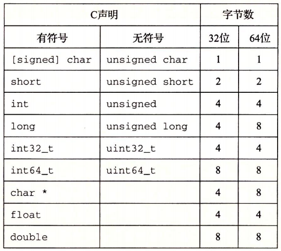

  - **强制类型转换**

    - 无符号数与有符号数：不改变数据内容，改变解释方式
    - 长整数变短整数：高位截断，保留低位
    - 短整数变长整数：符号扩展

- **零扩展和符号扩展**
  - 零扩展：适用于无符号整数，用 $0$ 扩展高位
  - 符号扩展：适用于带符号整数（补码），用符号位扩展高位

### 2.2 运算方法与运算电路

### 2.3 浮点数的表示与运算

- **浮点数的表示**
  $$
  V = (-1)^s \times M \times 2^E
  $$

  - **符号**：$s$ 决定这数是负数 $(s=1)$ 还是正数 $(s=0)$
    - 一个单独的符号位 $s$ 直接编码符号 $s$
  - **阶码**：$E$ 的作用是对浮点数加权，权重是 $2$ 的 $E$ 次幂
    - $k$ 位的阶码字段 $\text{exp}=e_{k-1} \ldots e_1e_0$ 编码阶码 $E$
  - **尾数**：$M$ 是一个二进制小数，范围是 $1\sim2 - \epsilon$，或者是 $0 \sim 1 - \epsilon$
    - $n$ 位的小数字段 $\text{frac}=f_{n-1} \ldots f_1f_0$ 编码尾数 $M$

- **浮点数编码的值**
  - 情况 $1$：规格化的值：当 $\text{exp}$ 的位模式既不全为 $0$，也不全为 $1$ 时
    - $E=e-Bias,Bias=2^{k-1}-1,M=1+f$
  - 情况 $2$：非规格化的值：当 $\text{exp}$ 的位模式全为 $0$ 时
    - $E=1-Bias,M=f$
  - 情况 $3$：特殊值：当 $\text{exp}$ 的位模式全为 $1$ 时
    - 小数位全为 $0$ 时：$s=0$ 时为 $+ \infty$，$s=1$ 时为 $- \infty$
    - 小数位为非零时：为 $\text{NaN}$
  
- **$\text{IEEE 754}$ 标准**

  - 在**单精度浮点格式**（$\text{C}$ 语言中的 $\text{float}$）中，$s$、$exp$ 和 $frac$ 字段分别为 $1$ 位、$k=8$ 位和 $n=23$ 位，得到一个 $32$ 位的表示

  - 在**双精度浮点格式**（$\text{C}$ 语言中的 $\text{double}$）中，$s$、$exp$ 和 $frac$ 字段分别为 $1$ 位、$k=11$ 位和 $n=52$ 位，得到一个 $64$ 位的表示

    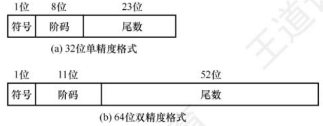

- **浮点数的表示范围**

  - 对于单精度浮点格式的规格化数，范围是 $[-(2-2^{-23})\times2^{127},-2^{-126}]\cup[2^{-126},(2-2^{-23})\times2^{127}]$

  - 对于单精度浮点格式的非规格化数，范围是 $[-\frac{2^{23}-1}{2^{23}}\times2^{-126},-2^{-149}]\cup[2^{-149},\frac{2^{23}-1}{2^{23}}\times2^{-126}]$

  - 当运算结果大于最大正数时称为**正上溢**，小于绝对值最大负数时称为**负上溢**，正上溢和负上溢统称**上溢**

    - 数据上溢时，用 $+ \infty$ 和 $- \infty$ 表示

  - 当运算结果在 $0$ 至最小正数之间时称为称为**正下溢**，在 $0$ 至绝对值最小负数之间时称为**负下溢**，正下溢和负下溢统称**下溢**

    - 数据下溢时，浮点数值趋近于 $0$，计算机将其当做机器零处理

    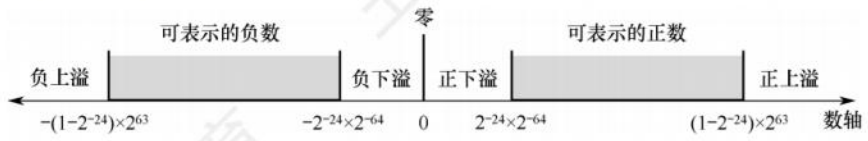

- **数据的大小端存储**
  - **大端法**：先存储高位字节，后存储低位字节
  - **小端法**：先存储低位字节，后存储高位字节（低位在低地址）

- **数据对齐**
  - 结构体的首地址必须是最大元素字节数的整数倍
  - 结构体中每个数据的地址必须是自身字节数的整数倍
  - 结构体的总体长度必须是最大元素字节数的整数倍

## 三、存储系统

### 3.1 存储器概述

- **存储器的分类（按层次分类）**
  - **高速缓存**（$\text{Cache}$）
  - **主存储器**（主存）
    - $\text{Cache}$ 和主存可以直接被 $\text{CPU}$ 读写
  - **辅助存储器**（辅存、外存）

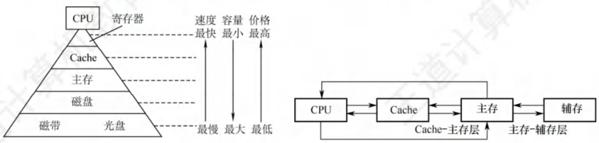

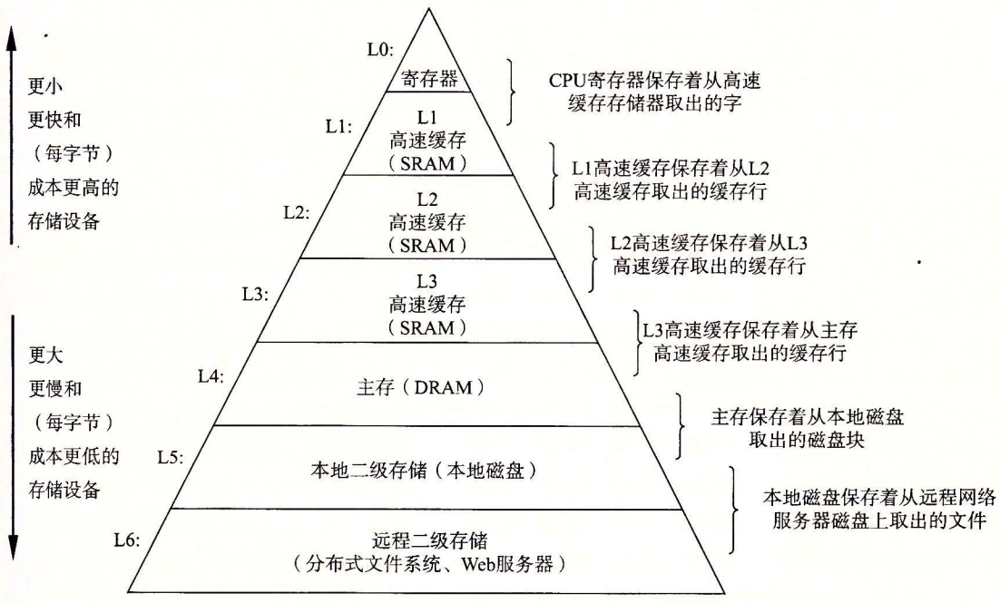

- **存储器的分类（按介质分类）**
  - 半导体存储器：主存、$\text{Cache}$
  - 磁表面存储器：磁盘、磁带
  - 光存储器：光盘

- **存储器的分类（按存取方式分类）**
  - **随机存储器（$\text{RAM}$）**：读写任何一个存储单元所需时间都相同，与存储单元所在的物理位置无关
    - 如内存、$\text{Cache}$
  - **只读存储器（$\text{ROM}$）**：只能随机读出而不能写入
    - 如 $\text{CD-ROM}$
  - **串行访问存储器**：读写某个存储单元所需时间与存储单元的物理位置有关
    - 顺序存取存储器（$\text{SAM}$）
    - 直接存取存储器（$\text{DAM}$）
  - **相联存储器（$\text{CAM}$）**：按照内容检索到存储位置进行读写
    - 如快表（$\text{TLB}$）

- **存储器的分类（按信息的可保存性分类）**
  - **易失性存储器**
    - 如 $\text{RAM}$
  - **非易失性存储器**
    - 如 $\text{ROM}$，磁表面存储器、光存储器

- **存储器的性能指标**
  - 存储容量：$存储字数 \times 字长$
  - 单位成本：$每位价格 = \frac{总成本}{总容量}$
  - 存储速度：$数据传输率 = \frac{数据的宽度}{存储周期}$

### 3.2 主存储器

- **主存**：**存储体**、**$\text{MAR}$**、**$\text{MDR}$**

  - 基本元件：$\text{MOS}$ 管、电容

    

- **$\text{SRAM}$ 芯片和 $\text{DRAM}$ 芯片**

  - $\text{SRAM}$，即静态 $\text{RAM}$，用于 $\text{Cache}$，读出后不需要重写，运行速度快

  - $\text{DRAM}$，即动态 $\text{RAM}$，用于主存，读出后需要重写，运行速度慢

    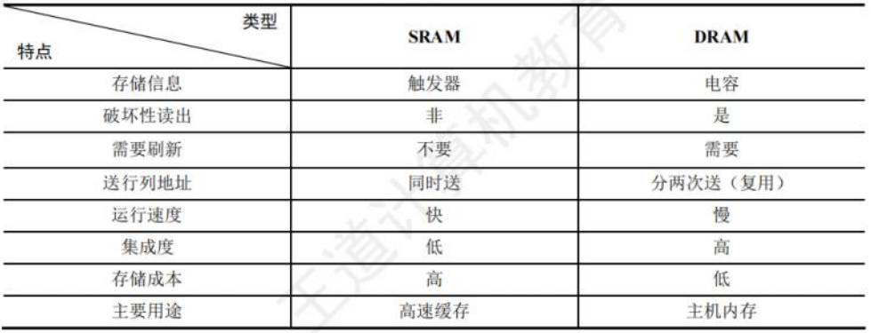

- **$\text{ROM}$ 芯片的分类**
  - 掩膜式只读存储器（$\text{MROM}$）
  - 一次可编程只读存储器（$\text{PROM}$）
  - 可擦除可编程只读存储器（$\text{EPROM}$）
  - 闪速存储器（$\text{Flash Memory}$）
  - 固态硬盘（$\text{SSD}$）
    - 很多 $\text{ROM}$ 芯片虽然名字是 “ 只读存储器 ”，但很多 $\text{ROM}$ 也可以写

### 3.3 主存储器与 $\text{CPU}$ 的连接

### 3.4 外部存储器

- **磁盘存储器**
  - 组成：磁盘驱动器、磁盘控制器、盘片
    - 存储区域：磁头、柱面、扇区
  - 性能指标
    - 容量
    - 记录密度
    - 平均存取时间：寻道时间 + 旋转延迟时间 + 传输时间
    - 数据传输率
  - 磁盘地址：驱动器号 | 柱面号 | 盘面号 | 扇区号
  - 独立冗余磁盘阵列（$\text{RAID}$）
- **固态硬盘（$\text{SSD}$）**
  - 原理：基于闪存技术 $\text{Flash Memory}$，属于电可擦除 $\text{ROM}$，即 $\text{EEPROM}$
  - 组成：闪存翻译层、存储介质
  - 与机械硬盘相比的特点：$\text{SSD}$ 读写速度快，安静无噪音，但一个 “块” 被擦除次数过多（重复写一个块）可能会坏掉，而机械硬盘不会因为写的次数太多而坏掉

### 3.5 高速缓冲存储器（$\text{Cache}$）

- **$\text{Cache}$ 工作原理**：将某些主存块复制到 $\text{Cache}$ 中，缓和 $\text{CPU}$ 与主存之间的速度矛盾
- **局部性原理**
  - **时间局部性**：现在访问的地址，不久之后也很可能被再次访问
  - **空间局部性**：现在访问的地址，其附近的地址也很可能即将被访问

- **$\text{Cache}$ 中存储的信息**

  - **有效位（$0/1$）$+$ 标记位 $+$ 整块数据**

  - 标记位用于指明对应的内存块，不同的映射方式，标记的位数不同

  - 高速缓存的结构可以用元组 $(S,E,B,m)$ 来表示，$\text{Cache}$ 的大小 $C = S\times E \times B$

    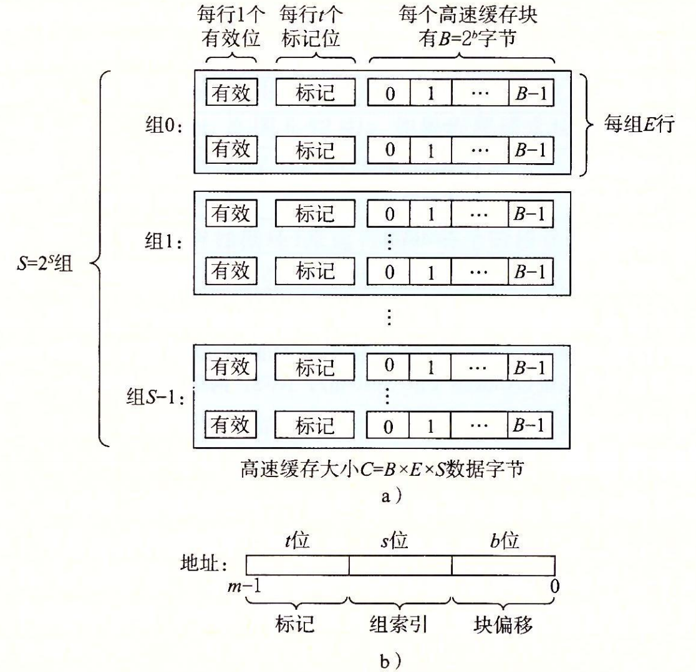

    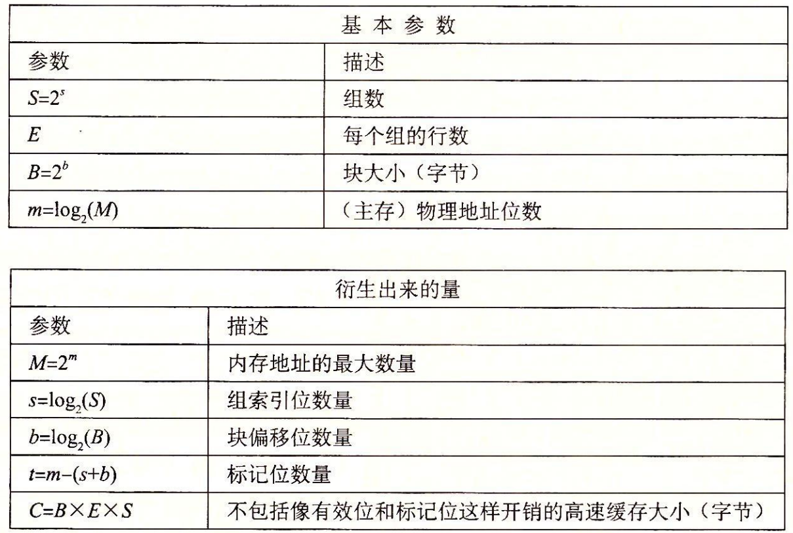

- **$\text{Cache}$ 和主存的映射方式**

  - **全相联映射**：主存块可以放到 $\text{Cache}$ 的任意位置
  - **直接映射**：每个组只有一行，主存块只能放到特定的某个 $\text{Cache}$ 行，行号 $=$ 主存块号 $\%$ 总行数
  - **组相连映射**：主存块可以放到特定分组中的任意位置，所属组号 $=$ 主存块号 $\%$ 总组数

- **$\text{Cache}$ 替换算法**
  - 随机算法（$\text{RAND}$）
  - 先进先出算法（$\text{FIFO}$）
  - 最近最少使用算法（$\text{LRU}$）$\star$：将最久没有被访问过的主存块替换
  - 最近不经常使用算法（$\text{LFU}$）：将被访问次数最少的主存块替换

- **$\text{Cache}$ 写策略（$\text{Cache}$ 一致性问题）**
  - **写命中**
    - 全写法：当 $\text{CPU}$ 对 $\text{Cache}$ 写命中时，必须把数据同时写入 $\text{Cache}$ 和主存
    - 回写法：当 $\text{CPU}$ 对 $\text{Cache}$ 写命中时，只修改 $\text{Cache}$ 的内容，而不立即写入主存。只有当此块被换出时才写回主存
  - **写不命中**
    - 写分配法：当 $\text{CPU}$ 对 $\text{Cache}$ 写不命中时，把主存中的块调入 $\text{Cache}$，在 $\text{Cache}$ 中修改
    - 非写分配法：当 $\text{CPU}$ 对 $\text{Cache}$ 写不命中时，只写入主存，不调入 $\text{Cache}$
  - 现代计算机通常采用多级 $\text{Cache}$ 结构，各级 $\text{Cache}$ 间常采用 “全写法 $+$ 非写分配法” ，$\text{Cache}$ 和主存间常采用 “回写法 $+$ 写分配法”

## 四、指令系统

### 4.3 程序的机器级代码表示

- **汇编代码格式**
  - **$\text{AT\&T}$ 格式**（$\text{CSAPP}$ 所使用的汇编代码格式）
    - 源操作数在左，目的操作数在右
    - 主要适用于 $\text{Unix}$，$\text{Linux}$ 操作系统
  - **$\text{Intel}$ 格式**
    - 源操作数在右，目的操作数在左
    - 主要适用于 $\text{Windows}$ 操作系统

### 4.4 $\text{CISC}$ 和 $\text{RISC}$ 的基本概念

- **指令集架构**
  - **$\text{CISC}$（复杂指令集计算机）**：一条指令完成一个复杂的基本功能
    - 代表：$\text{Intel}$ 芯片的 $\text{x86}$ 架构
  - **$\text{RISC}$（精简指令集计算机）**：一条指令完成一个基本动作，多条指令完成一个复杂的基本功能
    - 代表：$\text{ARM}$ 芯片的 $\text{ARM}$ 架构

## 五、中央处理器

## 六、总线

### 6.1 总线概述

- **总线**：**一组能为多个部件分时共享的公共信息传送线路**
- **总线的特点**
  - **分时**：同一时刻只允许有一个部件向总线发送信息，如果系统中有多个部件，则它们只能分时地向总线发送信息
  - **共享**：总线上可以挂接多个部件，各个部件之间互相交换的信息都可以通过这组线路分时共享
- **总线的分类**
  - 按数据传输方式分类
    - **串行总线**：只有一条双向传输或两条单向传输的数据线，适合长距离通信，效率低于并行总线
    - **并行总线**：有多条双向传输的数据线，适合近距离通信，效率高于串行总线
  - 按功能层次分类
    - **片内总线**：芯片内部的总线，用于 $\text{CPU}$ 芯片内部各寄存器之间及寄存器与 $\text{ALU}$ 的连接
    - **系统总线 $\star$**：**计算机系统内各功能部件之间相互连接的总线**，按传输信息内容的不同，又可分为**数据总线**、**地址总线**、**控制总线**
    - **$\text{I/O}$ 总线**
    - **通信总线**：计算机系统之间或计算机系统与其他系统之间传输信息的总线
  - 按时序控制方式分类
    - 同步总线
    - 异步总线

- **系统总线的结构**

  - **单总线结构**

    - $\text{CPU}$、主存、$\text{I/O}$ 设备都连接在**一组**总线上

    - 优点：结构简单，成本低，易于接入新的设备

    - 缺点：带宽低，负载重，多个部件只能争用唯一的总线，且不支持并行传送操作

      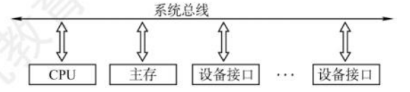

      > 单总线并不是指只有一根信号线，系统总线按传送信息的不同可以细分为地址总线、数据总线、控制总线

  - **双总线结构**

    - 有两条总线，一条是**主存总线**，用于 $\text{CPU}$、主存和通道之间进行数据传送；另一条是 **$\text{I/O}$ 总线**，用于多个外部设备与通道之间的数据传送

      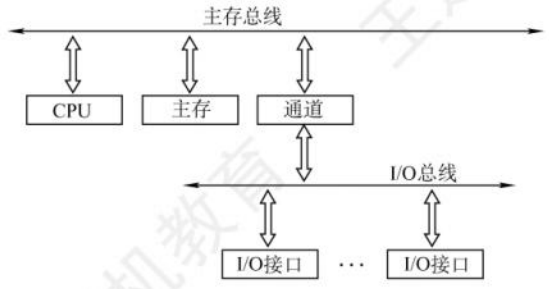

  - **三总线结构**

    - 在计算机系统各部件之间采用三条各自独立的总线来构成信息通路，分别是**主存总线**、**$\text{I/O}$ 总线**和**直接内存访问（$\text{DMA}$）总线**

      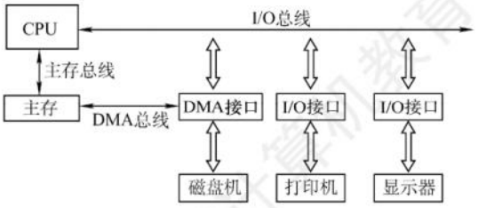

- **总线的性能指标**
  - 总线带宽
  - 总线宽度
  - 总线工作频率
  - ……

- **总线标准**：国际上公布的互联各个模块的标准
  - 系统总线标准：$\text{ISA}$、$\text{EISA}$、$\text{FBS}$
  - 局部总线标准：$\text{VESA}$、$\text{PCI}$、$\text{PCIe}$
  - 设备总线标准：$\text{USB}$、$\text{PCMCIA}$

### 6.2 总线事务和定时

- **总线事务**
  - 请求阶段
  - 仲裁阶段
  - 寻址阶段
  - 传输阶段
  - 释放阶段

- **总线定时**：总线在双方交换数据的过程中需要时间上配合关系的控制（实质是一种协议或规则）
  - 同步定时方式
  - 异步定时方式：不互锁方式、半互锁方式、全互锁方式
  - 半同步定时方式
  - 分离式定时方式

## 七、输入/输出系统

