# 计算机网络复习笔记[^1] [^2]

[TOC]

## 一、计算机网络与因特网

- **计算机网络由若干结点和连接这些结点的链路组成**
- **协议**：对等的实体在通信过程中应该遵守的规则
  - 协议由语法、语义、同步三部分组成
- RFC：请求评论，因特网工程任务组（IETF）的标准文档

### 1.1 网络边缘

- **接入网**：将端系统物理连接到其边缘路由器的网络

- 因特网使用的**物理媒介**：
  - **导引型媒介**
    - 双绞铜线
    - 同轴电缆
    - 光纤
  - **非导引型媒介**
    - 陆地无线电信道
    - 卫星无线电信道

### 1.2 网络核心

- **分组交换**：存储转发传输，存在排队时延和分组丢失，分为**虚电路**和**数据报**

  - **优点**：

    - 无建立时延
    - 线路利用率高
    - 相比于报文交换，减少了出错概率和重发数据量

  - **缺点**：

    - 存在存储转发时延
    - 需要传输额外的信息量
    - 可能出现乱序、丢包或重复分组的情况

  - $P$ 个分组经过 $N$ 条链路的传输时延为：
    $$
    d_{end-end} = (P+N-1)\frac{L}{R}
    $$

- **电路交换**：在两台主机之间创建一条专用的端到端连接，分为**频分复用**（FDM）和**时分复用**（TDM）
  
  - **优点**：
    - 通信时延小
    - 有序传输，没有冲突
    - 实时性强
  - **缺点**：
    - 建立时延长
    - 线路利用率低
    - 灵活性差
    - 难以实现差错控制

- 分组交换网络
  - **数据报网络**
    - 每个分组都带有目标地址，目标地址决定下一跳
    - 在不同的阶段，路由可以改变
    - 无连接
  - **虚电路网络**
    - 每个分组都带有标签（虚电路标识 VC ID），标签决定下一跳
    - 在呼叫建立时决定路由，在整个呼叫中路由保持不变
    - 有连接

### 1.3 分组交换网中的时延、丢包和吞吐量

- **计算机网络的性能指标**：**速率**、**带宽**、**吞吐量**、**时延**、**时延带宽积**、**往返时延**、**信道利用率**

- **节点总时延 = 处理时延 + 排队时延 + 传输时延 + 传播时延**
  $$
  d_{nodal} = d_{proc}+d_{queue}+d_{trans}+d_{prop}
  $$
  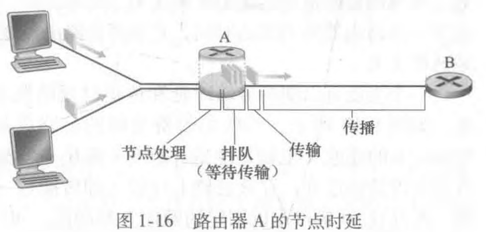

  - （计算时，区分传输时延与传播时延，区分 B 和 b ，1B = 8 bit）

- **流量强度**：$\frac{La}{R}$ （所有分组由 $L$ bit 组成， $R$ 为传输速率， $a$ 为到达分组的平均速率）
  - 流量强度不能大于 $1$

- **时延带宽积**：指发送端发送的第一个比特即将到达终点时，发送端已发出的比特数

- **丢包**

  - 原因
    - 网络拥塞
    - 链路故障
    - 无线信号干扰
    - 网络设备故障

- **带宽**：最高数据传输速率

- **吞吐量**：在源端和目标端之间的实际数据传输速率

  - 取决于瓶颈链路的传输速率 $min\{R1,R2,R3\}$ ，而且也受到干扰流量的影响
  - 分为瞬时吞吐量和平均吞吐量

### 1.4 协议层次及其服务模型

- **协议栈**：5 个层次，**应用层**（报文）、**传输层**（报文段）、**网络层**（数据报）、**链路层**（帧）、**物理层**（位）
  - 功能如下，
    - 应用层：为用户提供网络应用服务
    - 传输层：主机之间的数据传输
    - 网络层：为数据报从源到目的选择路由
    - 链路层：相邻网络节点之间的数据传输
    - 物理层：在线路上传送 bit
  
- **ISO/OSI 参考模型**：7 个层次，应用层、表示层、会话层、传输层、网络层、链路层、物理层

  - 自下而上表示，物理层在第 1 层，应用层在第 7 层

  > - 表示层：数据的格式转换及压缩
  > - 会话层：在文件中插入检查点

- **TCP/IP 参考模型**：4 个层次，应用层、传输层、网络层、网络接口层

  > - ISO/OSI 模型在网络层支持无连接和面向连接的通信，在传输层仅有面向连接的通信
  > - TCP/IP 模型在网际层仅有一种无连接的通信模式，但传输层支持无连接和面向连接两种模式

## 二、应用层

### 2.1 网络应用原理

- 网络应用体系结构

  - **客户-服务器体系结构**（ $C/S$ )
    - 网络中各计算机的地位不平等
    - 客户之间不直接通信
    - 可扩展性差
    
  - **对等体系结构**（ $P2P$ ）
  
    - 减轻了服务器的计算压力，消除了对某个服务器的完全依赖
    - 客户之间可以直接共享文档
    - 可扩展性好
    - 网络健壮性强
  
- 发起通信的进程被标示为**客户**，在会话开始时等待联系的进程是**服务器**

- **套接字**：是同一台主机内应用层与传输层之间的接口

- 进程寻址：**主机（IP地址）**+**目的地端口号**

  - 常见应用层协议使用的端口号

    | 应用层协议 | 支撑的运输协议 | 端口号                       |
    | ---------- | -------------- | ---------------------------- |
    | HTTP       | TCP            | 80                           |
    | Telnet     | TCP            | 23                           |
    | FTP        | TCP            | 控制端口 21<br />数据端口 20 |
    | SMTP       | TCP            | 25                           |
    | POP3       | TCP            | 110                          |
    | IMAP       | TCP            | 143                          |
    | DNS        | UDP            | 53                           |

- 传输层协议的**四个衡量标准**：**可靠数据传输**、**吞吐量**、**定时**、**安全性**

- 因特网提供的传输层服务

  - **TCP**：有连接、可靠数据传输、拥塞控制机制

  - **UDP**：无连接、不可靠数据传输、无拥塞控制机制

    - > 使用 UDP 的原因：如因特网电话应用等使用 UDP，能够容忍某些丢失但要求达到一定最小速率才能工作，使用 UDP 从而避开 TCP 的拥塞控制机制和分组开销，提高用户体验

### 2.2 Web 和 HTTP

- **URL**：用于标识万维网上的各种文档，使每个文档在整个万维网范围内具有唯一的标识符 URL

- Web 的应用层协议是**超文本传输协议**（HTTP），它是 Web 的核心
- HTTP 使用 TCP 作为传输层协议，默认端口 80 ，特点如下，
  - **HTTP 本身是无连接的**（通信双方在交换 HTTP 报文之前不需要先建立 HTTP 连接）
  - **HTTP 是无状态的**
  - **HTTP 既可以使用非持续连接**（HTTP/1.0），**也可以使用持续连接**（HTTP/1.1）
    - 对于非持续连接，每个网页元素对象的传输都需要单独建立一个 TCP 连接
    - 对于持续连接，所有请求响应经一个单独的 TCP 连接发送

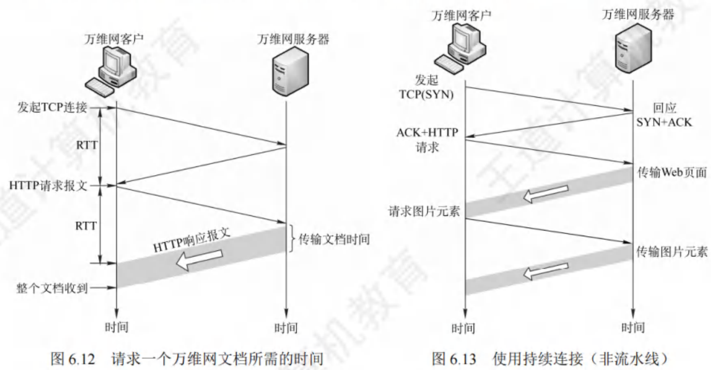

- 三次握手总的响应时间 $= 2 × RTT + t_{传输HTML文件时间} $

- HTTP 报文格式

  - **HTTP 请求报文**

    ```http
    GET /somdir/page.html HTTP/1.1 # 请求行
    Host: www.someschool.edu # 首部行
    Connection: close
    User-agent: Mozilla/5.0
    Accept-language: fr
    # 后面是实体体 ……
    ```

    请求行方法字段包括：

    - `GET` 获取资源
    - `POST` 发送数据
    - `HEAD` 只获取响应头，不获取实际内容
    - `PUT` 上传或更新资源
    - `DELETE` 删除资源

  - **HTTP 响应报文**

    ```http
    HTTP/1.1 200 OK # 状态行
    Connection: close # 首部行
    Date: Tue, 18 Gug 2015 15:44:04 GMT
    Server: Apache/2.2.3 (CentOS)
    Last-Modified: Tue, 18 Gug 2015 15:11:03 GMT
    Content-Length: 6821
    Content-Type: text/html
    (data data ......) # 实体体
    ```

    状态行状态码包括：

    - `200 OK` 请求成功，信息在返回的响应报文中
    - `202 Accepted` 请求成功，但尚未处理
    - `301 Moved Permanently` 请求的资源已被永久移动到新的 URL
    - `400 Bad Request` 错误的请求
    - `404 Not Found` 被请求的文档不在服务器上
    - `505 HTTP Version Not Supported` 不支持此版本

- HTTP 是一个无状态协议，服务器不保存用户的信息。使用 **cookie** 可以让服务器标识一个客户，提供服务
  
  - cookie 是一个存储在用户主机中的文本文件，但由服务器产生
  
  - cookie 有以下 $4$ 个组件，
    - 响应报文中的一个 cookie 首部行
    - 请求报文中的一个 cookie 首部行
    - 用户端系统中保留一个 cookie 文件，由浏览器管理
    - 位于 Web 站点的一个数据库，记录用户信息

- **Web 缓存器**：也叫代理服务器，是能够代表初始 Web 服务器来满足 HTTP 请求的网络实体
  
  - 原理：可以配置用户的浏览器，使用户的所有 HTTP 请求首先指向 Web 缓存器
  
  - Web 缓存器通常由 ISP 购买和安装
  - Web 缓存器既是服务器又是客户
  - 部署 Web 缓存器的好处：
    - （对用户）**可以大大减少对客户请求的响应时间**
    - （对机构）**能够大大减少一个机构的接入链路到因特网的通信量**
  - 条件 GET 方法

### 2.3 FTP 文件传输协议

- FTP 工作时使用两个并行的 TCP 连接，分别是**控制连接**（端口号 21）和**数据连接**（端口号 20）

### 2.4 电子邮件

- 电子邮件系统主要组成部分：**用户代理**、**邮件服务器**、**简单邮件传输协议**（SMTP）

- 电子邮件的收发过程：

  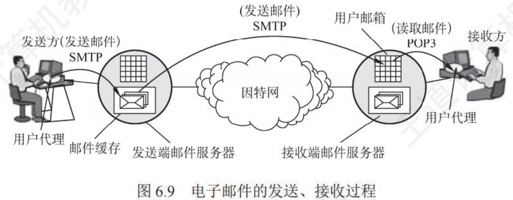

- **SMTP** 是一个**推协议**，用的是 **TCP** 连接，端口号为 **25**

- **POP3** 是一个**拉协议**，用的是 **TCP** 连接，端口号为 **110** （功能简单）

- **IMAP** 是一个**拉协议**，用的是 **TCP** 连接，端口号为 **143** （更为灵活，用户可实时查看，并在多个设备上同步邮件状态）

  > 今天，基于 Web 的邮件已经非常常见了。这种电子邮件，用户代理就是浏览器，用户和远程邮箱之间的通信通过 HTTP 进行。用户发送和获取电子邮件时，都通过 HTTP 协议在浏览器和邮件服务器之间进行报文传输，但是邮件服务器之间发送和接收报文仍然使用 SMTP

### 2.5 DNS

- **DNS**：**将主机名转换为 IP 地址**，协议运行在 **UDP** 上，使用 **53** 号端口

- DNS 除了进行主机名到 IP 地址的转换，还提供以下服务：
  - **主机别名**（DNS 可以获取别名对应的规范主机名和 IP 地址）
  - **邮件服务器别名**
  - **负载分配**

- DNS 工作原理

  - 使用单个 DNS 服务器有**单点故障**、**通信容量**、**远距离集中（高时延）**、**维护**等问题

  - 所以 DNS 采用了**分布式**的设计方案，分为四种：

    - **根 DNS 服务器**
    - **顶级域 DNS 服务器**
    - **权威 DNS 服务器**（本地 DNS 服务器不一定可以将其管辖的主机名转换为 IP 地址，但权威 DNS 服务器一定可以）
    - **本地 DNS 服务器**

  - 域名解析两种方式：

    - **递归查询**
    - **迭代查询**
      - 请求主机到本地 DNS 服务器的查询是递归的，其余查询是迭代的

    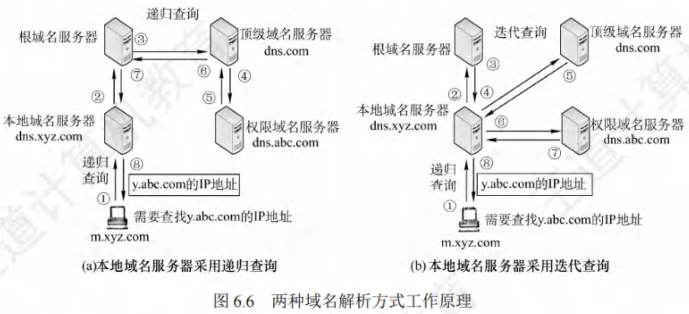

  - 为了改善时延性能和减少报文传输， DNS 还广泛使用了**缓存技术**

    - DNS 服务器会缓存主机名 / IP 地址对，一段时间后才丢弃缓存信息

- **DNS 记录和报文**
  
  - **资源记录**是一个包括下列字段的 $4$ 元组： $(Name, Value, Type, TTL)$ ，其中 TTL 是该记录的生成时间
    - 如果 $Type=A$ ：Name 是主机名，Value 是该主机对应的地址，一条类型为 A 资源记录提供了标准的主机名到 IP 地址的映射
    - 如果 $Type=NS$ ：Name 是一个域，Value 是知道如何获得该域中主机 IP 地址的权威 DNS 服务器的主机名
    - 如果 $Type=CNAME$ ：Value 是别名为 Name 的主机对应的规范主机名，该记录能够向主机提供一个主机名对应的规范主机名
    - 如果 $Type=MX$ ：Value 是个别名为 Name 的邮件服务器对应的规范主机名
  - **查询记录**方法：
    - 在 Windows 系统中，使用 `nslookup` 命令
    - 在 Linux 系统中，采用 `dig` 命令

### 2.6 P2P 文件分发

- **P2P 文件分发**：每个对等方能够向任何其他对等方重新分发他已经收到的文件的任何部分，从而在分发过程中协助该服务器

- **分发时间**：所有 $N$ 个对等方得到该文件的副本所需要的时间

  - $C / S$ 体系结构下的分发时间：
    $$
    D_{cs} = max\{\frac{NF}{u_s},\frac{F}{d_{min}}\}
    $$

  - $P2P$ 体系结构下的分发时间：
    $$
    D_{P2P} = max\{\frac{F}{u_s},\frac{F}{d_{min}},\frac{NF}{u_S + \sum_{i=1}^{N} u_i}\}
    $$

- BitTorrent 是一种用于文件分发的流行 P2P 协议
  - 待补充 ……

- **覆盖网络**：P2P 文件共享系统中的覆盖网络由参与文件共享系统的节点和节点之间的逻辑链接组成，如果 A 和 B 之间有一个半永久的 TCP 连接，则从节点 A 到节点 B 有一个逻辑链路
  - 覆盖网络不包括路由器

### 2.7 视频流和内容分发网

- **DASH**：经 HTTP 的动态适应流
  - **在 DASH 中，视频被编码为几个不同的版本，其中每个版本具有不同的比特率，对应不同的质量水平**
    - 可用带宽较高时，用户选择高比特率
    - 可用带宽较低时，用户选择低比特率

- **CDN**：内容分发网
  - 通过将内容缓存到全球各地的边缘服务器，使用户能够从**最近的节点**快速获取数据

## 三、运输层

- **传输层**为运行在不同主机上的进程之间提供**逻辑通信**
- 因特网提供了两种可用的传输层协议：**TCP**（传输控制协议），**UDP**（用户数据报协议）

### 3.1 多路复用与多路分解

- **多路复用**：从不同套接字中收集数据块，将数据块封装并添加首部信息产生报文段，并发送到网络层的过程
- **多路分解**：将运输层报文段中的数据交付到正确的套接字的工作

- **端口**与**端口号**
  - IP 地址标识的是主机，端口标识的是主机中的应用进程
  - 端口号是一个 16 bit 的数，大小在 0 ~ 65535 之间， 0 ~ 1023 为周知端口号

- 无连接的多路复用与多路分解
  - **UDP 套接字**由一个**二元组**标识（目的 IP 地址，目的端口号）

- 有连接的多路复用与多路分解
  - **TCP 套接字**由一个**四元组**标识（源 IP 地址，源端口号，目的 IP 地址，目的端口号）

### 3.2 无连接运输：UDP

- UDP 仅在 IP 层的数据报服务之上增加了复用和分解，以及差错检测
- UDP 协议的特点
  - 无需建立连接
  - 无连接状态
  - 分组首部开销小
  - 没有拥塞控制
  - 支持一对一、一对多、多对一和多对多的交互通信

- **UDP 报文段结构**

  - 首部有 **8 字节**，由 4 个字段组成：**源端口号**，**目的端口号**，**长度**，**检验和**。每个字段都是 2 字节

    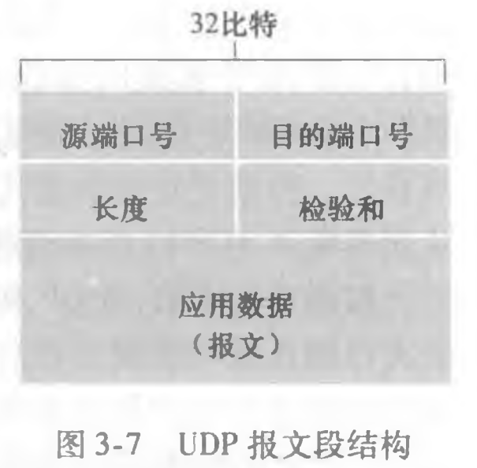

- **UDP 检验和**提供了**差错检测**功能
  - 发送方对报文段中的所有 16 比特字的和进行反码运算，求和时遇到的任何溢出都被回卷
  - 接收方将全部的 16 比特字（包括检验和）加在一起，若无差错，和将是 0xFFFF

### 3.3 可靠数据传输原理

- **可靠数据传输协议**（rdt）：检验和，序号，定时器，肯定和否定
  - **经完全可靠信道的可靠数据传输：rdt1.0**
  - **经具有比特差错信道的可靠数据传输：rdt2.0**
    - 分组中的比特可能受损的模型
    - 自动重传请求协议（ARQ）功能：差错检测、接收方反馈、重传
    - **rdt2.1**：考虑确认分组 ACK 或 NAK 受损的情况，对数据分组编序号
    - **rdt2.2**：用 ACK 1 代替 NAK
  - **经具有比特差错的丢包信道的可靠数据传输：rdt3.0**
    - 底层信道可能丢包的模型
    - 设置倒计时计数器

- **流水线可靠数据传输协议**：不以停等方式运行，允许发送方发送多个分组而无需等待确认
  - 必须增加序号范围
  - 发送方和接收方两端需要缓存多个分组
  - 需要处理丢失、损坏及延时过大的分组（回退 N 步，选择重传）

- **回退 N 步**（GBN）
  - 优点：接收缓存简单，不需要缓存任何失序分组
  - 缺点：单个分组的差错就能够引起 GBN 重传大量分组
- **选择重传**（SR）
  - 优点：避免了不必要的重传

### 3.4 面向连接的运输：TCP

- TCP 是在不可靠的 IP 层之上实现的可靠的数据传输协议

- **TCP 协议的特点**
  - 面向连接
  - 只能一对一连接
  - 可靠数据传输
  - 全双工通信
  - 面向字节流

- $MSS$ 与 $MTU$ 

  - $MSS$：**最大报文段长度**
- $MTU$：**最大传输单元**
  - 联系：$MSS + 40 = MTU$（40 为 TCP 头部和 IP 头部的总大小）

- **TCP 报文段结构**

  - 首部有 **20 字节**

  - 序号和确认号

    - **序号**：该报文段首字节的字节流编号
    - **确认号**：主机 A 期望从主机 B 收到的下一字节的序号

    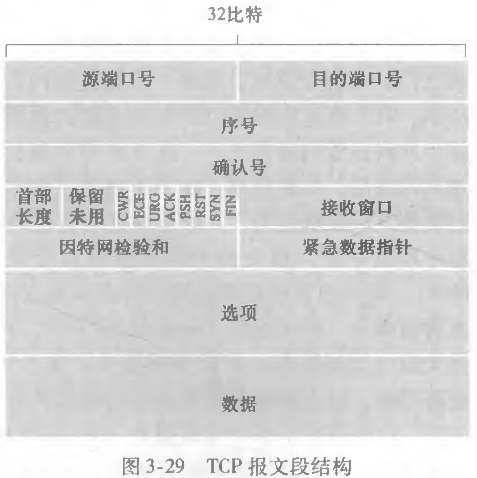

- 往返时间的估计与超时

  - **估计往返时间**
    $$
    EstimatedRTT = (1 - \alpha) \cdot EstimatedRTT + \alpha \cdot  SampleRTT
    $$

    - 这种平均被称为指数加权移动平均（EWMA）

  - **RTT 偏差**
    $$
    DevRTT = (1 - \beta) \cdot DevRTT + \beta \cdot |SampleRTT - EstimatedRTT|
    $$

  - **重传超时间隔**
    $$
    TimeoutInterval = EstimatedRTT + 4 \cdot DevRTT
    $$

- **TCP 使用检验、序号、确认和重传等机制实现可靠数据传输**

- **确认**

  - 确认号：主机 A 期望从主机 B 收到的下一字节的序号
  - **累积确认**：只确认数据流中至第一个至丢失字节为止的字节

- **重传**：有两种事件会导致 TCP 对报文段进行重传，**超时**和**冗余 ACK**
  - **超时**：TCP 每发送一个报文段，就对这个报文段设置一个超时计时器。计时器设置的重传时间到期但还未收到确认时，就重传这一报文段
    - 第一次设置的重传超时间隔是 $TimeoutInterval$
    - 每次重传时都会将下一次的超市间隔设为先前值的两倍
  - **冗余 ACK**
    - TCP 规定，每当比期望序号大的失序报文段到达时，就发送一个冗余 ACK
    - 如果 TCP 发送方接收到对相同数据的 3 个冗余 ACK ，就执行**快速重传**

- **TCP 流量控制**

  - TCP 要求发送方维持一个接收窗口（$rwnd$），接收方根据当前接收缓存的大小，动态调整接收窗口的大小，其大小反应了接收方的容量

  - 不允许已分配的缓存溢出：
    $$
    LastByteRcvd - LastByteRead ≤ RcvBuffer
    $$

    - $RcvBuffer$：接收方的接收缓存
    - $LastByteRcvd$：已到达接收缓存的最后一个字节
    - $LastByteRead$：读出的最后一个字节

  - 接收窗口（$rwnd$）大小：
    $$
    rwnd = RcvBuffer - (LastByteRcvd - LastByteRead)
    $$

  - 因此，**发送方需要将未确认的数据量控制在值 $rwnd$ 以内**
    $$
    LastByteSent - LastByteAcked ≤ rwnd
    $$

    - $LastByteSent$：已发送的最后一个字节
    - $LastByteAcked$：被确认的最后一个字节

    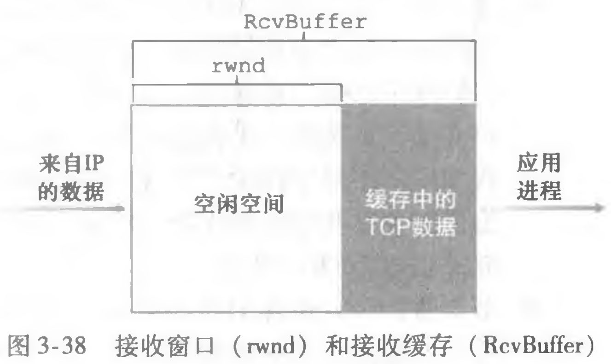

- **TCP 连接管理**

  - TCP 连接的建立：**"三次握手"**

    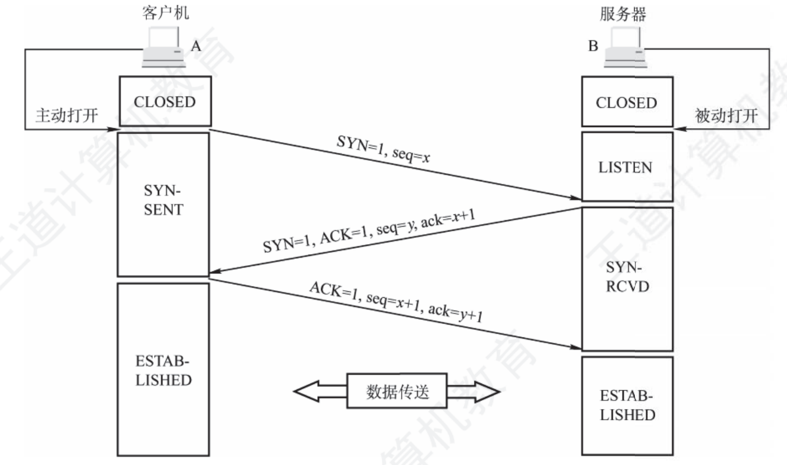

  - TCP 连接的释放：**"四次挥手"**

    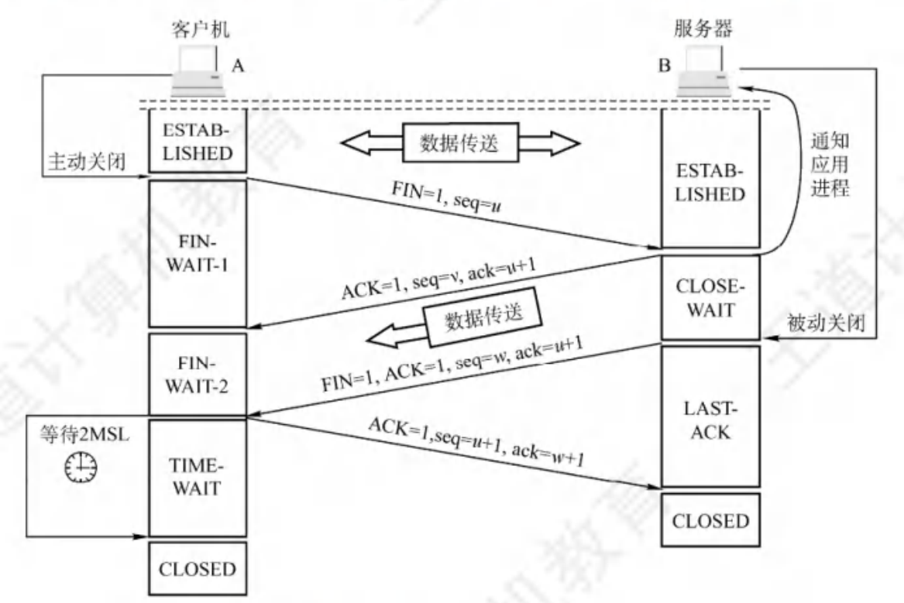

### 3.5 拥塞控制原理

- **拥塞原因与代价**
  - 情况 1：两个发送方和一台具有无穷大缓存的路由器
    - 当分组的到达速率接近链路容量时，分组经历巨大的排队时延
  - 情况 2：两个发送方和一台具有有限缓存的路由器
    - 当缓存已满，部分分组被丢弃，这将引起发送方的重传，此外，提前发生超时还可能导致发送方重传没有丢失的分组
  - 情况 3：4 个发送方和具有有限缓存的多台路由器及多跳路径
    - 在有许多跳的情况下，不同的链路中不同连接的载荷不同

- **拥塞控制方法**
  - **端到端拥塞控制**
  - **网络辅助的拥塞控制**（如明确拥塞通告）

- **拥塞控制与流量控制的区别**
  - 拥塞控制是让网络能够承受现有的网络负荷，是一个全局性的过程，涉及所有的主机，路由器
  - 流量控制是点对点的通信量的控制，是一个端到端的问题，目的是抑制发送端发送数据的速率，以便使接收端来得及接收

### 3.6 TCP 拥塞控制

- TCP 进行拥塞控制的算法有四种：**慢启动**、**拥塞避免**、**快速重传**和**快速恢复**。被称为 "加性增、乘性减" （AIMD）

- 发送窗口、接收窗口和拥塞窗口的关系
  $$
  LastByteSent - LastByteAcked ≤ min\{ cwnd,rwnd \}
  $$

  - 发送窗口：$LastByteSent - LastByteAcked$
  - 接收窗口：$rwnd$
    - 接收窗口的大小可根据 TCP 报文首部的窗口字段通知发送方
  - 拥塞窗口：$cwnd$

- **慢启动**
  - 当连接开始时，指数性增加（每个 RTT ）发送速率，直到发生丢失事件
    - 每过一个 RTT ，$cwnd$ 加倍
    - 等价表述：每收到一个 ACK ，$cwnd$ 加 1
  - 当出现超时丢包时，$cwnd$ 设置为 1，慢启动阈值 $ssthresh$ 值设置为检测到拥塞时的 $\left\lfloor cwnd/2 \right\rfloor$ ，重新开始慢启动
  - 当 $cwnd$ 到达或超过 $ssthresh$ 时，结束慢启动，进入拥塞避免模式（注意：若 $2cwnd>ssthresh$ ，则下一个 RTT 后的 $cwnd$ 等于 $ssthresh$ ，而不等于 $2cwnd$ ）
  - 当出现 3 个冗余 ACK 时， $ssthresh=\left\lfloor cwnd/2 \right\rfloor$，$cwnd=ssthresh+3MMS$ ，结束慢启动，进入快速恢复模式

- **拥塞避免**
  - 每经过一个 RTT 就把 $cwnd$ 加 1 ，而不是加倍
  - 当出现超时丢包时，$cwnd$ 设置为 1，慢启动阈值 $ssthresh$ 值设置为检测到拥塞时的 $\left\lfloor cwnd/2 \right\rfloor$ ，重新开始慢启动
  - 当出现 3 个冗余 ACK 时， $ssthresh=\left\lfloor cwnd/2 \right\rfloor$，$cwnd=ssthresh+3MMS$ ，结束拥塞避免，进入快速恢复模式


- **快速重传**
  - 如果 TCP 发送方接收到对相同数据的 3 个冗余 ACK ，就立即重传相应的报文段
- **快速恢复**
  - 对于每个冗余 ACK ， $cwnd$ 加 1 。在对丢失报文段的 ACK 到达后，$cwnd=ssthresh$ ，进入拥塞避免模式

- **TCP 拥塞控制算法**
  - TCP Tahoe：丢包全部按超时处理，进入慢启动
  - TCP Reno：包含快速恢复
  - TCP CUBIC：在拥塞避免阶段采用立方增长策略，主要用于 Linux 系统

- 吞吐量用丢包率（$L$）表示，一条连接的**平均吞吐量**为：$\frac{1.22 \cdot MSS}{RTT \cdot \sqrt{L}}$

- **明确拥塞通告**（ECN）
  - ECN 能够在数据包传输过程中向发送方和接收方提供网络拥塞的信息

- 公平性
  - 如果有多条 TCP 连接，通过同一段瓶颈链路，TCP 趋于给竞争的多条 TCP 连接提供平等的带宽共享
  - 现实中存在的不公平挑战：
    - 多媒体应用使用 UDP 连接压制 TCP 流量
    - Web 浏览器常使用并行连接传输多个对象

## 四、网络层：数据平面

- 网络层功能
  - **转发**：将分组从路由器的输入接口转发到合适的输出接口（数据平面）
  - **路由选择**：使用路由算法来决定分组从发送主机到目标接收主机的路径（控制平面）

- **数据平面（硬件）**
  - 本地，每个路由器的功能
  - 决定从路由器输入端口到达的分组如何转发到输出端口
  - 转发方式
    - 基于目的地转发
    - 泛化转发

- **控制平面（软件）**
  - 网络范围内的逻辑
  - 决定数据报如何在路由器之间路由，以及数据报从源到目标主机之间的端到端路径
  - 路由方式
    - 在路由器中实现
    - 在远程服务器中实现（SDN）

### 4.1 路由器工作原理

- **路由器体系结构**
  - 输入端口
  - 交换结构
  - 输出端口
  - 路由选择处理器

- 基于目的地的转发：**最长前缀匹配**

  - 在表中寻找最长的匹配项，向该项关联的接口转发分组

- **交换结构**
  
  - 经内存交换：在 CPU 直接控制下的交换
    - 一次只能转发 1 个分组
  - 经总线交换：数据报通过共享总线，从输入端口转发到输出端口
    - 一次只能转发 1 个分组
  - 经互联网络交换：同时并发转发多个分组，克服总线带宽限制
    - 一次可以转发多个分组
  
- 排队和缓存问题

  - **输入端口排队**

    - 当交换结构的速率小于输入端口的汇聚速率时，在输入端口可能要排队
    - 队列首部阻塞（HOL）：由于队列前面的受到竞争而阻塞，后面的即使不存在竞争也要等待

  - **输出端口排队**

    - 当交换结构的速率大于输出端口的汇聚速率时，在输出端口可能要排队
    - 弃尾：排队带来延迟，由于输出端口缓存溢出则丢弃数据报

  - **端口缓存大小**
    $$
    B = \frac{RTT \cdot C}{\sqrt N}
    $$

    - $B$ ：缓存大小
    - $C$ ：链路容量
    - $N$ ：N 条 TCP 流

- 分组调度
  - 先进先出（FIFO，FCFS）
  - 优先权排队
  - 循环和加权公平排队（RR，WFQ）

### 4.2 网际协议：IPv4、寻址、IPv6及其他

- **IPv4 数据报**

  - 首部有 **20 字节**

  - 首部字段

    - 版本
    - 首部长度：以 4 字节为单位
    - 总长度
    - 标识
    - **标志**：占 3 位，但后 2 位 MF 和 DF 才有意义。只有 DF = 0 时数据报才可被分片；MF = 1 表示原始数据报还有后续的片，MF = 0 表示该数据报是原始数据报的最后一个片
    - **片偏移**：以 8 字节为偏移单位
    - **生存时间（TTL）**：确保数据报不会永远在网络中循环。每经过一台路由器，TTL 就减 1 ，减到 0 则丢弃
    - 协议
    - 首部检验和
    - **源和目的地址**：占 32 比特

    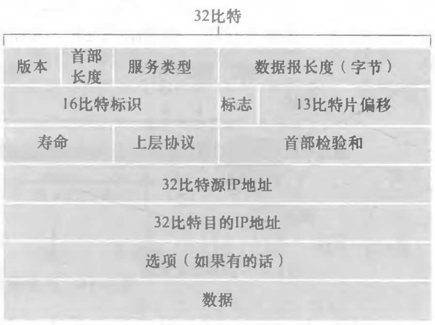

- **IP 数据报分片**
  - **MTU**（最大传输单元）：链路层帧所携带的最大数据长度

  - **因为片偏移的单值是 8B ，所以除了最后一个片外，其他所有片的数据部分都为 8B 的倍数**
  
    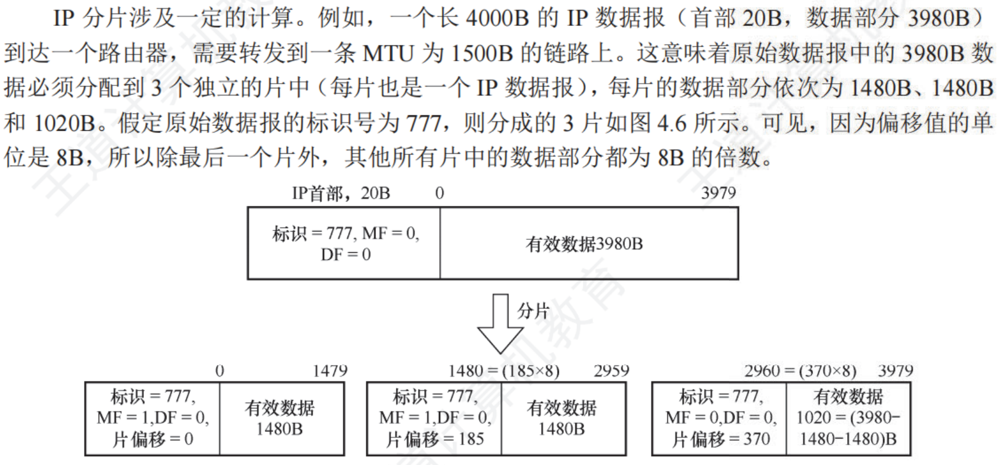
  
- **接口**：主机与物理链路之间的边界
  
  - 一个 IP 地址与一个接口相关联
  
- **IPv4 地址**
  - IP 地址长度为 **32 bit**
  - **子网**：IP 地址高位部分相同的节点（主机或路由器）构成的网络叫做子网
    - **子网掩码**
  - 私有 IP 地址
    - A 类：10.0.0.0 ~ 10.255.255.255
    - B 类：172.16.0.0 ~ 172.31.255.255
    - C 类：192.168.0.0 ~ 192.168.255.255
  - 特殊 IP 地址
    - 环回地址：127.x.x.x
    - 广播地址：255.255.255.255，报文会交付给同一网络中的所有主机
    - 零地址：0.0.0.0，表示本网络上的本主机

- **划分子网**

  - $IP 地址::=\{<网络号>,<子网号>,<主机号>\}$
  - **子网中主机号全 0 或全 1 的地址不能被指派**
    - 主机号全 0 的地址是子网的网络地址
    - 主机号全 1 的地址是子网的广播地址

- **无类别域间路由选择（CIDR）**：因特网的地址分配策略

  - 子网部分可以在任意的位置
  - 地址格式： $a.b.c.d/x$，其中 $x$ 是 地址中子网号的长度

- **动态主机配置协议（DHCP）**：允许主机在加入网络的时候，动态地从服务器那里获取一个 IP 地址

  - DHCP 工作过程

    - DHCP 发现报文（Discover）
    - DHCP 提供报文（Offer）
    - DHCP 请求报文（Request）
    - DHCP ACK 报文（ACK）

    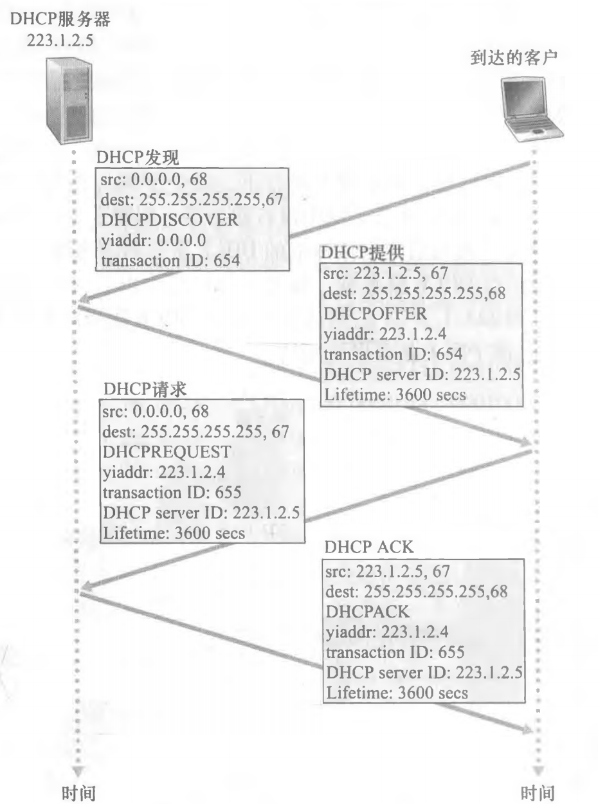

- **网络地址转换（NAT）**：将专用网络地址转换为公用地址

  - NAT 优点：本地网络只有一个有效的 IP 地址

  - **NAT 转换表**：WAN 端和 LAN 端的映射

  - NAT 缺点：

    - 违背了端到端原则
    - 端口数量有限

    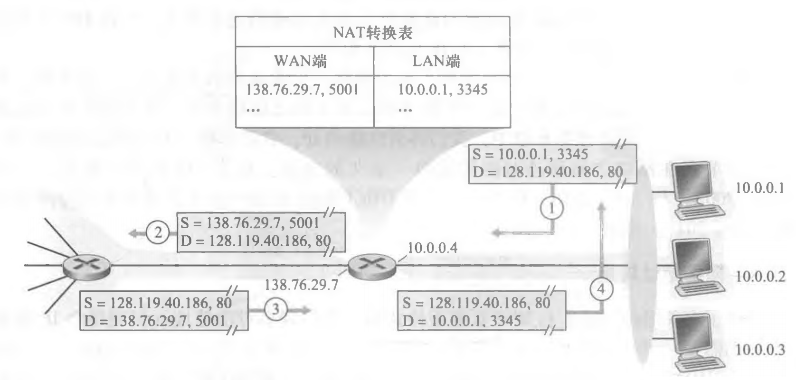

- **IPv6 数据报**
  - 首部有 **40 字节**
  - 只能在源主机进行分片，不允许在中间路由器上进行分片和组装（IPv4 允许在任何位置分片）
  - 取消了首部检验和
  - IPv4 到 IPv6 的迁移方法：建隧道
    - 在同时存在 IPv4 和 IPv6 路由器时，在 IPV4 路由器之间传输的 IPV4 数据报中封装 IPv6 数据报

- **IPv6 地址**
  - IP 地址长度为 **128 bit**

### 4.3 泛化转发和 SDN

- **泛化转发**：匹配 + 操作
  - **匹配**：对三个层次（链路层、网络层、传输层）的协议首部所选择的字段进行匹配
  - **操作**
    - 转发
    - 丢弃
    - 修改字段
  - 匹配 + 操作转发表在 OpenFlow 中称为**流表**

- **SDN 特点**
  - 基于流的匹配 + 操作
  - 控制平面和数据平面分离
  - 控制平面功能在数据交换设备之外实现
  - 可编程控制应用

## 五、网络层：控制平面

- 两种构建网络控制平面功能的方法
  - 传统方式：**每路由器控制**
    - 每台路由器运行一种路由选择算法
  - SDN 方式：**逻辑集中式控制**
    - 控制器与本地控制代理（CA）交互

### 5.1 路由选择算法

- **路由**：按照某种指标（传输延迟，所经过的站点数目等）找到一条从源节点到目标节点的较好路径

- **路由选择算法**：网络层软件的一部分，完成路由功能

- **路由选择算法的分类**
  - 集中式还是分散式
    - **集中式路由选择算法**：链路状态算法（LS）
    - **分散式路由选择算法**：距离向量算法（DV）
  - 静态还是动态
    - **静态路由选择算法**
    - **动态路由选择算法**
  - 负载敏感还是负载迟钝
    - **负载敏感算法**
    - **负载迟钝算法**

- **链路状态算法（LS）**
  - **使用 $Dijkstra$ 算法**
  
  - 存在问题：**拥塞敏感的路由选择震荡**

  - 解决方法：**避免自同步，让每台路由器发送链路通告的时间随机化**
  
    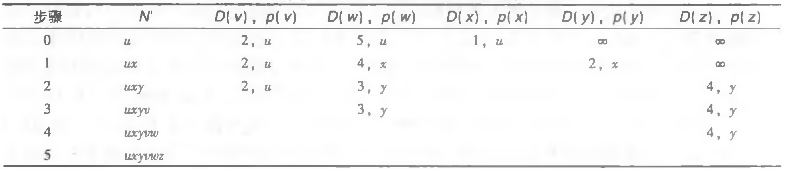
  
- **距离向量算法（DV）**

  - **使用 $Bellman-Ford$ 算法**
    $$
    D_x(y) = min_v\{ c(x, v) + D_v(y) \} \qquad 对 N 中的每个节点
    $$

  - 是迭代的、异步的、分布式的
  - 存在问题：**无穷计数问题**
    - 好消息传的快，坏消息传的非常慢
  - 解决方法：**增加毒性逆转**
    - 但涉及 3 个或更多节点的环路无法检测到

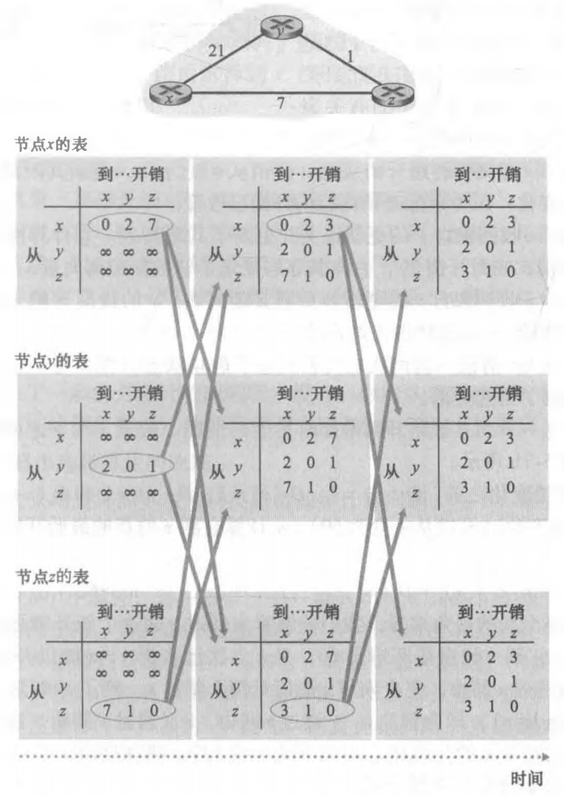

- **LS 与 DV 算法比较**
  - **消息复杂度**
    - LS：局部的路由信息，全局传播
    - DV：全局的路由信息，局部传播（更好）
  - **收敛时间**
    - LS：有可能震荡（更好）
    - DV：可能存在路由环路
  - **健壮性**
    - LS：错误信息影响较小（更好）
    - DV：错误可以扩散到全网

### 5.2 因特网中自治系统内部的路由选择

- **自治系统（AS）**：由一组处在相同管理控制下的路由器组成
  - 通常一个 ISP 中的路由器以及互联它们的链路构成一个 AS
- **自治系统内部路由选择协议**
  - 开放最短路优先（OSPF）
  - 路由信息协议（RIP）

- **开放最短路优先（OSPF）**
  - 是网络层协议
  - 基于链路状态算法（LS）
  - 根据总体开销进行路由选择
  - 优点：
    - 安全
    - 允许多条相同开销的路径
    - 对单播和多播路由选择的综合支持
    - 支持在单个 AS 中的层次结构

- **路由信息协议（RIP）**
  - 是应用层协议
  - 基于距离向量算法（DV）
  - 根据最少跳数进行路由选择

### 5.3 ISP 之间的路由选择

- **自治系统间路由选择协议**
  - 边界网关协议（BGP）
- **边界网关协议（BGP）**：不同自治系统（AS）之间交换路由信息的协议
  - 是应用层协议
  - 基于路径向量算法
    - 能够避免简单 DV 算法的路由环路问题

- **BGP 连接**：2 个 BGP 路由器在一个半永久的 TCP 连接上交换 BGP 报文
  - **外部 BGP（eBGP）**：跨越两个 AS 的 BGP 连接
  - **内部 BGP（iBGP）**：在相同 AS 中的两台路由器之间的 BGP 会话

- **BGP 属性**
  - **AS-PATH**： 前缀的通告所经过的 AS 列表（如 "AS2 AS3"）
  - **NEXT-HOP**：AS-PATH 起始的路由器接口的 IP 地址

- **BGP 路由选择算法**
  - **热土豆路由选择**：尽可能快地（最低开销地）将分组送出本 AS，即选择最靠近 NEXT-HOP 的路由
  - **路由器选择算法**：依次采取以下规则：
    - 选择具有最高本地偏好值的路由
    - 选择具有最短 AS-PATH 的路由
    - 使用热土豆路由选择
    - 使用 BGP 标识符选择路由

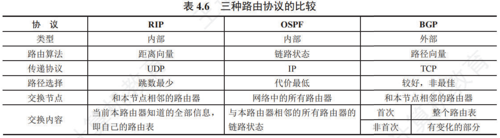

### 5.4 ICMP：因特网控制报文协议

- **因特网控制报文协议（ICMP）**：由主机、路由器、网关用于传达网络层控制信息
  - 是网络层协议，但是是在 IP 协议的上面
  - 主要用于差错报告

## 六、链路层和局域网

- **链路层提供的服务**
  - 成帧
  - 链路接入
  - 可靠交付
  - 差错检测与纠正

- **链路层功能在网络接口控制器（NIC）上实现**

### 6.1 差错检测和纠正技术

- 差错检测的 3 种方法：**奇偶校验**、**检验和方法**、**循环冗余检测**
  - $D$ ：被发送的数据比特
  - $EDC$ ：差错检测和纠正位

- **奇偶校验**
  - 单 bit 奇偶校验
  - 二维奇偶校验

- **检验和方法**

- **循环冗余检测（CRC）**

  - $D$ ：被发送的数据比特（ $d$ 比特）

  - $R$ ：CRC 比特（ $r$ 比特）

  - $G$ ：生成多项式（ $r + 1$ 比特）
    $$
    R = remainder \frac{D \cdot 2^r}{G} \qquad remainder为取余运算
    $$

### 6.2 多路访问链路和协议

- 链路层信道的类型
  - 广播信道
  - 点对点信道
  
- **多路访问问题**：如何协调多个发送和接收节点对一个共享广播信道的访问

- 多路访问协议的类型：**信道划分协议**、**随机接入协议**、**轮流协议**

- **信道划分协议**：把信道划分成小片（时间、频率、编码），分配片给每个节点专用
  - **时分多路复用（TDM）**
  - **频分多路复用（FDM）**
  - **码分多址（CDMA）**

- **随机接入协议**：信道不划分，允许冲突，冲突后恢复
  - **时隙 ALOHA**
    
    - 时间被划分成等长的时隙，每个时隙可发送一帧，节点只在时隙开始时发送帧
    
    - 最大效率为 $\frac{1}{e} = 0.37$
      $$
      N 个节点,任意一个节点成功传送的概率是 Np(1 - p)^{N - 1} \\
      对函数求导,p^* = \frac{1}{N} 时，函数取得最大值 \\
      \lim_{N \to \infty}Np^*(1 - p^*)^{N - 1} = \lim_{N \to \infty}N\frac{1}{N}(1 - \frac{1}{N})^{N - 1} = \frac{1}{e}
      $$
    
  - **ALOHA**
    
    - 最大效率为 $\frac{1}{2e}$
    
  - **载波侦听多路访问（CSMA）**
    
  - **具有碰撞检测的载波侦听多路访问（CSMA/CD）**
    
    - 检测到冲突，立即停止发送
    
    - CSMA/CD 的效率为 $\frac{1}{1 + 5d_{prop} / d_{trans}}$
    
    - 使用二进制指数后退算法确定冲突后随机等待的时间
      $$
      经历 n 次碰撞后，从\{0,1,2,…,2^n - 1 \}中随机选择一个 K 值 \\
      等待的实际时间量是  K \cdot 512 比特时间
      $$
    
    - 主要用于有线网络（802.3 Ethernet 中使用）
    
  - **具有碰撞避免的载波侦听多路访问（CSMA/CA）**
  
    - 发送数据前，尝试避免冲突的发生
    - 需要 ACK
    - 主要用于无线网络（802.11 WLAN 中使用）
  
- **轮流协议**：节点依次轮流，但是有很多数据传输的节点可以获得较长的信道使用权
  
  - **轮询协议**
  - **令牌传递协议**

### 6.3 交换局域网

- **MAC 地址**：链路层地址
  - 长度为 **6 字节**，共有 $2^{48}$  个可能的 MAC 地址，使用十六进制表示法
  - 主机和路由器的网络接口具有链路层地址
  - MAC 地址是唯一的
  - MAC 广播地址：FF-FF-FF-FF-FF-FF

- **地址解析协议（ARP）**：将 IP 地址解析为 MAC 地址

  - 跨越链路层和网络层两边的协议

  - ARP 表

    - LAN 上的每个 IP 节点都有一个 ARP 表
    - 包括一些 LAN 节点 IP/MAC 地址的映射

  - **在子网内发送**

    - 若 ARP 表中有对应 IP 的 MAC 地址，让适配器直接发送即可；若 ARP 表没有对应 IP 的 MAC 地址，向适配器传递 ARP 查询分组，适配器用广播 MAC 地址 FF-FF-FF-FF-FF-FF 发送使用链路层帧封装好的 **ARP 分组**，接收到的每个适配器都会检查自己的 MAC 地址是不是要找的，如果是，使用标准帧回应

  - **发送到子网外**

    - 路由器的每个接口都有一个 IP 地址，一个 ARP 模块和一个适配器，源主机 A 向该子网的网关路由器 B 发送数据包，若主机 A 没有路由器 B 的MAC 地址，使用 ARP 寻址。网关路由器 B 向目标子网发送数据包，若网关路由器 B 没有目标主机 C 的 MAC ，使用 ARP 寻址

    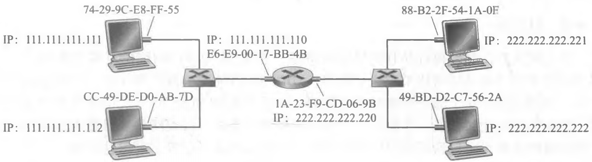

- **以太网**
  - **以太网帧结构**
    - 数据字段
    - 地址：6 字节源 MAC 地址，6 字节目标 MAC 地址
    - 类型：允许以太网复用多种网络层协议
    - CRC ：4 字节，在接收方校验
  - 是无连接，不可靠的服务
  - 以太网的 MAC 协议采用二进制指数后退的 CSMA/CD 介质访问控制形式

- **802.11 WLAN**

- **集线器**（hub）：是物理层设备，作用于各个比特而不是作用于帧

- **链路层交换机**

  - 透明
    - 有 MAC 地址，无 IP 地址
  - 即插即用，自学习
    - 交换机无需配置

- **链路层交换机和路由器的比较**

  - 共同点：
    - 都负责存储转发
    - 都有转发表
  - 不同点：
    - 交换机是链路层设备；路由器是网络层设备
    - 交换机使用 MAC 地址进行转发；路由器使用 IP 地址进行转发
    - 交换机即插即用，自学习；路由器执行路由选择算法
  
- **虚拟局域网（VLAN）**：允许用一个单一物理局域网的基础设施定义多个虚拟局域网

  - 之前的局域网的缺点：
    - 缺乏流量隔离
    - 交换机无效使用
    - 管理用户困难

### 6.4 链路虚拟化：网络作为链路层

- **多协议标签交换（MPLS）**
  - 路由弹性
  - 快速转发
  - 支持流量工程

- 主机连接网络并在浏览器键入 www.hnu.edu.cn 时网络通信的过程及协议
  - 首先从本地 DHCP 服务器获得本机的 IP 地址，本地网络的网关路由器 IP 地址和本地 DNS 服务器的 IP 地址
  - 由于不知道本地 DNS 服务器的 MAC 地址，需要 ARP 协议介入，获取本地 DNS 服务器的 MAC 地址
  - 使用 DNS 协议将 www.hnu.edu.cn 解析成 IP 地址
  - 三次握手建立 TCP 连接
  - HTTP 协议 GET 方法获取网站信息


[^1]: [美]詹姆斯·F.库罗斯（James F. Kurose），[美]基思·W.罗斯（Keith W. Ross）. 计算机网络：自顶向下方法（原书第7版）[M]. 陈鸣，译. 北京：机械工业出版社，2018.
[^2]: 王道论坛. 2025年计算机网络考研复习指导[M]. 北京：电子工业出版社，[2024].
