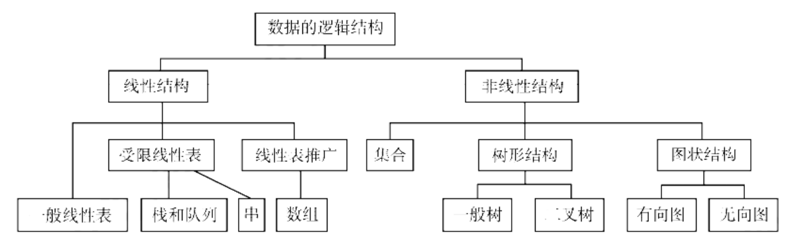

# 数据结构复习笔记

[TOC]

## 一、绪论

- **数据的逻辑结构**：分为线性结构和非线性结构

  

- **数据的存储结构**

  - 顺序存储
  - 链式存储
  - 索引存储
  - 散列存储

## 二、线性表

### 2.1 线性表的定义和基本操作

- **线性表**：具有相同数据类型的 $n$ 个数据元素的有限序列

- **线性表的基本操作**

  ```cpp
  InitList(&L)        // 初始化表。构造一个空的线性表L，分配内存空间
  DestroyList(&L)     // 销毁操作。销毁线性表，并释放线性表L所占用的内存空间
  ListInsert(&L;i,e)  // 插入操作。在表L中的第i个位置上插入指定元素e
  ListDelete(&L,i,&e) // 删除操作。删除表L中第i个位置的元素，并用e返回删除元素的值
  LocateElem(L,e)     // 按值查找操作。在表L中查找具有给定关键字值的元素
  GetElem(L,i)        // 按位查找操作。获取表L中第i个位置的元素的值
  Length(L)           // 求表长。返回线性表L的长度，即L中数据元素的个数
  PrintList(L)        // 输出操作。按前后顺序输出线性表L的所有元素值
  Empty(L)            // 判空操作。若L为空表，则返回true，否则返回false
  ```

### 2.2 线性表的顺序表示

- **顺序表**：线性表的顺序存储
  - 支持随机访问
- **顺序表的基本操作**
  - 插入操作
  - 删除操作
  - 按值查找

### 2.3 线性表的链式表示

- **单链表**：线性表的链式存储

  ```cpp
  typedef struct LNode{                      // 定义单链表结点类型
      ElemType data;                         // 数据域
      struct LNode *next;                    // 指针域
  }LNode, *LinkList;
  ```

- **单链表的基本操作**

  - 头插法建立单链表

  - 尾插法建立单链表

  - 按序号查找节点

  - 按值查找节点

  - 插入节点

  - 删除节点

  - 求表长

  - 链表逆置：将头结点摘下，然后从第一结点开始，依次插入到头结点的后面

    ```cpp
    Linklist Reverse(LinkList L) {
        LNode *p, *r;
        p = L->next;                      // p 为工作指针
        L->next = NULL;
        while(p != NULL) {
            r = p->next;                  // r 为临时指针，暂存 p 的后继
            p->next = L->next;
            L->next = p;
            p = r;
        }
        return L;
    }
    ```

- **双链表**：双链表结点中有两个指针 `prior` 和 `next` ，分别指向其前驱结点和后继结点

  ```cpp
  typedef struct DNode{                       // 定义双链表结点类型
      ElemType data;                          // 数据域
      struct DNode *prior, *next;             // 前驱和后继指针
  }DNode, *DLinklist;
  ```

- **双链表的基本操作**

  - 插入操作：在 `p` 所指的结点之后插入结点 `*s`

    ```cpp
    s->next = p->next;
    p->next->prior = s;
    s->prior = p;                            // 第三行和第四行可以调换
    p->next = s;
    ```

  - 删除操作

- **循环链表**
  - **循环单链表**：表中最后一个结点不是 `NULL` ，而改为指向头结点
  - **循环双链表**：头结点的 `prior` 指向表尾结点

- **静态链表**：借助数组来描述线性表的链式存储结构

## 三、栈、队列和数组

### 3.1 栈

- **栈**：只允许在一端进行插入或删除的线性表

  - 后进先出（ $LIFO$ ）

  - 栈的数学性质：$n$ 个不同元素进栈，出栈元素不同排列的个数为 $\frac{1}{n+1} C^{n}_{2n}$

- **栈的基本操作**

  ```cpp
  InitStack(&S)     // 初始化栈。构造一个空栈 S，分配内存空间。
  DestroyStack(&S)  // 销毁栈。销毁并释放栈 S 所占用的内存空间。
  Push(&S, x)       // 进栈。若栈 S 未满，则将 x 加入使其成为新的栈顶元素。
  Pop(&S, &x)       // 出栈。若栈 S 非空，则弹出（删除）栈顶元素，并用 x 返回。
  GetTop(S, &x)     // 读取栈顶元素。若栈 S 非空，则用 x 返回栈顶元素。
  StackEmpty(S)     // 判空。断一个栈 S 是否为空，若 S 为空，则返回 true，否则返回 false。
  ```

- **顺序栈**：栈的顺序存储结构

  ```cpp
  typedef struct{
      ElemType data[MaxSize];     // 静态数组存放栈中元素
      int top;                    // 栈顶元素
  }SqStack;
  
  /* 栈顶指针：S.top
     栈顶元素：S.data[S.top] */
  ```

  - 基本操作：初始化、栈判空、进栈、出栈、读栈顶元素
  - 共享栈：两个顺序栈共享一个一维数组空间，将两个栈的栈底分别设置在共享空间的两端，两个栈顶向共享空间的中间延伸

- **链栈**：栈的链式存储结构

  - **规定所有操作都在单链表的表头进行**

  - 便于多个栈共享存储空间和提高效率

### 3.2 队列

- **队列**：只允许在一端进行插入，而在另一端进行删除的线性表
  - 先进先出（ $FIFO$ ）

- **队列的基本操作**

  ```cpp
  InitQueue(&Q)     // 初始化队列，构造一个空队列Q。
  QueueEmpty(Q)     // 判队列空，若队列Q为空返回true，否则返回false。
  EnQueue(&Qx)      // 入队，若队列Q未满，则将x加入使之成为新的队尾。
  DeQueue(&Q&x)     // 出队，若队列Q非空，则删除队头元素，并用x返回。
  GetHead(Q&x)      // 读队头元素，若队列Q非空则用x返回队头元素。
  ClearQueue(&Q)    // 销毁队列，并释放队列Q占用的内存空间。
  ```

- **顺序队列**：队列的顺序存储结构

  ```cpp
  typedef struct{     
      ElemType data[MaxSize];   // 用静态数组存放队列元素     
      int front, rear;          // 队头指针和队尾指针
  }SqQueue;
  ```

- **循环队列**：将顺序队列改造为一个环状的空间
  - 基本操作：初始化、判队空、入队、出队

- **链队列**：队列的链式存储结构

- **双端队列**：两端都可以进行入队和出队操作的队列

## 四、串

- **串**：由零个或多个字符组成的有限序列

## 五、树与二叉树

### 5.1 树的基本概念

- **树的定义**：$n \ (n ≥ 0)$ 个结点的有限集。当 $n=0$ 时，称为空树
  - 树中一个结点的孩子个数称为该**结点的度**，树中结点的最大度数称为**树的度**
  - 度大于 $0$ 的结点称为**分支结点**，度为 $0$ 的结点称为**叶结点**
  - 若树中结点的各子树从左到右都是有次序的，不能互换，则称该树为**有序树**，否则称为**无序树**
  - **森林**是 $m \ (m ≥ 0)$ 棵互不相交的树的集合
- **树的性质**
  - **树中结点数等于所有结点的度数之和加 $1$**
  - 度为 $m$ 的树中第 $i$ 层最多有 $m^{i-1}$ 个结点 $(i ≥ 1)$
  - 高度为 $h$ 的 $m$ 叉树最多有 $\frac{m^h-1}{m-1}$ 个结点
  - 具有 $n$ 个结点的 $m$ 叉树的最小高度为 $\lceil log_m(n(m-1)+1) \rceil$

### 5.2 二叉树的概念

- **二叉树**：每个结点至多有两颗子树，并且二叉树的子树有左右之分，其次序不能任意颠倒
  - 二叉树是 $n \ (n ≥ 0)$ 个结点的有限集合

- **几个特殊的二叉树**
  - **满二叉树**：一颗高度为 $h$，且含有 $2^h-1$ 个结点的二叉树，即树中的每层都含有最多的结点
  - **完全二叉树**：高度为 $h$、有 $n$ 个结点的二叉树，当且仅当其每个结点都与高度为 $h$ 的满二叉树中编号为 $1 \sim n$ 的结点一一对应
  - **二叉排序树**：左子树上所有结点的关键字均小于根节点的关键字，右子树上的所有结点的关键字均大于根节点的关键字；左子树和右子树又各是一棵二叉排序树
  - **平衡二叉树**：树上任意一个结点的左子树和右子树的深度之差不超过 $1$

- **二叉树的性质**
  - **非空二叉树上的叶节点数等于度为 $2$ 的结点数加 $1$，即 $n_0=n_2+1$**
  - 非空二叉树上第 $k$ 层至多有 $2^{k-1}$ 个节点 $(k≥1)$
  - 高度为 $h$ 的二叉树至多有 $2^h-1$ 个节点 $(h≥1)$
  - 具有 $n$ 个结点的完全二叉树的高度为 $\lceil log_2(n+1) \rceil$

- **二叉树的存储结构**
  - 顺序存储：用一组地址连续的存储单元依次自上而下、自左至右存储完全二叉树上的结点元素
    - 将完全二叉树上编号为 $i$ 的结点元素存储在一维数组下标为 $i-1$ 的分量中
    - 适合完全二叉树和满二叉树
  - 链式存储：用链表结点来存储二叉树中的每个结点

### 5.3 二叉树的遍历和线索二叉树

- **二叉树的遍历**

  - **先序遍历**：**根** $\rightarrow$ 左 $\rightarrow$ 右

    ```cpp
    void PreOrder(BiTree T){
    	if(T != NULL){
    		visit(T);
    		PreOrder(T->lchild);
    		PreOrder(T->rchild);
    	}
    }
    ```

  - **中序遍历**：左 $\rightarrow$ **根** $\rightarrow$ 右

    ```cpp
    void InOrder(BiTree T){
    	if(T != NULL){
    		InOrder(T->lchild);
    		visit(T);
    		InOrder(T->rchild);
    	}
    }
    ```

  - **后序遍历**：左 $\rightarrow$ 右 $\rightarrow$ **根**

    ```cpp
    void PostOrder(BiTree T){
    	if(T != NULL){
    		PostOrder(T->lchild);
    		PostOrder(T->rchild);
    		visit(T);
    	}
    }
    ```

  - **层序遍历**：初始化一个辅助队列，根节点入队。若队列非空，则队头结点出队，访问该结点，并将其左右孩子插入队尾。重复上述操作直至队列为空

    ```cpp
    void LevelOrder(BiTree T){
       InitQueue(Q);                  // 初始化辅助队列
       BiTree p;
       EnQueue(Q,T);                  // 将根节点入队
       while(!isEmpty(Q)){            // 队列不空则循环
          DeQueue(Q,p);               // 队头结点出队
          visit(p);                   // 访问出队结点
          if(p->lchild != NULL)
             EnQueue(Q, p->lchild);   // 左孩子入队
          if(p->rchild != NULL)
             EnQueue(Q, p->rchild);   // 右孩子入队
       }
    }
    ```

- **由遍历序列构造二叉树**
  - 由二叉树的中序遍历和先序遍历序列**可以唯一**地确定一棵二叉树
  - 由二叉树的中序遍历和后序遍历序列**可以唯一**地确定一棵二叉树
  - 由二叉树的中序遍历和层序遍历序列**可以唯一**地确定一棵二叉树
  - 前序、后序、层序序列的两两结合**无法唯一**确定一棵二叉树，一定要有中序序列才行

- **线索二叉树**
  
  - 作用：方便从一个指定结点出发，找到其前驱、后继结点；方便遍历
  
  - 线索二叉树的存储结构
  
    ```cpp
    typedef struct ThreadNode{
        ElemType data;
        struct ThreadNode *lchild, *rchild;
        int ltag, rtag;
    }ThreadNode, *ThreadTree;
    ```
  
  - 以这种结点结构构成的二叉链表作为二叉树的存储结构，称为**线索链表**，其中指向结点前驱和后继的指针称为**线索**，加上线索的二叉树称为**线索二叉树**
  
  - $n$ 个结点的二叉树中，有 $n+1$ 条线索


