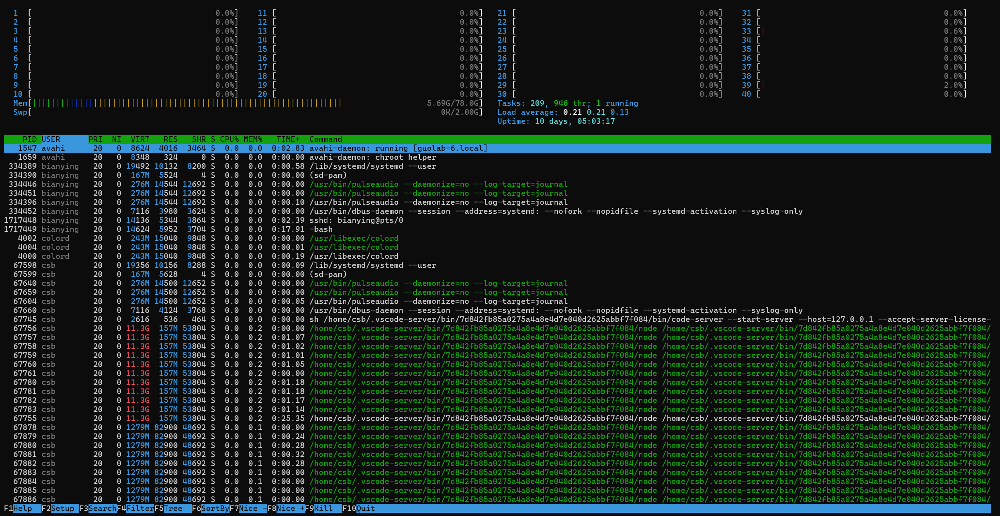

# Linux 常用命令 - 个人定制版

[TOC]

## 1. 进程与系统状态

### htop

- 实时监控系统进程、CPU、内存、交换空间等资源使用情况
- 用法：

```shell
sudo apt install htop
htop
```

<center>
    
    <br>
    <div style="color:orange; border-bottom: 1px solid #d9d9d9;
    display: inline-block;
    color: #999;
    padding: 2px;">运行 htop 命令后界面示例</div>
</center>

- 参数解释
  1. Mem（物理内存）
  2. Swp（Swap）

### ps

- 查看进程

```shell
ps aux
```

- `|`：管道符，表示将前一个命令的输出作为后一个命令的输入

```shell
ps aux | grep syz
ps aux | grep qemu
```

### kill

- 结束进程

```shell
kill PID        # 温和
kill -9 PID     # 强制
```

## 2. 网络

### ssh

## 3. 权限与用户

### chmod

- 查看当前目录下所有文件权限

```shell
ls -l
```

- 修改权限
  1. chmod = change mode

```shell
chmod 755 文件名
      ↑↑↑
      │││
      ││└─ 其他人(o)
      │└── 组用户(g)
      └─── 所有者(u)
```

## 4.调试与记录

### tee

```shell
命令 | tee 文件

# 不加 -a 会覆盖文件，加了就追加
命令 | tee -a 文件

# 终端 实时显示 make 输出，同样的内容写入 build.log
make | tee build.log
```

- `tee` 和 `>` 的核心区别

| 用法     | 屏幕 | 文件      |
| -------- | ---- | --------- |
| `>`      | ❌    | ✅         |
| `>>`     | ❌    | ✅（追加） |
| `tee`    | ✅    | ✅         |
| `tee -a` | ✅    | ✅（追加） |
