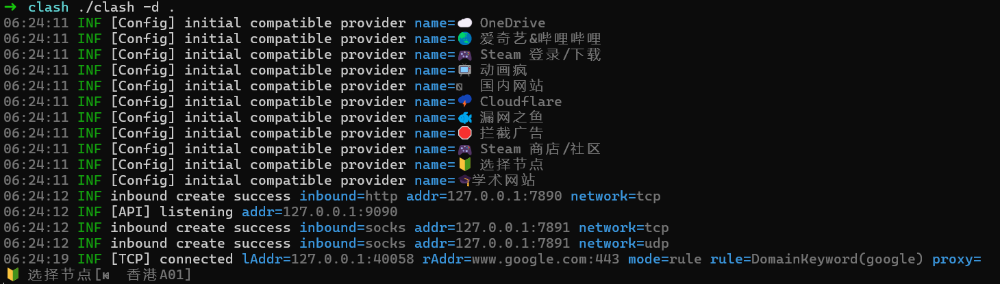

# Linux 服务器代理配置方法

### 1. 下载客户端

- 在用户目录下创建 `clash` 文件夹


```shell
# 创建 clash 文件夹
[~]$ mkdir ~/clash
[~]$ cd ~/clash
```

- 在 [Release Clash-Premium · DustinWin/proxy-tools · GitHub](https://github.com/DustinWin/proxy-tools/releases/tag/Clash-Premium) 中下载合适的 `clash` 版本压缩包，复制粘贴到 `clash` 文件夹下，解压缩，并修改权限

```shell
# 解压缩
[~/clash]$ tar -zxvf clashpremium-release-linux-amd64-v3.tar.gz
# 重命名为 clash
[~/clash]$ mv CrashCore clash
# 确保权限正确
[~/clash]$ chmod +x clash
```

### 2. 下载 clash 配置文件

- 下载 `clash` 配置文件 `config.yaml`

```shell
[~/clash]$ wget -O config.yaml "https://cb3wv.no-mad-world.club/link/1kEiPhW9xxxxxxxx?clash=3"
```

- 注意 `allow-lan` 需要设置成 `false`，不然流量跑完了

### 3. 运行 clash

- 运行 clash 二进制文件

```shell
[~/clash]$ ./clash -d . 
```

- 若提示缺失 `Country.mmdb`，则从镜像源进行下载

```bash
[~/clash]$ wget -4 -O Country.mmdb https://gitlab.com/ineo6/geoip/raw/master/Country.mmdb
```

- 最终文件目录结构如下

```text
.
|-- Country.mmdb
|-- cache.db
|-- clash
|-- clashpremium-release-linux-amd64-v3.tar.gz
`-- config.yaml
```

- 运行成功后效果如下



### 4. 修改代理环境变量

- 修改代理环境变量，让服务器终端 / 命令行工具主动走 clash 代理。端口一般为 7890，可以在 `config.yaml` 中的 `port:7890` 字段查看

```shell
export HTTP_PROXY=http://127.0.0.1:7890
export HTTPS_PROXY=http://127.0.0.1:7890
```

```shell
# 同时设置大小写（兼容不同程序的变量名）
export http_proxy=http://127.0.0.1:7890
export https_proxy=http://127.0.0.1:7890
export HTTP_PROXY=http://127.0.0.1:7890
export HTTPS_PROXY=http://127.0.0.1:7890
export NO_PROXY=localhost,127.0.0.1,::1

# 让 sudo 继承代理变量（核心！）
alias sudo='sudo -E'  # -E 表示继承当前用户环境变量
```

永久生效：

```
# 编辑用户环境变量文件
vim ~/.bashrc

# 在文件末尾添加以下内容：
export http_proxy=http://127.0.0.1:7890
export https_proxy=http://127.0.0.1:7890
export HTTP_PROXY=http://127.0.0.1:7890
export HTTPS_PROXY=http://127.0.0.1:7890
export NO_PROXY=localhost,127.0.0.1,::1
alias sudo='sudo -E'

# 生效配置
source ~/.bashrc
```


- 向 www.google.com 发送 GET请求，验证代理是否配置成功

```shell
[~]$ curl https://www.google.com
```