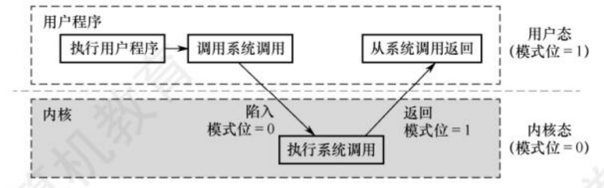
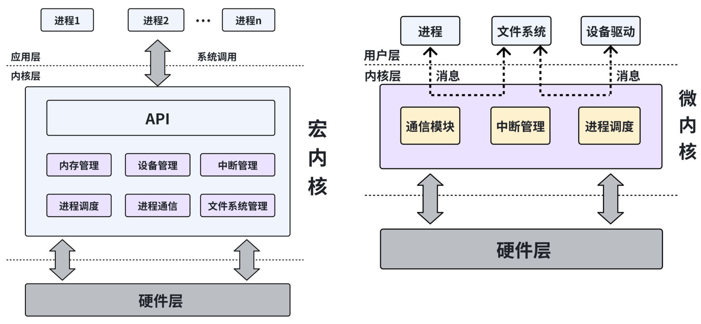
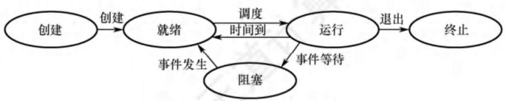
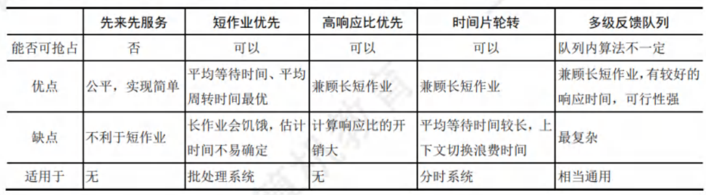
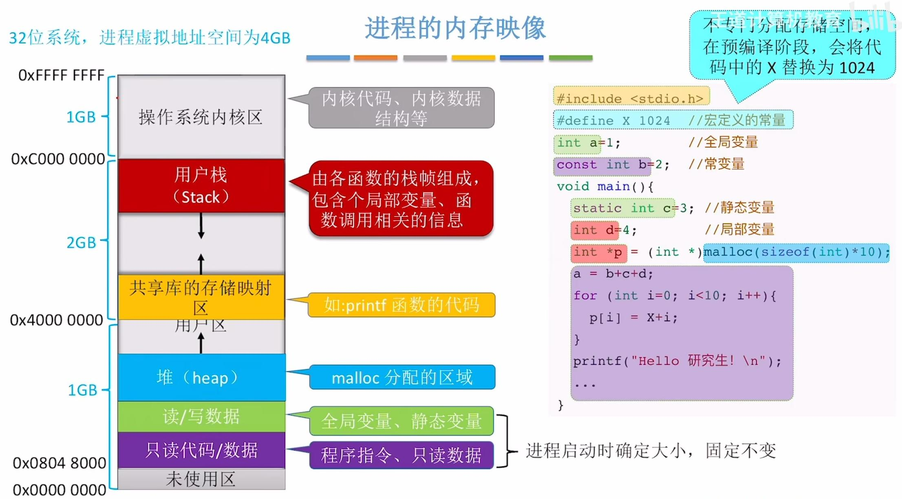
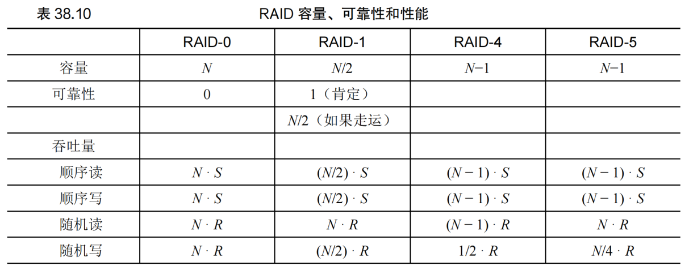

# 操作系统复习笔记[^1] [^2]

[TOC]

## 一、计算机系统概述

### 1.1 操作系统的基本概念

- **计算机系统的组成**：**硬件**、**操作系统**、**应用程序**、**用户**

- **操作系统**：控制和管理整个计算机系统的硬件与软件资源，合理地组织、调度计算机的工作与资源的分配，进而为用户和其他软件提供方便接口与环境的程序集合

- **操作系统的特征**
  - **并发**：指多个事件在同一时间间隔内发生
    
    - 单核 $\text{CPU}$  同一时刻只能执行一个程序，各个程序只能并发执行
    - 多核 $\text{CPU}$ 同一时刻可以同时执行多个程序，各个程序可以并行执行
    
  - **共享**：系统中的资源可供内存中多个并发执行的进程共同调用
    - 互斥共享方式
    - 同时共享方式
    
    - *并发和共享是两个最基本的特征，二者互为存在条件*
    
  - **虚拟**
  
    - 时分复用技术（如 $\text{CPU}$ 虚拟化）
    - 空分复用技术（如内存虚拟化）
  
  - **异步**
  

### 1.2 操作系统的发展历程

- **操作系统发展历程**
  - **手工操作阶段**
  - **批处理阶段**
    - 单道批处理系统
    - 多道批处理系统：资源利用率高、系统吞吐量大、但*不提供人机交互能力*
  - **分时操作系统**
  - **实时操作系统**

### 1.3 操作系统的运行环境

- **特权指令**：不允许用户直接使用的指令
- **非特权指令**：允许用户直接使用的指令

- $\text{CPU}$ 的运行模式
  - **内核态**
    - 运行的是内核程序，此时可以执行特权指令
  - **用户态**
    - 运行的是应用程序，此时只能执行非特权指令
  - *$\text{CPU}$ 中的程序状态字寄存器（ $\text{PSW}$ ）有个二进制位，$0$ 表示内核态，$1$ 表示用户态*

- **内核态和用户态的切换**
  
  - 内核态 $->$ 用户态：一条修改 $\text{PSW}$ 的特权指令
  - 用户态 $->$ 内核态：由中断引起，硬件自动完成
  
- **中断**（外中断）：来自 $\text{CPU}$ 执行指令外部的事件
  
  - $\text{I/O}$ 结束中断
  - 时钟中断
  
- **异常**（内中断）：来自 $\text{CPU}$ 执行指令内部的事件
  
  - 故障：由指令执行引起的异常，如非法操作码、除数为 $0$
  - 自陷：由陷入指令引起，是事先安排的，如条件陷阱指令
  - 终止：由致命错误引起
  
- **系统调用**：**操作系统对应用程序提供的接口**

  - 设备管理

  - 文件控制：`open()`、`read()`、`write()`、`close()`

  - 进程控制：`fork()`、`exec()`、`wait()`、`exit()`、`kill()`

  - 进程通信：`socket()`

  - 内存管理

    

### 1.4 操作系统的体系结构

- **操作系统结构分类**：**分层法**、**模块化**、**宏内核**、**微内核**、**外核**

- **宏内核**：**将操作系统的主要功能模块都作为系统内核，运行在核心态**
  - 优点：高性能
  - 缺点：内核代码庞大，结构混乱，难以维护
  - 实例：$\text{Windows、Android、IOS、macOS、Linux}$
- **微内核**：**只把最基本的功能保留在内核**
  - 优点：内核功能少，结构清晰，易于维护
  - 缺点：需要频繁地在内核态和用户态之间切换，性能低
  - 实例：$\text{HarmonyOS}$



## 二、进程与线程

### 2.1 进程与线程

- **进程**：**操作系统为正在运行的程序提供的抽象**
  - $\text{PCB}$  是进程存在的唯一标志
  
- **进程的组成**
  - **进程控制块**（ $\text{PCB}$  ）
    - 进程描述信息：$\text{PID}$ 、$\text{UID}$ 
    - 进程控制和管理信息
    - 资源分配清单
    - 处理机相关信息
  - **程序段**：程序的代码
  - **数据段**：运行过程中产生的各种数据

- **进程的特征**
  - 动态性
    - *进程最基本的特征*
  - 并发性
  - 独立性
  - 异步性
  - 结构性

- **进程的状态与转换**

  - 状态

    - **创建态**：进程正在被创建，操作系统为进程分配资源，初始化 $\text{PCB}$ 
    - **就绪态**：进程获得了除 $\text{CPU}$  外的一切所需资源
    - **运行态**：进程占有 $\text{CPU}$  ，并在 $\text{CPU}$  上运行
    - **阻塞态**：因等待某一事件而暂时不能运行
    - **终止态**：进程正在被撤销，操作系统回收进程拥有的资源，撤销 $\text{PCB}$ 

  - 转换

    

- **上下文切换**：让操作系统停止运行一个程序，并开始在给定的 $\text{CPU}$ 上运行另一个程序。即为当前正在执行的进程保存一些寄存器的值，并为即将执行的进程恢复一些寄存器的值

- **原语**：进程控制用的程序段

  - 特点：原子性，执行期间不允许中断
  - 实现方法：在原语前和原语后分别使用 “ 关中断指令 ” 和 “ 开中断指令 ” 这两个特权指令

- **进程 API**
  - **`fork()` 系统调用**：**创建新进程**
    - `fork()` 返回值：在父进程中，返回新创建子进程的 $\text{PID}$ ，在子进程中，返回 $0$
  - **`wait()` 系统调用**：**父进程等待子进程执行完毕**
    - `wait()` 以阻塞方式等待子进程退出，防止僵尸进程的产生
  - **`exec()` 系统调用**：**将当前运行的程序替换为另一个运行程序**（PID 不变）

- `fork()` 和 `exec()` 的区别
  - 系统调用 `fork()` 用于创建子进程，得到两个返回值。新创建的子进程直接从 `fork()` 系统调用返回。父进程和子进程代码和数据段相同，但pid和内存空间不同
  - 系统调用   `exec()` 并没有创建新进程，而是直接将当前运行的程序替换为不同的程序。并且，对 `exec()` 的成功调用永远不会返回

- **僵尸进程和孤儿进程**
  - **僵尸进程**：一个进程使用 `fork()` 创建子进程，如果子进程退出，而父进程并没有调用 `wait()` 或 `waitpid()` 获取子进程的状态信息，那么子进程的进程描述符仍然保存在系统中，这种进程称之为僵尸进程
  - **孤儿进程**：一个父进程退出，而它的一个或多个子进程还在运行，那么这些子进程将成为孤儿进程。孤儿进程将被 $\text{init}$ 进程（进程号为  $1$ ）所收养，并由 $\text{init}$ 进程对它们完成状态收集工作

- **进程的通信**
  
  - **共享存储**：设置一个共享内存区域，并映射到进程的虚拟地址空间。进程需要互斥地访问共享空间
    - 例如 $\text{PV}$ 操作
  - **消息传递**：传递结构化的消息
  - **管道通信**
  - **信号**：用于通知进程某个特定事件已经发生（与信号量是两个东西）
    - 例如 `SIGHUP` 、`SIGINT` 、`SIGQUIT`

- **线程**：线程是进程中的一个执行单元，负责当前进程中程序的执行，一个进程中至少有一个线程。一个进程中是可以有多个线程的，这个应用程序也可以称之为多线程程序。它们共享地址空间，能够访问相同的数据，而且每个线程都有一个栈
- **线程的组成**
  - 每个线程都有一个线程控制块（ $\text{TCB}$ ）

- **线程的属性**

  - 多 $\text{CPU}$计算机中，一个进程的各个线程可占用不同的 $\text{CPU}$（如果没有线程，一个进程只能占用一个 $\text{CPU}$）

  - 同一进程中的线程切换，不会引起进程切换；不同进程中的线程切换，会引起进程切换
  - 切换同一进程内的线程，系统开销很小；切换进程，系统开销较大

- **线程的实现方式**
  - 用户级线程（ $\text{ULT}$ ）
  - 内核级线程（ $\text{KLT}$ ）

- **多线程模型**
  - 多对一模型：将多个用户级线程映射到一个内核级线程
  - 一对一模型：将每个用户级线程映射到一个内核级线程
  - 多对多模型：将 $n$ 个用户级线程映射到 $m$ 个内核级线程（$n \geq m$）

- **线程 API**

  - **`pthread_create()`：线程创建**

    - 返回值：成功返回 $0$ ，否则返回错误状态码

    ```c
    int pthread_create(pthread_t *             thread,                   // 指向 pthread_t 结构体地址的指针
                       const pthread_attr_t *  attr,                     // 设置进程属性
                       void *                  (*start_routine)(void *), // 函数指针
                       void *                  arg);                     // 传递给线程开始执行的函数的参数
    ```

  - **`pthread_join()`：线程完成**

    - 返回值：成功返回 $0$ ，否则返回错误状态码

    ```c
    int pthread_join(pthread_t  thread,    // thread 参数用于指定接收哪个线程的返回值
                     void **    retval);   // retval 参数表示接收到的返回值
    ```

### 2.2 处理机调度

- **调度器**（调度程序）：用于调度和分派 $\text{CPU}$ 的组件称为调度器
  
  - 组成
    - 排队器
    - 分派器
    - 上下文切换器
  
- **闲逛进程**（ $\text{idle}$ ）：没有其他就绪进程时，系统运行闲逛进程（所以 $\text{CPU}$ 永远不会空闲）
  
  - 优先级最低
  - 可以是 $0$ 地址指令，占一个完整的指令周期
  - 能耗低
  
- **调度的指标**

  - **$\text{CPU}$ 利用率**
    $$
    \text{CPU 利用率} = \frac{\text{CPU 有效工作时间}}{\text{CPU 有效工作时间} + \text{CPU 空闲等待时间}}
    $$

  - **系统吞吐量**：单位时间内 $\text{CPU}$ 完成作业的数量

    - 长作业会降低系统的吞吐量，短作业会提高系统的吞吐量

  - **周转时间**
    $$
    周转时间 = 完成时间 - 到达时间
    $$

  - **等待时间**
    $$
    等待时间 = 完成时间 - 执行时间 - 到达时间
    $$

  - **响应时间**
    $$
    响应时间 = 首次运行时间 - 到达时间
    $$

- **调度算法**

  - **先进先出（ $\text{FIFO}$）**

    - 非抢占式算法
    - 优点：公平、实现简单
    - 缺点：对长作业有利，对短作业不利
    - 不会导致饥饿

  - **最短任务优先（ $\text{SJF}$）**

    - 非抢占式算法
    - 优点：平均等待时间和平均周转时间短
    - 缺点：对短作业有利，对长作业不利
    - 会导致饥饿

  - **最短完成时间优先（ $\text{STCF}$）**

    - 抢占式算法

  - **高响应比优先（ $\text{HRRN}$ ）**

  - **时间片轮转（ $\text{RR}$ ）**：轮流让各个进程执行一个时间片
  
    - 抢占式算法
    - 不会导致饥饿
    
  - **优先级调度算法**
  
  - **多级反馈队列（ $\text{MLFQ}$ ）**
  
    - 规则 $1$ ：如果 $\text{A}$ 的优先级 $> \text{B}$ 的优先级，运行 $\text{A}$（不运行 $\text{B}$ ）
    - 规则 $2$ ：如果 $\text{A}$ 的优先级 $= \text{B}$ 的优先级，轮转运行 $\text{A}$ 和 $\text{B}$
    - 规则 $3$ ：工作进入系统时，放在最高优先级（最上层队列）
    - 规则 $4$ ：一旦工作用完了其在某一层中的时间配额（无论中间主动放弃了多少次 $\text{CPU}$ ），就降低其优先级（移入低一级队列）
    - 规则 $5$ ：经过一段时间 $\text{S}$ ，就将系统中所有工作重新加入最高优先级队列
    
  - **比例份额算法**：确保每个工作都获得一定比例的 $\text{CPU}$ 时间，而不是优化周转时间和响应时间
  
    - **彩票调度**：彩票数代表了进程占有某个资源的份额
      - 假如有新进程加入，不需要对每个进程记录全局状态，只需要用新进程的票数更新全局的总票数就可以了
    - **步长调度**：每个工作都有自己的步长，这个步长和票数值成反比。当需要进行调度时，选择目前拥有最小行程值的进程，并且在运行之后将该进程的行程值增加一个步长
      - 彩票调度算法只能一段时间后，在概率上实现比例；而步长调度算法可以在每个调度周期后做到完全正确
    
    

- **多处理机调度**
  - 存在的问题
    - **缓存一致性问题**：指 $\text{CPU}$ 缓存与内存的不一致性问题
    - **缓存亲和度问题**：一个进程在某个 $\text{CPU}$ 上运行时，会在该 $\text{CPU}$ 的缓存中维护许多状态。下次该进程在相同 $\text{CPU}$ 上运行时，由于缓存中的数据而执行得更快。相反，在不同的 $\text{CPU}$ 上执行，会由于需要重新加载数据而很慢
    - **负载均衡**
  - **单队列多处理器调度（ $\text{SQMS}$ ）**：将所有需要调度的工作放入一个单独的队列中
    - 优点：能够从单 $\text{CPU}$ 调度程序很简单地发展而来
    - 缺点：扩展性不好（由于同步开销有限），并且不能很好地保证缓存亲和度
  - **多队列多处理器调度（ $\text{MQMS}$ ）**：每个 $\text{CPU}$ 一个队列
    - 优点：更具有可扩展性，具有良好的缓存亲和度
    - 缺点：负载不均（可以使用工作窃取等迁移方式解决）

### 2.3 同步与互斥

- 进程同步：并发带来了异步性，有时需要进程同步解决这种异步问题
- **临界资源**：同一时间段内只允许一个进程访问的资源
- **临界区**：访问共享资源（临界资源）的一段代码
- **竞态条件**：多个执行线程大致同时进入临界区
- 不确定性：程序由一个或多个竞态条件组成，程序的输出因运行而异，具体取决于哪些线程在何时运行，这导致结果也是不确定的。
- **互斥执行**：保证只有一个线程进入临界区，从而避免出现竞态，产生确定的程序输出
- **进程互斥的软件实现方法**
  - 单标志法
  - 双标志先检查
  - 双标志后检查
  - $\text{Peterson}$ 算法
- **进程互斥的硬件实现方法**
  - 控制中断
    - 优点：简单、高效
    - 缺点：只适用于单处理器
  - 测试并设置指令（$\text{TestAndSet}$）
  - 比较并交换指令（$\text{Swap}$）

- **互斥锁**：提供互斥进入临界区
  - 评价锁的指标：能否提供互斥、公平性、性能
  - 锁的种类：控制中断、测试并设置指令、比较并交换指令、链接的加载和条件式存储指令、获取并增加指令
  - 自旋锁：需要连续循环忙等的互斥锁

- **条件变量**：允许一个线程等待另一个线程满足某个条件后再继续执行

- **信号量**：操作系统中用来解决并发中的互斥和同步问题的一种方法

  - $\text{POSIX}$ 信号量 $\text{API}$

  ```cpp
  1. sem_t
  2. int sem_init(sem_t *sem, int pshared, unsigned int value)
  3. int sem_wait(sem_t *s) {
      value of semaphore --;
      wait if value of semaphore < 0;
  }
  4. int sem_post(sem_t *s) {
      value of semaphore ++;
      if there are one or more threads waiting, wake one;
  }
  ```

  - **一对原语**：`wait(S)` 和 `signal(S)`

    - `wait`、`signal` 原语简称为 $\text{P}$、$\text{V}$ 操作

  - 信号量的类型

    - **整型信号量**：不满足让权等待原则（存在"忙等"问题，类似于自旋锁）

      ```cpp
      wait(s):   while s <= 0; s = s - 1;
      signal(s): s = s + 1;
      ```

    - **记录型信号量**：满足让权等待原则，避免忙等待消耗 $\text{CPU}$ 资源

      (实现方式与上述 $\text{POSIX}$ 信号量 $\text{API}$ 相同)

  - 信号量的值 = 这种资源的剩余数量（如果信号量的值小于 $0$ ，说明此时有进程在等待这种资源

- **经典同步问题**
  - 生产者-消费者问题
  - 读者-写者问题
  - 哲学家就餐问题

- **管程**：解决信号量机制编程麻烦、易出错的问题

### 2.4 死锁

- **死锁**：各进程互相等待对方手里的资源，导致各进程都阻塞，无法向前推进

- **死锁产生的条件**：互斥、持有并等待、非抢占、循环等待

- **解决死锁的方法**：预防、通过调度避免死锁、检查和恢复

## 三、内存管理

### 3.1 内存管理概念

- **地址转换**：将指令中的虚拟地址转换为数据实际存储的物理地址
  - 虚拟地址
  - 物理地址

- **地址空间**：操作系统提供的一个易用的物理内存抽象，是运行的程序看到的系统中的内存，一个进程的地址空间包含运行的程序的所有内存状态

- **进程的内存映像**

  - **栈内存**：申请和释放由编译器隐式管理
  - **堆内存**：申请和释放由程序员显式完成
  - 数据段
  - 代码段

  

### 3.2 虚拟内存管理

- **动态重定位**（基址加界限机制）：需要**基址寄存器**和**界限寄存器**
  $$
  physical \ address = virtual \ address + base
  $$

- **分段**：在 $\text{MMU}$ 中引入不止一个基址和界限寄存器对，而是给地址空间内的每个逻辑段一对
  - 优点：使得操作系统能够将不同的段放到不同的物理内存区域，从而避免了虚拟地址空间中的未使用部分占用物理内存
  - 缺点：将空间切成不同长度的分片以后，空间本身会碎片化，随着时间推移，分配内存会变得比较困难

- **分页**：将一个进程的地址空间分割成固定大小的单元，每个单元称为一页
  - 优点
    - 灵活性：通过完善的分页方法，操作系统能够高效地提供地址空间的抽象，而不用管进程如何使用地址空间
    - 简单性：分页提供的空闲空间管理的简单性
    - 不会导致外部碎片
  - 缺点：较高的性能开销、较慢的机器

- **页表**：为地址空间的每个虚拟页面保存地址转换，从而知道每个页在物理内存中的位置
  - 内容：VPN、PPN、有效位、保护位、存在位、脏位、参考位

- $\text{TLB}$（**快表**，地址转换旁路缓冲存储器）：**是一种访问速度比内存快很多的高速缓存**
  - 基本算法
    - 首先从虚拟地址中提取页号 $\text{VPN}$，然后检查 $\text{TLB}$ 是否有该 $\text{VPN}$ 的转换映射。如果有，那么 $\text{TLB}$ 命中，这意味着 $\text{TLB}$ 有该页的转换映射，接下来就可以从相关的 $\text{TLB}$ 项中取出页帧号 $\text{PFN}$，与原来虚拟地址中的偏移量组合形成期望的物理地址 $\text{PA}$，并访问内存
    - 如果 $\text{CPU}$ 没有在 $\text{TLB}$ 中找到转换映射（$\text{TLB}$ 未命中），那么硬件访问页表来寻找转换映射。假设该虚拟地址有效，而且有相关的访问权限，那么用该转换映射更新 $\text{TLB}$。最后，当 $\text{TLB}$ 更新成功后，系统会重新尝试该指令，这时 $\text{TLB}$ 中有了这个转换映射，内存引用得到很快处理

- **页表太大，消耗的内存太多的解决方法**
  - 使用更大的页
    - 缺点：内部碎片问题
  - 分页和分段混合
    - 缺点：不灵活、产生外部碎片
  - 多级页表
    - 优点：紧凑、支持稀疏的地址空间、更容易管理内存
    - 缺点：$\text{TLB}$ 未命中时成本较高、页表查找更复杂
  - 反向页表
  - 将页表中的一部分交换到磁盘

- **平均内存访问时间（$\text{AMAT}$）**
  $$
  AMAT=(P_{Hit}×T_M)+(P_{Miss}×T_D)
  $$

- **页替换策略**：最优替换策略、$\text{FIFO}$、随机、$\text{LRU}$、近似 $\text{LRU}$（增加一个使用位）

- **外部碎片**：还没有被分配出去（不属于任何进程），但由于太小，无法分配给申请内存空间的新进程的内存空闲区域
  - 解决措施：紧凑物理内存，重新安排原有的段；利用空闲列表管理算法，试图保留大的内存块用于分配

- **内部碎片**：如果分配程序给出的内存块超出请求的大小，在这种块中超出请求的空间（因此而未使用）就被认为是内部碎片（因为浪费发生在已分配单元的内部）

- **管理空闲空间的策略**：最优匹配、最差匹配、首次匹配、下次匹配、分离空闲列表、伙伴系统（二分伙伴分配程序）

## 四、文件管理

### 4.1 文件系统基础

- **文件**：一组有意义的信息的集合
- **文件系统的整体组织**：数据块、$\text{inode}$、位图（数据位图、$\text{inode}$ 位图）、超级块

## 五、输入输出管理

### 5.1 $\text{I/O}$ 管理概述

- **$\text{I/O}$ 设备**：将数据输入/输出计算机的外部设备

- **$\text{I/O}$ 设备的分类**
  - 按使用特性分类：人机交互类外部设备、存储设备、网络通信设备
  - 按传输速率分类：低速设备、中速设备、高速设备
  - 按信息交换的单位分类：块设备、字符设备

### 5.3 磁盘与固态硬盘

- **磁盘**：由表面涂有磁性物质的圆形盘片组成
  - **磁道**：每个盘片被划分为一个个磁道
  - **扇区**：每个磁道又划分为一个个扇区

- **如何在磁盘中读/写数据**：*磁头*移动到目标位置，*盘片*旋转，对应扇区划过磁道才能完成读/写

- **磁盘 $\text{I/O}$ 时间**：寻道时间、旋转时间、传输时间
  $$
  T_{I/O} = T_{寻道} + T_{旋转} + T_{传输}
  $$

- **磁盘调度算法**

  - **先来先服务算法（$\text{FIFO}$）**
  - **最短寻找时间优先（$\text{SSTF}$）**
    - 基于贪心算法
    - 缺点：可能导致饥饿
  - **电梯算法（$\text{SCAN}$）**
    - 只有移动到最边缘的磁道时才能改变方向
    - 缺点：对各个位置磁道的响应频率不平均
  - **$\text{LOOK}$ 调度算法**
    - $\text{SCAN}$ 算法的改进，只要在磁头移动方向上不再有请求，就立即改变磁头方向
  - **循环扫描算法（$\text{C-SCAN}$）**
    - 只有磁头朝某个方向移动时才会响应请求，移动到边缘后立即让磁头返回起点，返回途中不响应任何请求

- **减少磁盘 $\text{I/O}$ 时间延迟的方法**
  - 交替编号
  - 错位命名

- **廉价冗余磁盘阵列（$\text{RAID}$）**

  - 评价 $\text{RAID}$ 的指标：容量、可靠性、性能

    


[^1]: [美]雷姆兹·H·阿帕西杜（Remzi H. Arpaci-Dusseau），[美]安德莉亚·C·阿帕西杜（Andrea C. Arpaci-Dusseau）. 操作系统导论[M]. 王海鹏，译. 北京：人民邮电出版社，2023.
[^2]: 王道论坛. 2024年操作系统考研复习指导[M]. 北京：电子工业出版社，2023.
