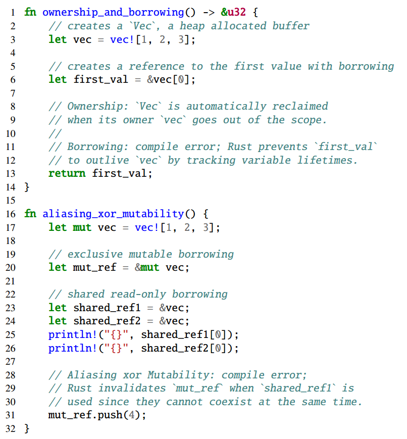
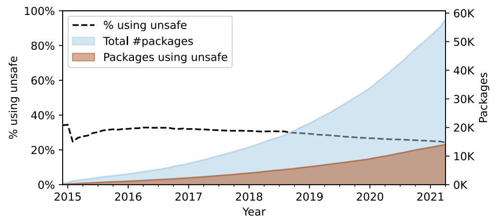

# RUDRA: Finding Memory Safety Bugs in Rust at the Ecosystem Scale

<table>
  <tr>
    <td>
      <b>
	  📌 Title: RUDRA: Finding Memory Safety Bugs in Rust at the Ecosystem Scale
	</b>
    </td>
  </tr>
  <tr>
    <td>
      <b>👨‍🎓 Author: </b>
	  Yechan Bae, Youngsuk Kim, Ammar Askar, Jungwon Lim, Taesoo Kim
    </td>
  </tr>
  <tr>
    <td>
      <b>🏛️ Publication: </b>
	  SOSP ’21 (Symposium on Operating Systems Principles 2021)
   </td>
  </tr>
  <tr>
    <td>
      <b>📜 Journal Tags:  </b>
	  Theory of computation ￫ Program analysis, Security and privacy ￫ Software and application security
    </td>
  </tr>
  <tr>
    <td>
      <b>🎯 Tags:   </b>
	  Rust, Memory-safety, Program analysis
    </td>
  </tr>
  <tr>
    <td>
      <b>🔗 DOI:   </b>
	  <a href="https://doi.org/10.1145/3477132.3483570">https://doi.org/10.1145/3477132.3483570</a>
    </td>
  </tr>
  <tr>
    <td>
      <b>📁 Local Link:   </b>
	  2021_SOSP_RUDRA_Rust_Memory_Safety.pdf
    </td>
  </tr>
  <tr>
    <td>
      <b>📅 Note Date:   </b>
	  2025/11/3
    </td>
  </tr>

------

  <h2 style="color: #e0ffff; background-color: #66cdaa">📜 研究背景 现状 目标</h2>

### ⚙️ 背景

- Rust 通过编译时检查，在不牺牲性能的前提下避免 C/C++ 的**内存安全问题**，依赖如下：

  1. **所有权**（Ownership）：每个值有且仅有一个 所有者变量，所有者出作用域时，值的内存自动回收

     ```rust
     let vec = vec![1,2,3]; // vec 是所有者，ownership_and_borrowing 函数结束时 vec 的内存被回收
     ```

  2. **借用**（Borrowing）：允许临时创建值的引用，但引用的生命周期不能超过所有者

     ```rust
     let ref = &vec[0]; // 若 vec 先出作用域，ref 就成了悬垂引用，编译器直接报错
     ```

     > ```rust
     > fn main() {
     >     let ref;  // 声明一个引用（未初始化）
     >     {
     >         let vec = vec![1, 2, 3];  // vec 是向量的所有者，作用域从这里开始
     >         ref = &vec[0];  // 引用 vec 中的第一个元素，引用的生命周期依赖于 vec
     >     }  // 到这里，vec 出作用域（被销毁，内存被释放）
     >     println!("{}", ref);  // 错误！ref 此时是悬垂引用，指向已释放的内存
     > }
     > ```

  3. **别名互斥**（Aliasing XOR Mutability）：同一时间，一个值要么被多个共享引用访问，要么被一个可变引用访问，二者不能共存

     ```rust
     // 若有 &mut vec，就不能同时有 &vec，避免并发读写的数据竞争
     ```

     <center>
         
         <br>
         <div style="color:orange; border-bottom: 1px solid #d9d9d9;
         display: inline-block;
         color: #999;
         padding: 2px;">关于 Rust 保证内存安全的三个核心思想的举例分析</div>
     </center>


- 为什么需要 `unsafe` ？
  - 必要性：Rust 的安全规则太严格，无法满足**系统编程的底层需求**（如操作系统内核执行内存映射I/O）
    1. 访问硬件寄存器（需要裸指针`*const T`/`*mut T`）
    2. 调用系统调用（编译器无法验证其安全性）
    3. 实现高性能数据结构（如`Vec`的动态扩容需要直接操作内存）


- `unsafe` 带来的问题？

  - Rust 的安全保证是**全局的**—— 只要程序中存在一段有 bug 的`unsafe`代码，整个程序的内存安全就会被打破

  - 并且，`unsafe`代码的错误很难排查，原因如下：
    1. **传递性破坏**：`unsafe`的 bug 会突破安全边界，影响所有依赖它的安全代码
    2. **跨代码依赖**：安全代码和`unsafe`代码可能相距很远（如第三方库的`unsafe` bug 影响上层应用）
    3. **隐式代码路径**：编译器插入的代码（如恐慌时的析构函数调用）程序员难以感知，可能触发`unsafe`的隐藏 bug

### 💡 现状

- 现有**生态中 25%-30% 的 Rust 包直接使用`unsafe`**，且这个比例长期稳定，意味着大量潜在风险

  <center>
      
      <br>
      <div style="color:orange; border-bottom: 1px solid #d9d9d9;
      display: inline-block;
      color: #999;
      padding: 2px;">使用 unsafe 代码的包的比例始终在 25% ~ 30%</div>
  </center>

### 🚀 目标

- **论文核心目标**：设计一个可规模化、高精度的静态分析工具，能扫描整个 Rust 生态（crates.io）的`unsafe`代码，发现内存安全 bug

<h2 style="color: #20b2aa; background-color: #afeeee">🔁 研究内容</h2>

### 🚊 研究基础

- 论文核心发现：Rust `unsafe`代码的**三大 bug 模式**

  > 论文通过分析已知漏洞和审计热门包，提炼出`unsafe`代码中最常见、最隐蔽的三类 bug 模式 —— 这是 RUDRA 的检测目标，也是论文的核心创新点之一

  1. 模式 1：**恐慌安全漏洞（Panic Safety Bug）**

     - Rust 的`panic!`用于表示不可恢复错误，此时程序会  unwind 调用栈，并自动调用所有栈变量的析构函数。但`unsafe`代码中，程序员可能会临时创建不一致状态，并计划在后续代码中修复这个状态。若`panic`发生在创建不一致和修复之间，析构函数会处理这个异常状态，导致内存安全问题

       > ```rust
       > pub fn retain<F>(&mut self, f: F) where F: FnMut(char) -> bool {
       >     let len = self.len();
       >     let mut del_bytes = 0;
       >     let mut idx = 0;
       >     
       >     unsafe { self.vec.set_len(0); } // 临时将字符串长度设为0（不一致状态）
       >     
       >     while idx < len {
       >         let ch = unsafe { self.get_unchecked(idx..len).chars().next().unwrap() };
       >         let ch_len = ch.len_utf8();
       >         
       >         if !f(ch) { // 若闭包f在这里panic...
       >             del_bytes += ch_len;
       >         } else {
       >             // 复制字符到正确位置
       >             unsafe {
       >                 ptr::copy(
       >                     self.vec.as_ptr().add(idx),
       >                     self.vec.as_mut_ptr().add(idx - del_bytes),
       >                     ch_len
       >                 );
       >             }
       >         }
       >         idx += ch_len;
       >     }
       >     
       >     unsafe { self.vec.set_len(len - del_bytes); } // 修复：恢复正确长度
       > }
       > ```
       >
       > - **问题**：若闭包`f`在执行中`panic`，程序会 unwind 栈，调用`self.vec`的析构函数。但此时`self.vec`的长度被临时设为 0，析构函数会释放长度为 0 的内存 —— 但实际内存中还存着原字符串的字符，导致**内存泄漏**；更严重的是，若后续代码复用这块内存，会出现使用未初始化内存的问题
       > - **修复**：在`panic`后确保字符串状态一致 —— 比如在`panic`时将字符串长度重置为 0

  2. 模式 2：**高阶安全不变量漏洞（Higher-order Invariant Bug）**

     - Rust 的类型系统只能保证语法安全，但无法保证语义安全—— 尤其是高阶函数的隐含约束。程序员可能会假设高阶参数满足某些语义，但类型系统无法验证这些假设。若高阶参数违反假设，会触发 `unsafe` 代码的内存安全问题

  3. 模式 3：**Send/Sync 传播漏洞（Send/Sync Variance Bug）**

     - 编译器会自动实现`Send`/`Sync`，若一个类型的所有字段都是`Send`，则该类型自动是`Send`（`Sync`同理）。但`unsafe`代码中，程序员可能手动实现`Send`/`Sync`，却忽略了泛型参数的约束—— 导致线程安全保证被打破

### 💻 技术路线

- **[RUDRA](https://github.com/sslab-gatech/Rudra)**：一个可规模化、高精度的静态分析工具，能扫描整个 Rust 生态（crates.io）的`unsafe`代码，发现内存安全 bug

  

- **RUDRA 的设计目标**：
  1. 泛型感知：能分析泛型函数（避免低级 IR 实例化导致的信息丢失）
  2. 可扩展性：6.5 小时扫描 43k 包（crates.io 全量）
  3. 可调精度：支持高 / 中 / 低精度，平衡误报率和覆盖率


- **RUDRA 的实现**：
  1. 基础：**HIR+MIR 混合分析**
  2. 算法 1：**不安全数据流检查器（UD）**—— 检测恐慌安全和高阶不变量 bug
     - 核心思想是污点追踪：追踪生命周期绕过操作（即可能创建不一致状态的`unsafe`操作）的数据流，若数据流最终流向可能触发恐慌的位置或高阶参数调用，则报告 bug
  3. 算法 2：**Send/Sync 方差检查器（SV）**—— 检测 Send/Sync 传播 bug
     - 核心思想是约束推断：根据泛型类型的 API 签名，推断其`Send`/`Sync`所需的最小约束，若实际实现的约束不满足，则报告 bug

### 🔬 实验

- RUDRA 分析 crates.io 上 43k 包（2020 年 7 月数据），成功分析 33k 包（77.9%）
  1. **bug 数量**：发现 264 个未公开的内存安全 bug
     - 76 个被分配 CVE
     - 112 个进入 RustSec
     - 占 RustSec 自 2016 年以来所有内存安全 bug 的 51.6%
  2. **bug 质量**：
     - 涉及核心库：Rust 标准库 2 个、Rust 编译器 1 个、futures 库 1 个
     - 潜伏时间长：平均潜伏 3 年
     - 覆盖热门包：如`smallvec`（缓冲区溢出）、`lock_api`（数据竞争）、`rocket_http`（use-after-free）

### 📜 贡献

- 论文贡献如下：
  1. 提炼出 Rust `unsafe`代码的三大 bug 模式
  2. 实现 RUDRA，首次实现 “生态级”`unsafe`代码扫描。
  3. 发现 264 个 bug，推动 112 个 RustSec 公告

  <h2 style="color: #004d99; background-color: #87cefa">🤔 个人总结</h2>

### 📚 参考

[^1]:  Steve Klabnik, Carol Nichols, Rust 社区. Rust 程序设计语言（简体中文版）[EB/OL]. [2025-02-17]. https://kaisery.github.io/trpl-zh-cn/title-page.html.

