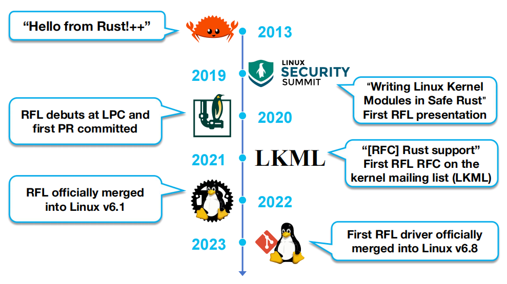

# An Empirical Study of Rust-for-Linux: The Success, Dissatisfaction, and Compromise

<table>
  <tr>
    <td>
      <b>
	  📌 Title: An Empirical Study of Rust-for-Linux: The Success, Dissatisfaction, and Compromise
	</b>
    </td>
  </tr>
  <tr>
    <td>
      <b>👨‍🎓 Author: </b>
	  Hongyu Li (Beijing University of Posts and Telecommunications), Liwei Guo (University of Electronic Science and Technology of China), Yexuan Yang (Beijing University of Posts and Telecommunications), Shangguang Wang (Beijing University of Posts and Telecommunications), Mengwei Xu (Beijing University of Posts and Telecommunications) 
    </td>
  </tr>
  <tr>
    <td>
      <b>🏛️ Publication: </b>
	  2024 USENIX Annual Technical Conference (USENIX ATC 24), July 10–12, 2024, Santa Clara, CA, USA
   </td>
  </tr>
  <tr>
    <td>
      <b>📜 Journal Tags:  </b>
	  Rust-for-Linux (RFL), Linux kernel, memory safety, concurrency bugs, safe abstraction, kernel drivers, performance overhead, code review
    </td>
  </tr>
  <tr>
    <td>
      <b>🎯 Tags:   </b>
	  Rust, Linux kernel safety, empirical study, kernel driver development, static analysis
    </td>
  </tr>
  <tr>
    <td>
      <b>🔗 DOI:   </b>
	  <a href="https://www.usenix.org/conference/atc24/presentation/li-hongyu">https://www.usenix.org/conference/atc24/presentation/li-hongyu</a>
    </td>
  </tr>
  <tr>
    <td>
      <b>📁 Local Link:   </b>
	  atc24-li-hongyu.pdf
    </td>
  </tr>
  <tr>
    <td>
      <b>📅 Note Date:   </b>
	  2025/10/27
    </td>
  </tr>
------

  <h2 style="color: #e0ffff; background-color: #66cdaa">📜 研究背景 现状 目标</h2>

### ⚙️ 背景

- **Linux 内核**是数字世界的基石，但它用 C 语言开发，天生存在**内存 / 并发 bug 问题**（如野指针、use-after-free、数据竞争）—— 尽管社区做了多年安全加固，这类 bug 仍频繁爆发

  

- 但 **Rust 语言**通过**静态所有权机制 + 类型检查**，**可能**可以在「无运行时开销」的前提下解决内存 / 并发安全问题

### 💡 现状

    
     
    
RFL 发展的几个显着里程碑

- 于是 2013 年诞生了 Rust-for-Linux（RFL）项目，目标是让 Linux 内核用 Rust 写驱动，兼顾安全与性能

  1. RFL 尝试以零开销提高 Linux 驱动程序的安全性
  2. 并将现代的开发经验和高效的开发工具带入内核以吸引更多的开发者

  

- 但到 2024 年，RFL 虽已合并到 Linux 主线，却缺乏系统的实证分析：

  1. （问题一）**Rust 到底怎么和 Linux 内核融合？**
  2. （问题二）**融合后真的能兼顾安全与性能吗？**
  3. （问题三）**开发效率和社区协作有没有提升？**

  <h2 style="color: #20b2aa; background-color: #afeeee">🔁 研究内容</h2>

### 🚊 研究基础

- Rust 的**安全性基础**：

  1. 每个内存位置一次只能由一个变量独占拥有
  2. 变量的所有权可以通过线程内和线程间的引用永久移动或临时借用，分别使用 Send 和 Sync 特性
  3. 变量超出作用域时，内存自动释放

  

- RFL 的融合逻辑（Rust 怎么嵌入 Linux）：Linux 内核是 C 写的，RFL 要让 Rust 驱动能调用内核的 C 接口，靠 3 层结构（图 2）：
  1. **绑定层（bindings crate）**：用`rust-bindgen`工具自动把 Linux 内核的 C 接口（如`kmalloc`内存分配）翻译成 Rust 能调用的 FFI（Foreign Function Interface）
  2. **安全抽象层（kernel crate）**：手动封装绑定层的 unsafe FFI ，提供 Rust 风格的安全 API （如用 Rust 的`Box`管理内核内存）
  3. **驱动层（drivers crate）**：开发者用安全抽象层的 API 写 Rust 驱动，无需直接接触 unsafe 代码

    
     
    
RFL 靠 3 层结构让 Rust 驱动能调用内核的 C 接口

### 👩🏻‍💻 研究问题

- **RQ1：RFL 的现状如何？**
  1. 基础设施成熟，但驱动 / 文件系统是短板，原因是代码审查太慢
  2. Rust 与 Linux 的内存模型冲突，导致额外开销
  3. Rust 靠`ScopeGuard`、`ARef`、`Pin` 这些辅助类型接管内核资源管理

- **RQ2：RFL 达到预期目标了吗？**
  1. 安全目标：Rust 让内核更可安全化，但不是绝对安全
  2. 性能目标：二进制体积变大，运行时开销时好时坏
  3. 开发目标：代码质量提升，吸引新手但门槛未降

- **RQ3：从 RFL 能学到什么？**

  1. 对 RFL 开发者的建议：

     - 不要迷信 Rust 的编译检查：用`RustBelt`（形式化验证工具）、`miri`（Rust 中间代码解释器）补充检测语义 bug
     - 从所有权角度设计驱动
     - `unsafe`作为最后手段

  2. 对 Linux 社区的建议：优先 Rust 化高收益子系统
     $$
     \text{子系统 Rust 化的收益} = \frac{\text{Rust 能修复的 bug 数}}{\text{子系统代码行数}}
     $$

### 🧩 数据

- 收集了 RFL 项目的 6 个关键驱动、1540 次代码提交、269 个问题（Issues）、763 个合并请求（PR）、3611 封邮件、1.25 万条 Zulip 论坛讨论

### 📜 贡献

1. 收集了 RFL 项目的 6 个关键驱动、1540 次代码提交、269 个问题（Issues）、763 个合并请求（PR）、3611 封邮件、1.25 万条 Zulip 论坛讨论
2. 基于[数据集](https://github.com/Richardhongyu/rfl_empirical_tools)开发了一个工具集，用于自动处理 API 、分析其使用统计数据并通过子系统视图报告结果
3. 对当前 RFL 开发现状进行了详细分析，揭示了将 Rust 集成到内核执行环境中的关键难点，并对未来 RFL 驱动程序开发提出建议

  <h2 style="color: #004d99; background-color: #87cefa">🤔 个人总结</h2>

### 🙋‍♀️ 重点记录

- **eBPF**（extended Berkeley Packet Filter）：可以在特权上下文中（如操作系统内核）运行沙盒程序，以便在运行时向操作系统添加额外的功能
- **LoC**（Lines of Code）：代码行数，是一个常用的度量标准，用于衡量软件项目的规模、复杂性和开发进度
