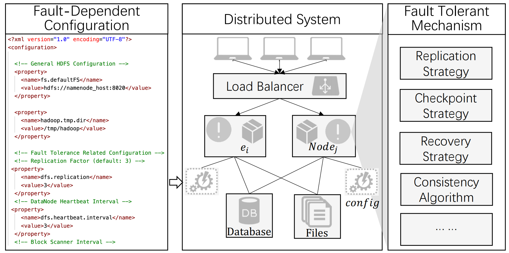
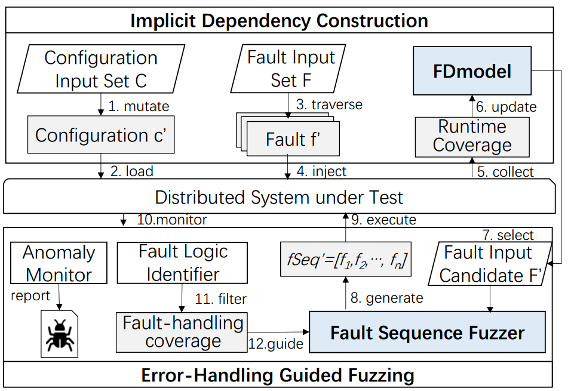

# CAFault: Enhance Fault Injection Technique in Practical Distributed Systems via Abundant Fault-Dependent Configurations

<table>
  <tr>
    <td>
      <b>
	  📌 Title: CAFault: Enhance Fault Injection Technique in Practical Distributed Systems via
Abundant Fault-Dependent Configurations
	</b>
    </td>
  </tr>
  <tr>
    <td>
      <b>👨‍🎓 Author: </b>
	  Yuanliang Chen, Fuchen Ma, Yuanhang Zhou, Zhen Yan, Yu Jiang
    </td>
  </tr>
  <tr>
    <td>
      <b>🏛️ Publication: </b>
	  USENIX ATC 2025
   </td>
  </tr>
  <tr>
    <td>
      <b>📜 Journal Tags:  </b>
	  fault injection, distributed systems, configuration testing, fuzzing, fault tolerance, CAFault, FDModel, bug detection
    </td>
  </tr>
  <tr>
    <td>
      <b>🎯 Tags:   </b>
	  fault injection, distributed systems, configuration testing, fuzzing, fault tolerance, CAFault, FDModel, bug detection
    </td>
  </tr>
  <tr>
    <td>
      <b>🔗 DOI:   </b>
	  
    </td>
  </tr>
  <tr>
    <td>
      <b>📁 Local Link:   </b>
	  ""
    </td>
  </tr>
  <tr>
    <td>
      <b>📅 Note Date:   </b>
	  2025/9/27
    </td>
  </tr>

------

<h2 style="color: #e0ffff; background-color: #66cdaa">📜 研究背景 现状 目标</h2>

### ⚙️ 背景

- **故障注入技术**（fault injection techniques）：通常用于测试分布式系统是否能够正确处理不同的潜在故障

### 💡 现状

- **存在的问题**：

  1. 现有的故障注入测试通常在**固定的默认配置**下执行，忽略了不同配置对测试执行路径的影响

     > 例如，在 MySQL-Cluster 中，数据一致性机制的默认配置被设置为 Raft

  2. **配置参数**和**故障注入参数**的输入空间过大，总搜索空间为 $M * N$（配置参数空间大小 * 故障注入参数空间大小）

  

- **核心挑战**：
  
  1. 如何自动分析和识别**故障和配置输入之间的隐式依赖关系**？
  2. 如何优化和修剪**故障注入参数**的输入空间 $N$ ？

### 🚀 目标

- **CAFault**（**C**onfiguration **A**ware **Fault**)）：本文提出的一个通用的测试框架，**通过丰富的故障相关配置**来增强现有的**故障注入技术**
  1. 引入 **FDModel** ，可以自动识别故障注入参数和配置参数之间的隐式依赖关系，**剪枝配置空间**
  2. 采用故障处理引导的模糊化策略，**优化故障空间探索**

  <h2 style="color: #20b2aa; background-color: #afeeee">🔁 研究内容</h2>

### 🚊 研究基础

- **分布式系统的故障**：网络延迟、数据包丢失、硬件故障

  

- **分布式系统的容错机制**：
  - 复制：在多个不同的节点上创建副本
  - 共识协议：多个节点通过互相通信和投票的方式，对某个决策达成一致意见，如 Raft 共识协议
  - 故障转移策略：系统通过故障检测机制发现某个节点故障后，自动将该节点的工作任务转移到备用节点上

    
     
    
分布式系统中的典型容错机制，受各种配置设置的影响

### 💻 技术路线

- **CAFault**：一个配置感知的故障注入框架

  1. 模块一：**FDModel（故障 - 配置依赖模型）—— 剪枝配置空间**

  2. 模块二：**故障处理引导的模糊测试 —— 优化故障空间探索**

     

         
          
         
CAFault 的工作流程，包括隐式依赖构造和故障处理引导模糊化两个主要阶段

     

- **（模块一）FDModel 的更新**：动态学习 “配置项 - 故障” 的隐式依赖，只保留对容错逻辑有影响的配置，减少无效探索

  - **核心思路**：同一故障下，若修改某个配置导致容错逻辑的覆盖率变化，则两者存在依赖。将测试分布式系统过程形式化定义为：
    $$
    φ = \{ C，F，Cov \}
    $$

  - **FDModel 构建步骤**：
    1. 初始化配置集：从系统默认配置开始，放入待探索配置集 $C$
    2. 配置变异：从 $C$ 中取出一个配置 $c$ ，随机变异部分配置项（如布尔型取反、数值型加减），生成新配置 $c'$
    3. 覆盖率对比：
       - 加载配置 $c$，注入所有故障（如节点崩溃、网络延迟），记录容错逻辑的覆盖率 $Cov$
       - 加载配置 $c'$ ，重复注入相同故障，记录覆盖率 $Cov'$
       - 若 $Cov≠Cov'$ ，说明变异的配置项与这些故障存在依赖
    4. 依赖最小化：用二分法筛选出最小影响配置集（eg：若变异 3 个配置项导致覆盖率变化，二分法逐步排除无影响项，最终定位到 1 个关键配置）
    5. 更新 FDModel：将 “配置项 - 故障” 的依赖关系存入模型，同时将 $c'$（高价值配置）加入 $C$ ，用于后续测试

- **（模块二）故障处理引导的模糊测试**

### 📜 结论

- **CAFault** 在 HDFS、ZooKeeper、MySQL-Cluster 等分布式系统的容错逻辑覆盖率比 CrashFuzz、Mallory 和 Chronos 分别提高了 31.5 %、29.3 %和81.5 %，并检测出了 **16** 个严重的未知错误

  

- **3 个贡献**：
  
  1. 提出 FDModel 
  2. 引入故障处理引导模糊测试
  3. 在 4 个主流分布式系统上进行工程验证

  <h2 style="color: #004d99; background-color: #87cefa">🤔 个人总结</h2>

### 🙋‍♀️ 重点记录

- 一些分布式系统：
  - **HDFS**（Hadoop Distributed File System）：一种**分布式文件系统**，专为大规模数据存储设计，能够在普通商用硬件上运行。它通过分布式架构管理跨多台机器存储的文件，支持高吞吐量和容错性
  - **ZooKeeper**：是由 Apache 维护的一个开源的**分布式协调服务**。它主要用于解决分布式系统中的数据一致性问题，提供高效且可靠的分布式协调服务。
  - **MySQL-Cluster**：一种高可用性、高性能的**数据库集群技术**，它允许在无共享系统中部署内存中的数据库集群。这种架构使得系统能够使用廉价硬件，并且对软硬件没有特殊要求
  - **IPFS**（InterPlanetary File System，星际文件系统）：一种**分布式网络传输协议**，旨在通过去中心化、内容寻址和点对点通信技术实现高效、安全的文件存储与共享

  
  
- **模糊测试**（Fuzzing）：生成随机输入，触发程序异常

  

- **SOTA**（state-of-the-art）：指在特定任务中目前表现最好的方法或模型

  > SOTA：目前该领域表现最优的算法
  >
  > Motivation：论文中提出的方法所追求的具体效果，即希望实现的目标
  >
  > Benchmark：用于对比的各种技术指标
  >
  > Baseline：用于对比的算法
  >
  > eg：论文基于某种 Motivation（要比对比算法更优），选择了该领域的 SOTA（当前最优的方法）作为本文的基线算法（Baseline）。在运行速度这一基准（Benchmark）上，表现更加优异，同时其他指标基本持平。
